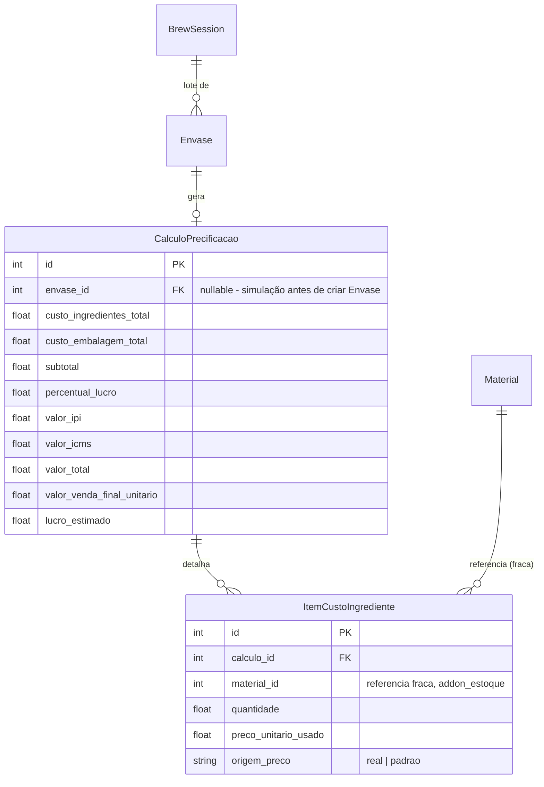

# Proposta — Precificação de Envase (Lote → Custo → Preço de Venda)

> Status: **[ABERTO]** — levantamento feito, schema é rascunho pra
> discussão, nada implementado. Segue o mesmo formato da skill 05
> (proposta antes de código).

## 0. Sobre o bug relatado (lote não listava no Envase)

Confirmado: é exatamente o que o patch pendente corrige —
`envase.lote_id` estava sem `@weak_ref` (Grupo B do relatório
anterior), então o formulário caía no fallback de id numérico cru, o
combo de Lote não aparecia. Assim que aplicar o patch, `lote_id`
passa a resolver contra `BrewSession` (via
`mash_control_lookups.get_session`) e lista normalmente.

## 1. O que o BrewStation (legado, GitHub) já tem

Local: `plugin_integ_bFather` (`model/calculo_envase.py`,
`utils/calculadora.py`, `api/routes/calculos_routes.py`). Mecânica
real (não é só ideia, está implementada e funcional):

Parâmetros hoje (`CalculoEnvase`, tabela `calculo_envase`):
`valor_litro_base`, `custo_embalagem`, `custo_impressao`,
`custo_tampinha`, `percentual_lucro`, `margem_cartao`,
`percentual_sanitizacao`, `percentual_impostos` (um único percentual
de imposto), `valor_total`, `valor_venda_final`. Vínculo opcional com
`Envase` (`envase_id`, nullable).

**Confirma o que você disse**: é uma base real e utilizável, mas
incompleta em 3 pontos específicos (seção 3).

## 2. O que o Tesseract já tem, que essa feature nova vai usar

| Peça | Onde já existe | Papel na precificação |
|---|---|---|
| "Lote" | `BrewSession` (`feature_mash_control`) | `envase.lote_id` já aponta pra cá (skill 05/02, cross-Feature mesmo Addon) — o Lote **já é** a BrewSession, não precisa de tabela nova só pra isso |
| Ingredientes da receita | `RecipeIngredient` (`feature_mash_control`), com referência fraca a `Material` (`addon_estoque`) | Fonte de quantidade + qual Material foi usado |
| Custo real pago | `ItemPedidoCompra.preco_unitario` (`addon_estoque`) — linha de recebimento já registrada por Material | Isso é **melhor** que o `preco_kg` fixo do legado: em vez de um preço de cadastro estático, dá pra pegar o **último preço realmente pago** (ou uma média) direto do ledger de compras |
| Embalagem | `ItemEnvase` + `Material` (tipo embalagem) | Quantidade e tipo de embalagem usada no envase |
| Tanque/planta | `BrewPlantVessel`, `BrewPlant` | Contexto, não entra direto no cálculo |

## 3. Lacunas reais (o que o legado NÃO tem, que você pediu)

1. **Preço padrão/fallback por Material quando não há preço real
   registrado.** Legado sempre usa `preco_kg` do cadastro (nunca fica
   sem valor, mas também nunca reflete o que foi realmente pago).
   Você quer o inverso: priorizar o preço real pago
   (`ItemPedidoCompra`), e só cair num valor padrão configurável
   (ex.: malte R$25/kg) quando não existir nenhuma compra registrada
   ainda pro Material.
2. **Impostos em linhas separadas (IPI, ICMS, ...), não um percentual
   único.** Legado tem `percentual_impostos` (um número só).
3. **Tela consolidada com abas/cards estilo SAP.** Legado é formulário
   + botão "calcular" separado, sem fluxo de "gerar Lote a partir da
   Receita" dentro do Workspace.

## 4. Perguntas em aberto (preciso da sua decisão antes de desenhar o schema)

| # | Pergunta | Opções |
|---|---|---|
| 1 | Onde mora o "preço padrão" por Material? | (A) campo novo em `Material` (`addon_estoque`) — um padrão por material, simples, mas mistura "cadastro" com "parâmetro de precificação" — (B) tabela nova própria de precificação (`PrecoPadrao` ou similar), fora de `Material` — mais limpo, mas mais uma tabela |
| 2 | "Divergência" do Lote — o que diverge, exatamente? | Você mencionou "informações do lote, divergentes dos dados reais" — preciso saber quais campos (volume real vs. planejado? data real vs. planejada? algo além disso?) pra saber se `BrewSession` já cobre isso (ela já tem campos reais separados dos da receita) ou se falta algo |
| 3 | Onde vive essa Feature nova? | (A) dentro de `feature_envase` (mais próximo do problema, mas mistura "empacotamento" com "precificação") — (B) `feature_precificacao` nova, dentro de `addon_brewstation`, consumindo `feature_envase`+`feature_mash_control`+`addon_estoque` (mais alinhado à skill 00 — um conceito, um módulo) |
| 4 | Impostos: percentual fixo por imposto, ou tabela de alíquotas configurável (por Material/UF/etc.)? | (A) simples — 2-3 campos de percentual (IPI, ICMS) direto no cálculo — (B) tabela de alíquotas própria, reaproveitável — mais correto fiscalmente, mais trabalho |
| 5 | O cálculo salvo (`CalculoEnvase`) fica preso a UM Envase, ou você quer simular preço ANTES de criar o Envase (como o legado permite, `envase_id` nullable)? | Afeta se o fluxo é "cria Envase → calcula" ou "simula → decide → cria Envase" |

## 5. Rascunho de schema (estrawman — só pra dar corpo à discussão, não é decisão)

Assumindo Opção B na pergunta 3 (`feature_precificacao`) e Opção A nas
perguntas 1 e 4 (mais simples, ajusta depois se crescer):

`origem_preco` (`"real"`/`"padrao"`) resolve a pergunta 1 do jeito
mais simples: o service tenta `ItemPedidoCompra` mais recente pro
Material, se não achar cai no valor padrão e marca a linha — assim a
tela mostra pro usuário quais custos são reais e quais são estimados,
sem esconder isso.

## Próximos passos

1. ~~Suas respostas às 5 perguntas da seção 4.~~ **Respondidas — ver
   seção 6.**
2. Com isso, formalizo o schema definitivo + manifesto da
   Feature (seguindo skills 02/03), ainda como proposta — só depois
   de aprovado é que entra código.
3. Desenho de tela (abas/cards) fica pra depois do schema fechado —
   schema primeiro, UI depois.

---

## 6. Decisões (rodada 1) + 2 desdobramentos novos

### 6.1 Preço padrão — por tipo de insumo, não por Material genérico

Decidido: não é um campo em `Material` nem uma tabela genérica de
precificação — é específico do domínio BrewStation, mora em
`feature_ingredientes`, e é **por tipo de insumo** (malte / lúpulo /
levedura — os 3 tipos que já existem como model próprio ali), não por
`Categoria`/`TipoProduto` genérico do `addon_estoque`. Ou seja: 3
valores hoje (extensível se aparecer um 4º tipo de insumo no futuro),
não uma tabela paramétrica grande.

**Tela nova (unificação), pedida junto**: uma tela só pra
`feature_ingredientes`, com abas Malte / Lúpulo / Levedura (mesma
ideia do BrewStation legado, que já tinha os 3 numa coisa só), e no
topo um card por tipo mostrando o preço padrão — só leitura, com ícone
de lápis que abre popup pra editar. Isso é **exatamente** o padrão
`is_workspace` que propus no levantamento de consolidação (arquivo
`levantamento-consolidacao-telas.md`) — não é uma peça nova de UI, é o
primeiro caso real de uso daquele padrão. As 3 telas atuais
(`Maltes`, `Lúpulos`, `Leveduras`) continuam existindo — a aba, dentro
do workspace, reaproveita a mesma grid, não duplica código.

### 6.2 Divergência de Lote — achado importante: nem a receita nem a sessão guardam esses valores hoje

Fui ver como o BrewFather (o produto de verdade, não a integração)
modela isso, como você pediu. Resumo do que encontrei
(docs.brewfather.app/batches): um Batch passa por estágios
(Planejamento → Brewing → Fermentando → Condicionando → Completo →
Arquivado), e em cada estágio existem campos "medidos" ao lado dos
"planejados" — Densidade Inicial (OG) planejada vs. medida, Densidade
Final (FG), volume (pré-fervura, pós-fervura, no fermentador),
eficiência real vs. estimada. No fechamento (Completo), mostra um
resumo "Real vs. Planejado" de OG/FG/ABV/IBU/SRM.

**Achado ao conferir o Tesseract**: hoje **nem `MashRecipe` nem
`BrewSession` guardam nenhum desses valores** — nem planejado, nem
real. `MashRecipe` só tem nome/versão/descrição/mapeamento de
equipamento (texto livre); `BrewSession` só tem status/datas/operador/
custo de insumos. Ou seja, isso não é um buraco pequeno de "faltou um
campo" — é um pedaço inteiro do domínio de Mash Control que ainda não
existe.

**Pergunta de escopo antes de desenhar**: essa "sessão de lote"
(planejado vs. real: OG, FG, volume, eficiência, ABV) é conceitualmente
do **ciclo de vida da `BrewSession`** — existe e faz sentido registrar
isso mesmo que o usuário nunca chegue a criar um Envase depois. Minha
recomendação é essa entidade morar em `feature_mash_control` (não em
`feature_envase`), e a precificação do Envase só **ler** o volume/
custo real de lá — mesmo padrão de referência fraca cross-Feature que
`envase.lote_id` já usa hoje. Isso mantém a decisão 6.3 (Feature de
precificação em `feature_envase`) sem misturar "resultado do brew" com
"cálculo de preço", que são responsabilidades diferentes. Se você
preferir diferente (ex.: colocar direto em `feature_envase` mesmo),
me avisa antes de eu formalizar.

### 6.3 Confirmado: Feature de precificação vive em `feature_envase`

Sem pendência aqui.

### 6.4 Impostos — 2-3 campos simples agora

`valor_ipi` / `valor_icms` (percentual, aplicado como o `calculadora.py`
legado já faz — sobre o total). Tabela de alíquotas reaproveitável
fica de fora, registrado como item de backlog pra quando existir
`addon_finance` — não mexo nisso agora.

### 6.5 Confirmado: fluxo de simulação (`envase_id` continua nullable)

Fluxo: **simula → calcula → decide → cria Envase** (igual ao legado).
`CalculoPrecificacao.envase_id` fica nullable, exatamente como no
rascunho da seção 5.

### 6.6 Simplificação aceita: sem OG/FG por enquanto — só o que a precificação precisa

Você topou a sugestão da 6.2 (mora em `feature_mash_control`) e pediu
pra simplificar: por ora, sem densidade inicial/final e demais
métricas de qualidade de brassagem — isso depende de leitura de
sensor/controlador externo (`tesseract-device-bridge`) que ainda não
está integrado a esse ponto, então fica de fora até existir essa
fonte de dado confiável. **Entendimento**: em vez de uma tabela nova
("sessão de lote" separada), a divergência fica só no que a
precificação realmente consome — **volume** — como 2 campos simples
nos models que já existem, sem tabela nova nenhuma:

| Campo novo | Onde | Papel |
|---|---|---|
| `volume_planejado_litros` | `MashRecipe` (hoje não tem nenhum campo de volume) | Alvo da receita |
| `volume_real_litros` | `BrewSession` (hoje também não tem) | Medido no dia da brassagem — é o que `feature_envase` vai ler pra calcular custo por litro |

Se no futuro o `tesseract-device-bridge` passar a alimentar OG/FG
automaticamente, aí sim vira uma tabela própria de leituras — por
ora, 2 campos resolvem o que a precificação precisa sem criar
estrutura que ainda não tem dado real pra preencher.

**Me confirma que esse entendimento está certo** e formalizo o
patch: os 2 campos novos (`feature_mash_control`) + o schema de
`feature_envase`/precificação (seção 5, com `origem_preco`) + a
tabela pequena de preço padrão por tipo de insumo em
`feature_ingredientes` (seção 6.1) — tudo num pacote só, já que são
peças do mesmo fluxo.
