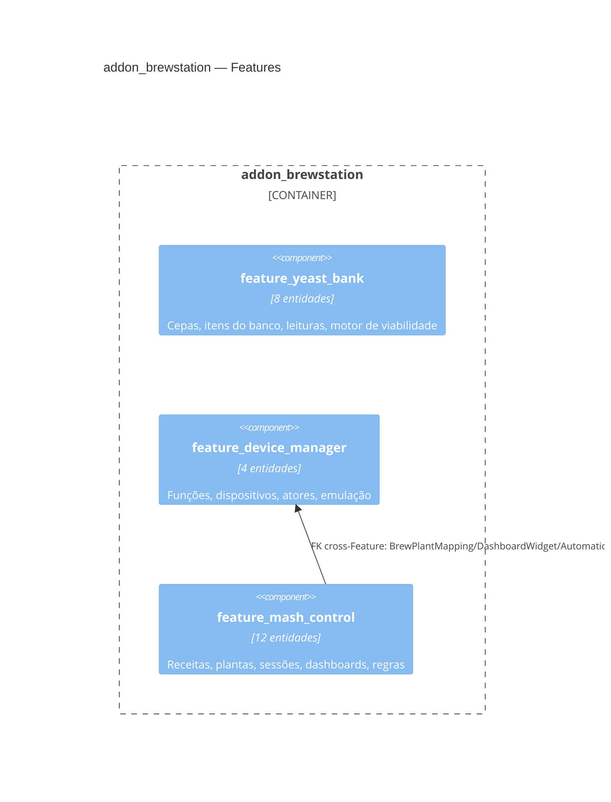

# 02 — Diagrama C4 (Addon BrewStation — Componente)

```mermaid
C4Component
    title addon_brewstation — Features

    Container_Boundary(brewstation, "addon_brewstation") {
        Component(yeastbank, "feature_yeast_bank", "8 entidades", "Cepas, itens do banco, leituras, motor de viabilidade")
        Component(devicemanager, "feature_device_manager", "4 entidades", "Funções, dispositivos, atores, emulação")
        Component(mashcontrol, "feature_mash_control", "12 entidades", "Receitas, plantas, sessões, dashboards, regras")
    }

    Rel(mashcontrol, devicemanager, "FK cross-Feature: BrewPlantMapping/DashboardWidget/AutomationRule -> DeviceFunction")
```

Ver C4 do Sistema (`docs/technical/02-diagrama-c4.md`) para o nível
Container completo, incluindo o Core.
