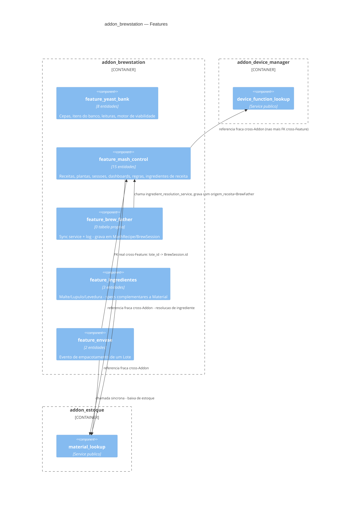

# 02 — Diagrama C4 (Addon BrewStation — Componente)

Ver C4 do Sistema (`docs/technical/02-diagrama-c4.md` da raiz) para o
nível Container completo, incluindo o Core — **ainda não atualizado**
com as caixas de `addon_estoque` e a promoção de `addon_device_manager`
(pendência).

## Correção desta rodada

O diagrama anterior mostrava `feature_device_manager` como componente
interno deste Addon com `Rel` de "FK cross-Feature". Isso ficou
desatualizado desde a promoção a Addon independente (skill 05) — o
código já usava referência fraca; só este diagrama não tinha
acompanhado.
