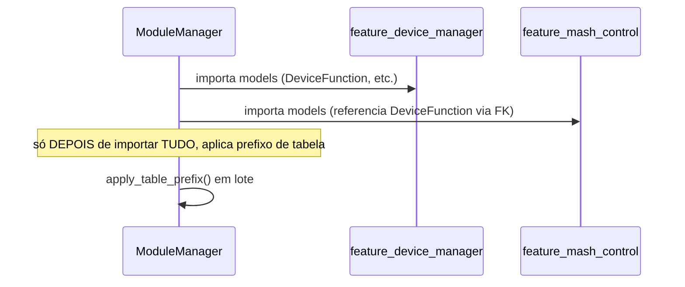

# 03 — Fluxos (Addon BrewStation)

## Sequência: dependência entre Features no boot

Ver `docs/technical/06-manutencao-e-expansao.md` (sistema) para o
porquê dessa ordem — FK cross-Feature quebrava se o prefixo fosse
aplicado Feature por Feature.

Fluxos específicos de cada Feature (caminho feliz da operação
principal) estão em `features/*/docs/technical/03-fluxos.md`.
