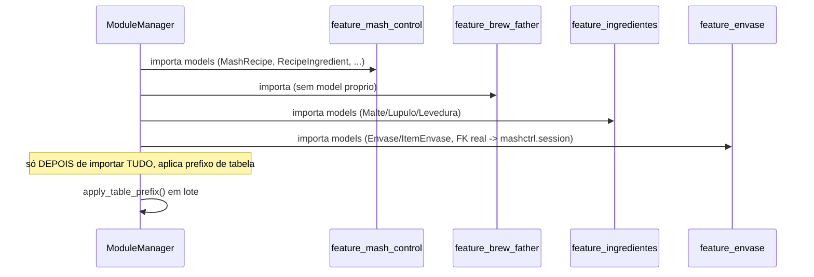

# 03 — Fluxos (Addon BrewStation)

## Sequência: dependência entre Features no boot

Ver `docs/technical/06-manutencao-e-expansao.md` (sistema) para o
porquê dessa ordem.

## Fluxos cross-Addon desta rodada

`feature_mash_control` e `feature_envase` chamam services públicos de
`addon_device_manager`/`addon_estoque` — ver
`features/feature_mash_control/docs/technical/03-fluxos.md` e
`features/feature_envase/docs/technical/03-fluxos.md` para o detalhe
sequencial completo.

Fluxos específicos de cada Feature (caminho feliz da operação
principal) estão em `features/*/docs/technical/03-fluxos.md`.
