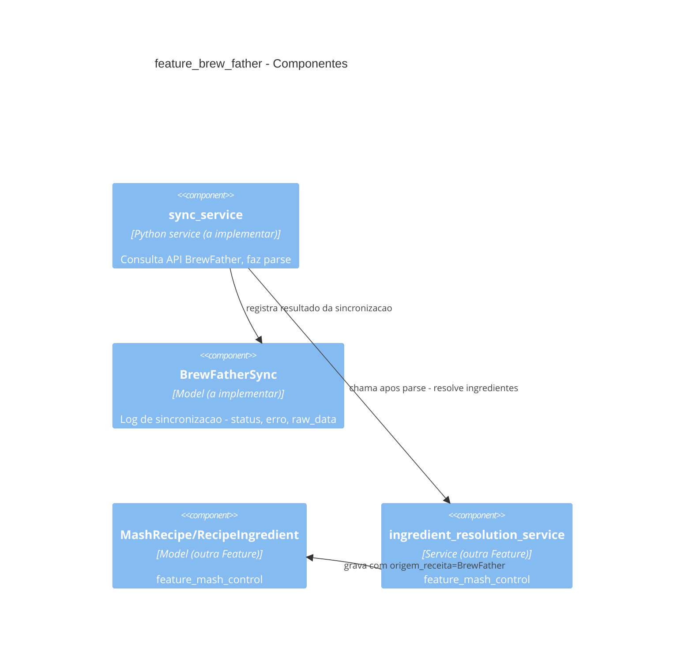

# 02 — Diagrama C4 (Feature Brew Father — Componente)

```mermaid
C4Component
    title feature_brew_father - Componentes

    Component(sync_svc, "sync_service", "Python service (a implementar)", "Consulta API BrewFather, faz parse")
    Component(log, "BrewFatherSync", "Model (a implementar)", "Log de sincronizacao - status, erro, raw_data")
    Component(recipe_ext, "MashRecipe/RecipeIngredient", "Model (outra Feature)", "feature_mash_control")
    Component(resolve_ext, "ingredient_resolution_service", "Service (outra Feature)", "feature_mash_control")

    Rel(sync_svc, resolve_ext, "chama apos parse - resolve ingredientes")
    Rel(resolve_ext, recipe_ext, "grava com origem_receita=BrewFather")
    Rel(sync_svc, log, "registra resultado da sincronizacao")
```
