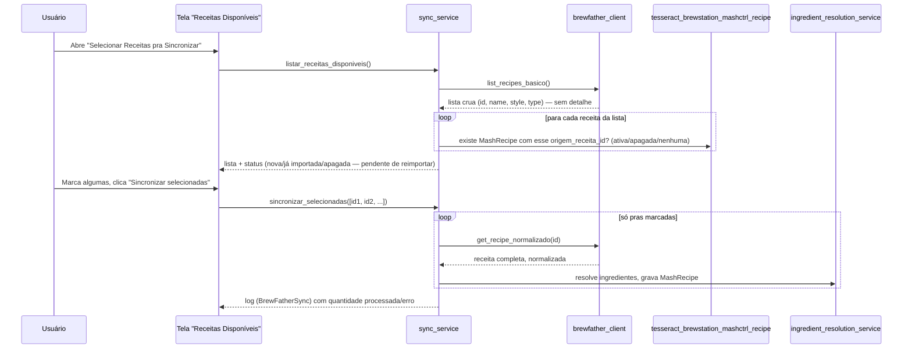

# 03 — Fluxos (Feature Brew Father)

Fluxo completo (parse da API + resolução de ingrediente) documentado
em `features/feature_mash_control/docs/technical/03-fluxos.md`
("Sequência: importação de receita + resolução de ingrediente") — não
duplicado aqui pra evitar dessincronia entre os dois documentos.

Responsabilidade exclusiva desta Feature: consultar a API BrewFather e
converter o payload pro formato de entrada que
`ingredient_resolution_service` espera (descrição + quantidade +
unidade por ingrediente).

## Sequência: sincronização seletiva (skill 27, 2026-09-01)

Este fluxo é exclusivo desta Feature (não existe equivalente em
`feature_mash_control`) — a API do BrewFather não expõe filtro por
tag/pasta no servidor, então a seleção acontece inteiramente aqui.

O status "apagada — pendente de reimportar" depende da correção feita
na skill 25 (`_importar_receita` passou a filtrar `is_deleted=False`
na deduplicação) — sem ela, uma receita apagada nunca seria
reimportada de verdade, mesmo marcada de novo aqui.
