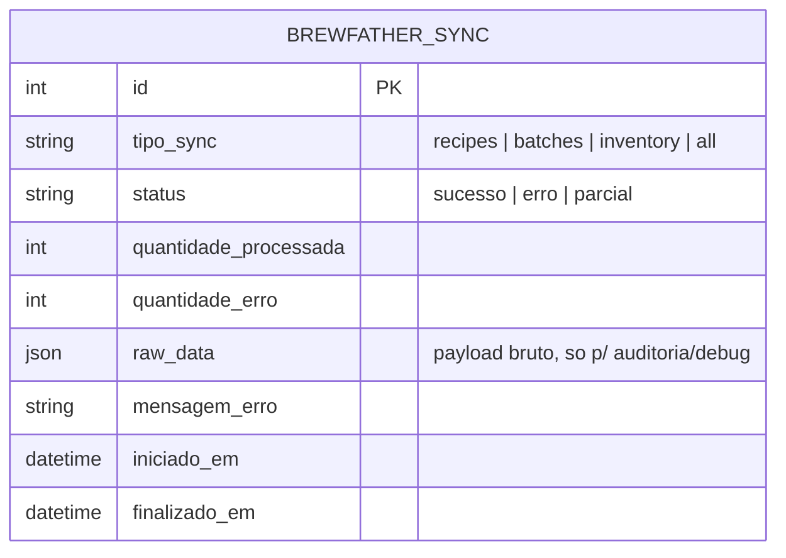

# 04 — Modelo de Dados (Feature Brew Father)

Sem tabela de domínio própria. Único model previsto — ainda não
implementado — é o log de sincronização:

Tabela real prevista: `tesseract_brewstation_brewfather_sync`.
