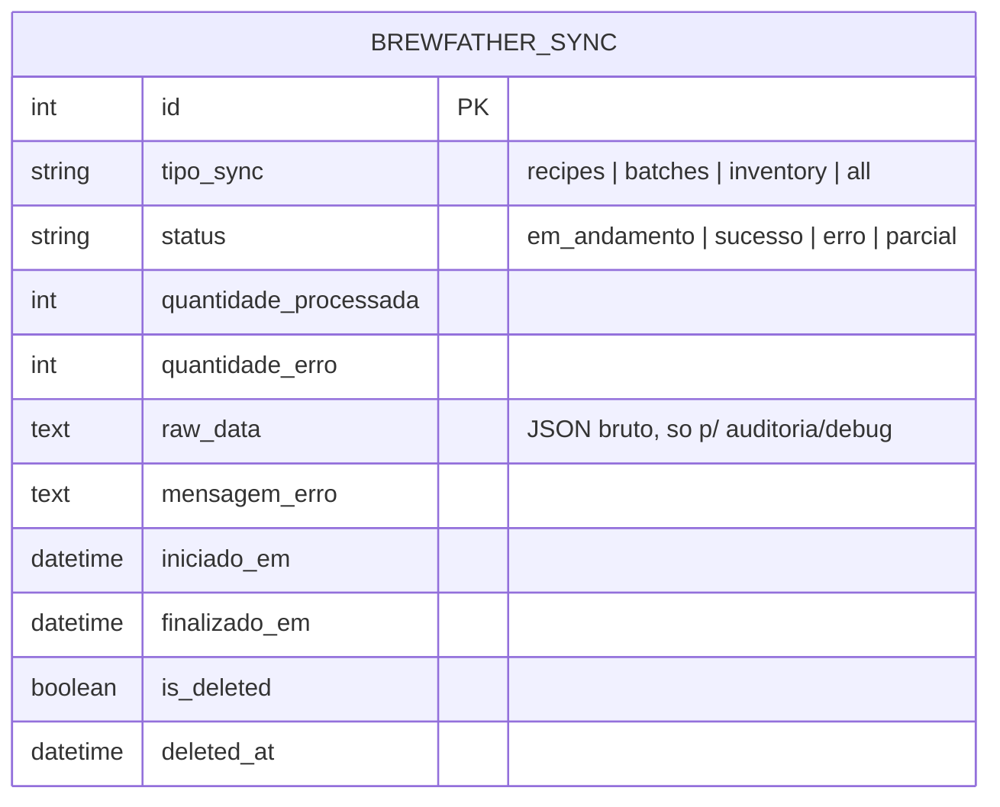

# 04 — Modelo de Dados (Feature Brew Father)

Sem tabela de domínio própria de receita/lote. Única tabela real desta
Feature é o log de sincronização — **já implementado** (esta seção
dizia "ainda não implementado" numa versão anterior; corrigido nesta
rodada, ver `docs/technical/06-manutencao-e-expansao.md` pra como é
usado na prática):

```mermaid
erDiagram
    BREWFATHER_SYNC {
        int id PK
        string tipo_sync "recipes | batches | inventory | all"
        string status "em_andamento | sucesso | erro | parcial"
        int quantidade_processada
        int quantidade_erro
        text raw_data "JSON bruto, so p/ auditoria/debug"
        text mensagem_erro
        datetime iniciado_em
        datetime finalizado_em
        boolean is_deleted
        datetime deleted_at
    }
```

Tabela real: `tesseract_brewstation_brewfather_sync`.

`sincronizar_selecionadas()` (skill 27) grava nesta mesma tabela, com
`tipo_sync="recipes"` igual a `sync_recipes()` — aparecem juntas no
mesmo histórico, sem distinção de "foi tudo de uma vez ou seletiva"
no schema (só o `raw_data` de cada log mostra quantas receitas
entraram naquela chamada).
