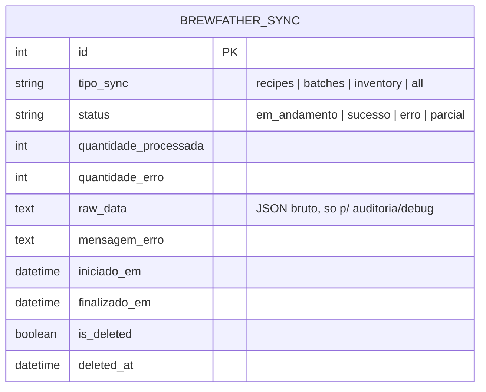

# 04 — Modelo de Dados (Feature Brew Father)

Sem tabela própria de receita/lote. Esta Feature guarda o log de
sincronização e o vínculo confirmado entre inventário Brewfather e
Material do Estoque:

```mermaid
erDiagram
    BREWFATHER_SYNC {
        int id PK
        string tipo_sync "recipes | batches | inventory | all"
        string status "em_andamento | sucesso | erro | parcial"
        int quantidade_processada
        int quantidade_erro
        text raw_data "JSON bruto, so p/ auditoria/debug"
        text mensagem_erro
        datetime iniciado_em
        datetime finalizado_em
        boolean is_deleted
        datetime deleted_at
    }
```

Tabelas reais: `tesseract_brewstation_brewfather_sync` e
`tesseract_brewstation_brewfather_inventory_link`. O vínculo contém
`categoria`, `remote_id` e `material_id` (referência fraca ao Estoque),
com unicidade por item remoto e por Material em cada categoria. Ele é
independente de `IngredientMapping`, que relaciona descrições de receitas.

`sincronizar_selecionadas()` (skill 27) grava nesta mesma tabela, com
`tipo_sync="recipes"` igual a `sync_recipes()` — aparecem juntas no
mesmo histórico, sem distinção de "foi tudo de uma vez ou seletiva"
no schema (só o `raw_data` de cada log mostra quantas receitas
entraram naquela chamada). `tipo_sync` tem `@enum_field` com opções
fixas receitas, lotes, inventário e tudo; só a sincronização de
receitas cria logs operacionais hoje. As ações em massa sobre receitas
não excluem logs.
