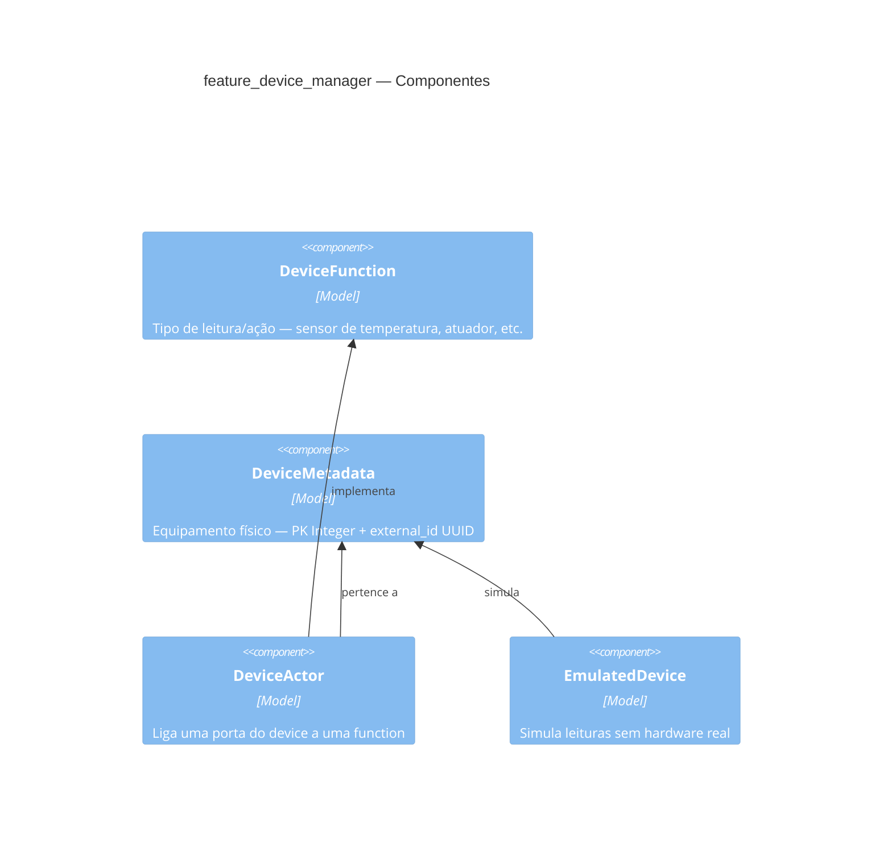

# 02 — Diagrama C4 (Feature Device Manager — Componente)

```mermaid
C4Component
    title feature_device_manager — Componentes

    Component(func, "DeviceFunction", "Model", "Tipo de leitura/ação — sensor de temperatura, atuador, etc.")
    Component(device, "DeviceMetadata", "Model", "Equipamento físico — PK Integer + external_id UUID")
    Component(actor, "DeviceActor", "Model", "Liga uma porta do device a uma function")
    Component(emulated, "EmulatedDevice", "Model", "Simula leituras sem hardware real")

    Rel(actor, device, "pertence a")
    Rel(actor, func, "implementa")
    Rel(emulated, device, "simula")
```
