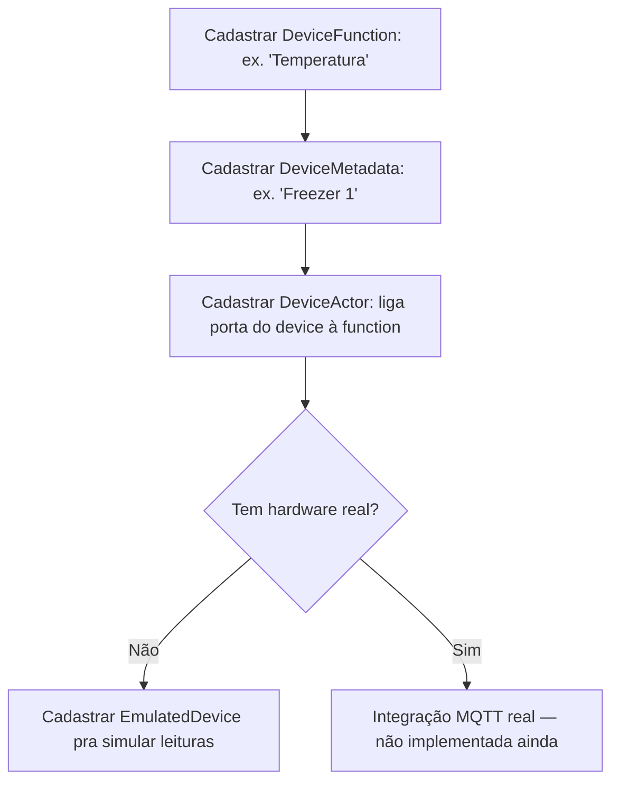

# 03 — Fluxos (Feature Device Manager)

## Caminho feliz: cadastro de um dispositivo monitorado

```mermaid
flowchart TD
    A[Cadastrar DeviceFunction: ex. 'Temperatura'] --> B[Cadastrar DeviceMetadata: ex. 'Freezer 1']
    B --> C[Cadastrar DeviceActor: liga porta do device à function]
    C --> D{Tem hardware real?}
    D -->|Não| E[Cadastrar EmulatedDevice pra simular leituras]
    D -->|Sim| F[Integração MQTT real — não implementada ainda]
```
