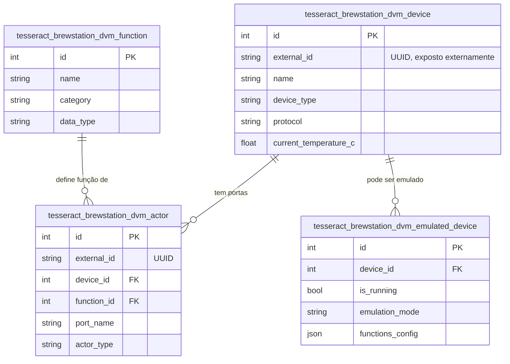

# 04 — Modelo de Dados (Feature Device Manager)

## Colunas não óbvias

| Tabela | Coluna | Descrição |
|---|---|---|
| `..._device`/`..._actor` | `external_id` | UUID gerado automaticamente — usado em integrações externas (MQTT, etc.), nunca como PK (skill 02, "Regra de PK externa") |
| `..._actor` | `plugin_name`/`plugin_entity_id` | Referência fraca a entidade de outro módulo — nunca FK direta entre Addons (skill 02) |
| `..._emulated_device` | `functions_config` | JSON — corrigido em relação ao original (que usava `default={}` mutável compartilhado entre instâncias) |

## FK entre módulos

Todas internas a esta Feature. `feature_mash_control` referencia
`DeviceFunction` (FK cross-Feature, mesmo Addon — permitido).
