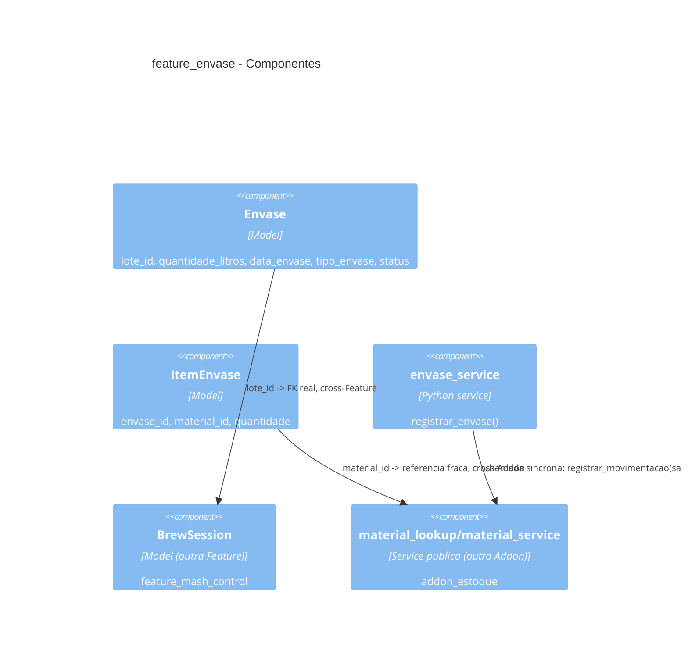

# 02 — Diagrama C4 (Feature Envase — Componente)

```mermaid
C4Component
    title feature_envase - Componentes

    Component(envase, "Envase", "Model", "lote_id, quantidade_litros, data_envase, tipo_envase, status")
    Component(item, "ItemEnvase", "Model", "envase_id, material_id, quantidade")
    Component(svc_env, "envase_service", "Python service", "registrar_envase()")
    Component(session_ext, "BrewSession", "Model (outra Feature)", "feature_mash_control")
    Component(lookup_ext, "material_lookup/material_service", "Service publico (outro Addon)", "addon_estoque")

    Rel(envase, session_ext, "lote_id -> FK real, cross-Feature")
    Rel(item, lookup_ext, "material_id -> referencia fraca, cross-Addon")
    Rel(svc_env, lookup_ext, "chamada sincrona: registrar_movimentacao(saida)")
```
