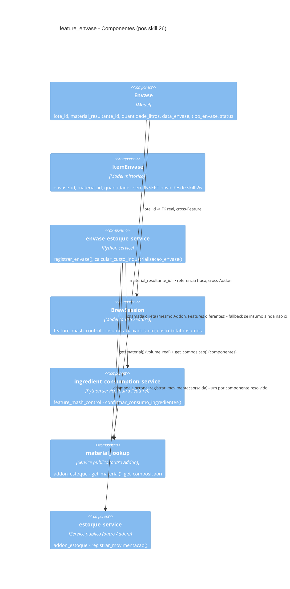

# 02 — Diagrama C4 (Feature Envase — Componente)

`ItemEnvase` não aparece mais como destino de nenhuma relação a partir
de `envase_estoque_service` — fica desenhado no diagrama só pra deixar
claro que a tabela existe (dado histórico), não porque o service atual
escreve nela.
