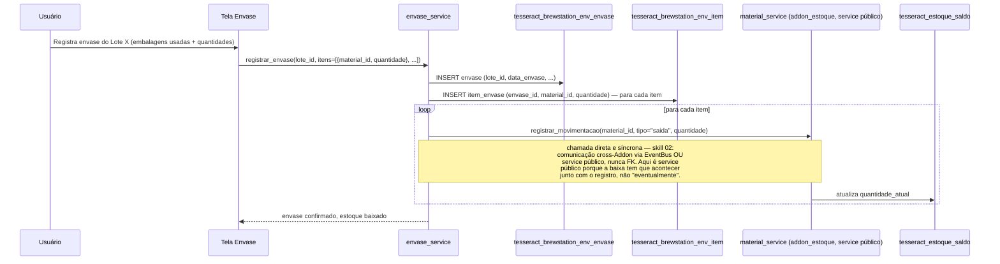

# 03 — Fluxos (Feature Envase)

## Caminho feliz: registro de Envase → baixa síncrona de estoque

```mermaid
sequenceDiagram
    participant User as Usuário
    participant UI as Tela Envase
    participant EnvSvc as envase_service
    participant Envase as tesseract_brewstation_env_envase
    participant Item as tesseract_brewstation_env_item
    participant EstSvc as material_service (addon_estoque, service público)
    participant Saldo as tesseract_estoque_saldo

    User->>UI: Registra envase do Lote X (embalagens usadas + quantidades)
    UI->>EnvSvc: registrar_envase(lote_id, itens=[{material_id, quantidade}, ...])
    EnvSvc->>Envase: INSERT envase (lote_id, data_envase, ...)
    EnvSvc->>Item: INSERT item_envase (envase_id, material_id, quantidade) — para cada item

    loop para cada item
        EnvSvc->>EstSvc: registrar_movimentacao(material_id, tipo="saida", quantidade)
        Note over EnvSvc,EstSvc: chamada direta e síncrona — skill 02:<br/>comunicação cross-Addon via EventBus OU<br/>service público, nunca FK. Aqui é service<br/>público porque a baixa tem que acontecer<br/>junto com o registro, não "eventualmente".
        EstSvc->>Saldo: atualiza quantidade_atual
    end

    EnvSvc-->>UI: envase confirmado, estoque baixado
```
