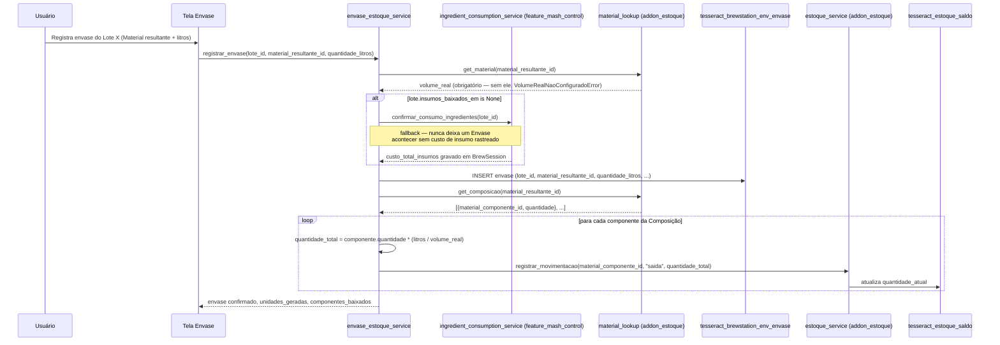
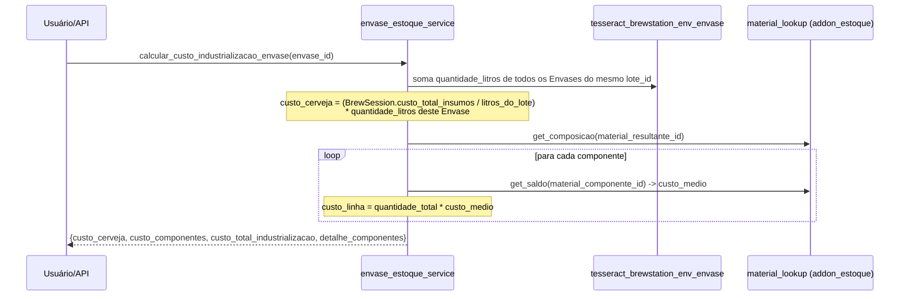

# 03 — Fluxos (Feature Envase)

## Caminho feliz: registro de Envase → Composição → baixa síncrona

`ItemEnvase` não é mais criado em nenhum passo deste fluxo — os
componentes vêm inteiramente da Composição do Material resultante.

## Cálculo de custo de industrialização (sob demanda, não no registro)

Este cálculo não grava nada — pode ser chamado quantas vezes quiser,
a qualquer momento depois do Envase existir (mesmo raciocínio de
"cálculo separado de commit" já usado em
`ingredient_consumption_service.calcular_custo_insumos_receita()`).
