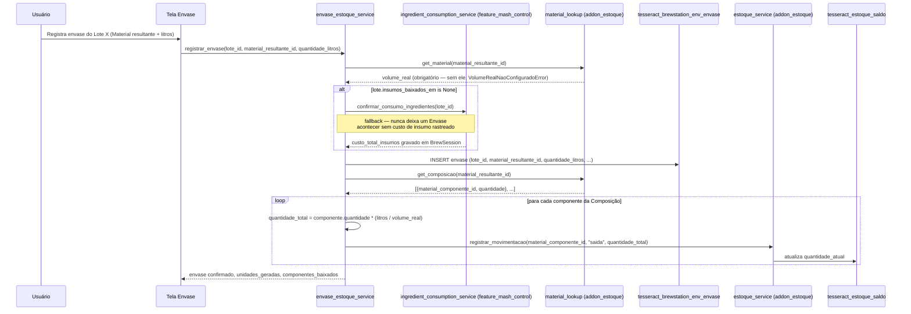
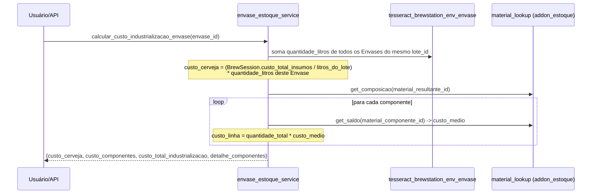
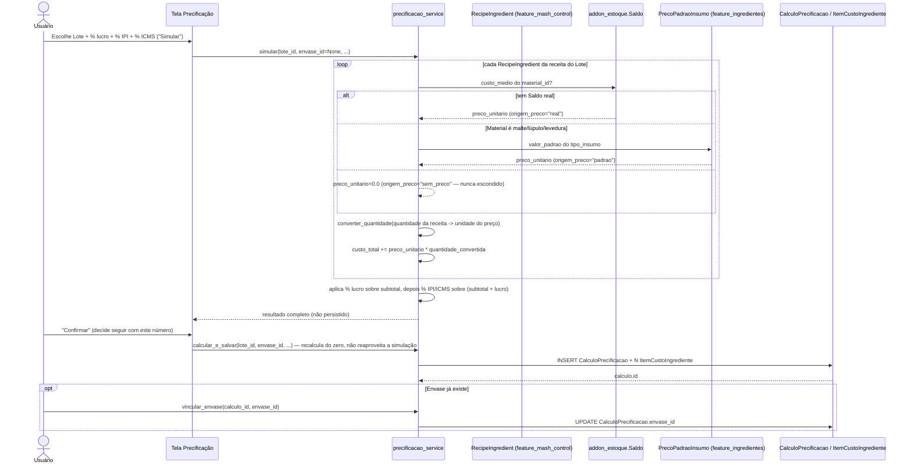

# 03 — Fluxos (Feature Envase)

## Caminho feliz: registro de Envase → Composição → baixa síncrona

`ItemEnvase` não é mais criado em nenhum passo deste fluxo — os
componentes vêm inteiramente da Composição do Material resultante.

## Cálculo de custo de industrialização (sob demanda, não no registro)

Este cálculo não grava nada — pode ser chamado quantas vezes quiser,
a qualquer momento depois do Envase existir (mesmo raciocínio de
"cálculo separado de commit" já usado em
`ingredient_consumption_service.calcular_custo_insumos_receita()`).

## Precificação de venda: simula → calcula-e-salva → vincula (mecanismo separado)

> Ver `01-visao-geral.md`, seção "Dois mecanismos de custo", para a
> diferença em relação ao cálculo de industrialização acima — este
> fluxo tem tela própria (`controller/precificacao.py`) e persiste
> resultado; o de industrialização não.

**Achados reais deste fluxo:**

- **`simular()` e `calcular_e_salvar()` recalculam do zero, cada um**
  — `simular()` não retorna um id reaproveitável; confirmar depois de
  simular dispara a mesma conta de novo, não só grava o que já foi
  calculado. Se o preço de algum insumo mudar entre o clique em
  "Simular" e o clique em "Confirmar", o valor salvo pode diferir do
  que foi mostrado na simulação.
- **Custo de embalagem depende de `envase_id` ser passado** — sem
  Envase ainda (simulação antes de decidir embalar), `custo_embalagem_total`
  é sempre `0.0`, não por falta de preço, mas porque não há
  `ItemEnvase` para somar. Ver o achado sobre `ItemEnvase` estar
  congelado desde a skill 26, na seção acima (`01-visao-geral.md`).
- **Ordem de aplicação dos percentuais**: lucro incide sobre
  `subtotal` (ingredientes + embalagem); IPI e ICMS incidem sobre
  `subtotal + lucro` — nunca em cascata um sobre o outro (`valor_ipi`
  e `valor_icms` são calculados separadamente, ambos sobre a mesma
  base, depois somados).
- **`_material_display()` resolve nome, nunca id** — correção da
  última sessão real antes desta auditoria (commit
  "mostra nome do Material (não id)"); a tela de resultado usa
  `material_lookup.get_material()` para mostrar o nome do insumo, não
  o `material_id` cru.

## Transação de confirmação (2026-09-25)

`EnvaseService.create_override` delega a `envase_estoque_service.registrar_envase`. A função chama `confirmar_consumo_ingredientes(commit=False)` quando necessário, grava o Envase com `flush`, chama `registrar_movimentacao(commit=False)` para cada componente e só então executa um `commit`. Qualquer erro reverte todo o conjunto. O CRUD gerado usa hooks de serviço para impedir update/trash/restore/delete e a tela de detalhe apenas consulta o registro; a API compartilha os mesmos hooks. O fluxo de estorno permanece pendente e deve escrever movimentações compensatórias, sem alterar as originais.
