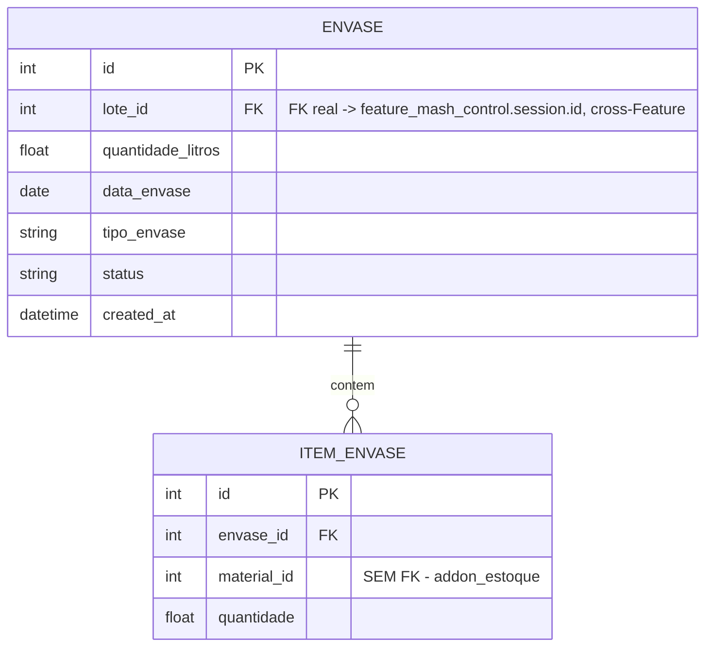

# 04 — Modelo de Dados (Feature Envase)

Tabelas reais: `tesseract_brewstation_env_envase`,
`tesseract_brewstation_env_item`.

`lote_id` é FK real porque `feature_mash_control` é do mesmo Addon
(skill 02 permite FK cross-Feature). `material_id` é referência fraca
porque `addon_estoque` é Addon diferente.
