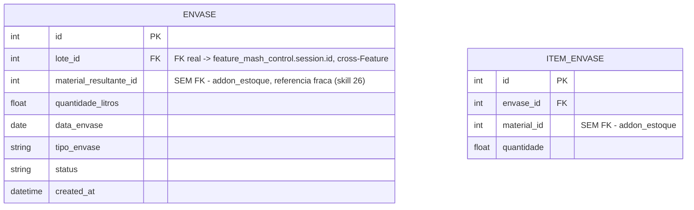

# 04 — Modelo de Dados (Feature Envase)

```mermaid
erDiagram
    ENVASE {
        int id PK
        int lote_id FK "FK real -> feature_mash_control.session.id, cross-Feature"
        int material_resultante_id "SEM FK - addon_estoque, referencia fraca (skill 26)"
        float quantidade_litros
        date data_envase
        string tipo_envase
        string status
        datetime created_at
    }
    ITEM_ENVASE {
        int id PK
        int envase_id FK
        int material_id "SEM FK - addon_estoque"
        float quantidade
    }
```

Tabelas reais: `tesseract_brewstation_env_envase`,
`tesseract_brewstation_env_item_envase`.

`lote_id` é FK real porque `feature_mash_control` é do mesmo Addon
(skill 02 permite FK cross-Feature). `material_resultante_id` é
referência fraca porque `addon_estoque` é Addon diferente — resolvido
em runtime via `material_lookup.get_material()` +
`material_lookup.get_composicao()`, nunca ORM direto.

## `ItemEnvase` — histórico desde a skill 26 (2026-09-01)

Não há mais relacionamento ativo `ENVASE ||--o{ ITEM_ENVASE` — a FK
`envase_id` continua existindo no schema (nenhuma migration de
remoção foi feita), e Envases criados **antes** da skill 26 continuam
com suas linhas de `ItemEnvase` intactas, mas
`envase_estoque_service.registrar_envase()` não insere mais nada
nessa tabela. Os componentes de um Envase novo são resolvidos em
runtime, a partir de `Composicao` (`addon_estoque`,
`material_pai_id = Envase.material_resultante_id`) — nunca persistidos
localmente nesta Feature.

Decisão de remover a tabela/FK por completo fica em aberto — ver
`06-manutencao-e-expansao.md`.
