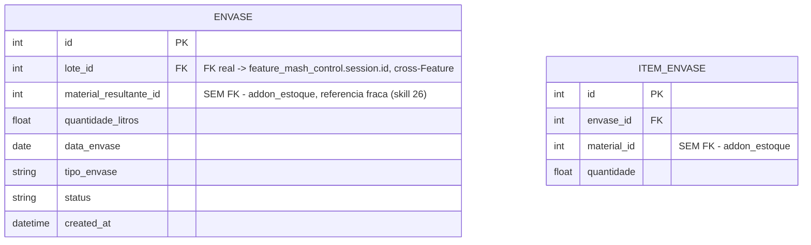
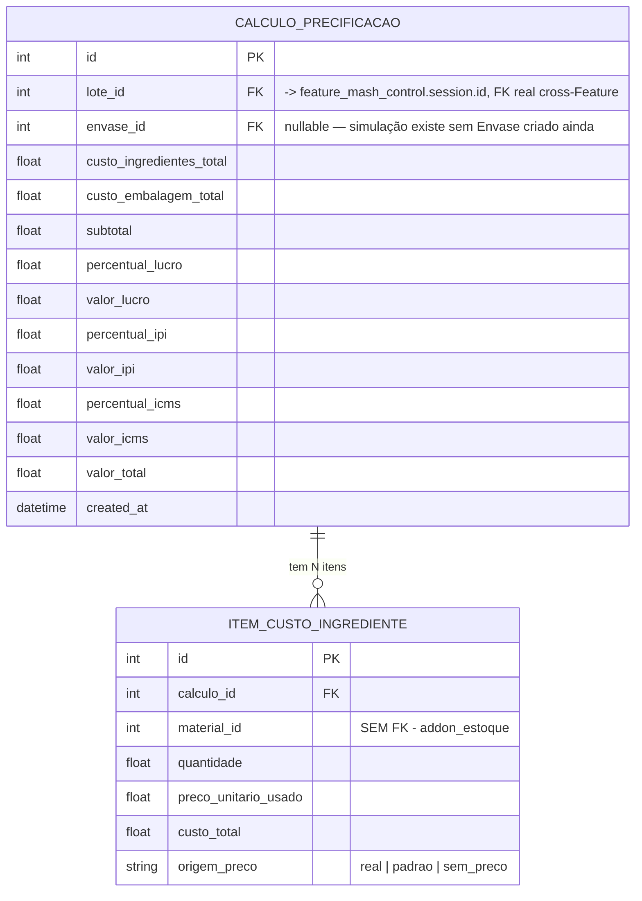

# 04 — Modelo de Dados (Feature Envase)

```mermaid
erDiagram
    ENVASE {
        int id PK
        int lote_id FK "FK real -> feature_mash_control.session.id, cross-Feature"
        int material_resultante_id "SEM FK - addon_estoque, referencia fraca (skill 26)"
        float quantidade_litros
        date data_envase
        string tipo_envase
        string status
        datetime created_at
    }
    ITEM_ENVASE {
        int id PK
        int envase_id FK
        int material_id "SEM FK - addon_estoque"
        float quantidade
    }
```

Tabelas reais: `tesseract_brewstation_env_envase`,
`tesseract_brewstation_env_item_envase`.

`lote_id` é FK real porque `feature_mash_control` é do mesmo Addon
(skill 02 permite FK cross-Feature). `material_resultante_id` é
referência fraca porque `addon_estoque` é Addon diferente — resolvido
em runtime via `material_lookup.get_material()` +
`material_lookup.get_composicao()`, nunca ORM direto.

## `ItemEnvase` — histórico desde a skill 26 (2026-09-01)

Não há mais relacionamento ativo `ENVASE ||--o{ ITEM_ENVASE` — a FK
`envase_id` continua existindo no schema (nenhuma migration de
remoção foi feita), e Envases criados **antes** da skill 26 continuam
com suas linhas de `ItemEnvase` intactas, mas
`envase_estoque_service.registrar_envase()` não insere mais nada
nessa tabela. Os componentes de um Envase novo são resolvidos em
runtime, a partir de `Composicao` (`addon_estoque`,
`material_pai_id = Envase.material_resultante_id`) — nunca persistidos
localmente nesta Feature.

Decisão de remover a tabela/FK por completo fica em aberto — ver
`06-manutencao-e-expansao.md`.

```mermaid
erDiagram
    CALCULO_PRECIFICACAO {
        int id PK
        int lote_id FK "-> feature_mash_control.session.id, FK real cross-Feature"
        int envase_id FK "nullable — simulação existe sem Envase criado ainda"
        float custo_ingredientes_total
        float custo_embalagem_total
        float subtotal
        float percentual_lucro
        float valor_lucro
        float percentual_ipi
        float valor_ipi
        float percentual_icms
        float valor_icms
        float valor_total
        datetime created_at
    }
    ITEM_CUSTO_INGREDIENTE {
        int id PK
        int calculo_id FK
        int material_id "SEM FK - addon_estoque"
        float quantidade
        float preco_unitario_usado
        float custo_total
        string origem_preco "real | padrao | sem_preco"
    }
    CALCULO_PRECIFICACAO ||--o{ ITEM_CUSTO_INGREDIENTE : "tem N itens"
```

Tabelas reais: `tesseract_brewstation_env_calculo_precificacao`,
`tesseract_brewstation_env_item_custo_ingrediente`.

## `CalculoPrecificacao`/`ItemCustoIngrediente` — o que cada campo significa

- **`envase_id` nullable de propósito**: o fluxo é
  simula (nada persiste) → calcula-e-salva (persiste
  `CalculoPrecificacao` + `ItemCustoIngrediente`, `envase_id` ainda
  `None`) → vincula ao Envase (`vincular_envase()`, preenche
  `envase_id` depois que o usuário decide seguir com aquele número).
  Um `CalculoPrecificacao` pode existir para sempre sem nunca ganhar
  um `envase_id` — é uma simulação descartada, não lixo a limpar.
- **`origem_preco` em `ItemCustoIngrediente`** — `"real"` (veio de
  `Saldo.custo_medio`, ou seja, já teve compra registrada em
  `addon_estoque`), `"padrao"` (caiu em `PrecoPadraoInsumo`,
  `feature_ingredientes`, por ser malte/lúpulo/levedura sem `Saldo`
  ainda), ou `"sem_preco"` (nenhum dos dois — Material não é insumo
  reconhecido e nunca foi comprado; custo entra como `0.0`, **nunca
  escondido do usuário** — decisão explícita, ver
  `03-fluxos.md`).
- **Conversão de unidade** (achado real, corrigido na última sessão):
  `RecipeIngredient.quantidade` está na unidade da **receita**
  (`unidade_medida`, ex. gramas), mas o preço resolvido está na
  unidade-**base** do Material ou na unidade de `PrecoPadraoInsumo`
  (ex. quilo) — sem converter antes de multiplicar, lúpulo em gramas
  virava 1000× mais caro (achado do Christopher, por print de tela).
  `unidade_conversao.converter_quantidade()` resolve isso antes de
  multiplicar; `ItemCustoIngrediente` não guarda a unidade original,
  só o resultado já convertido.
