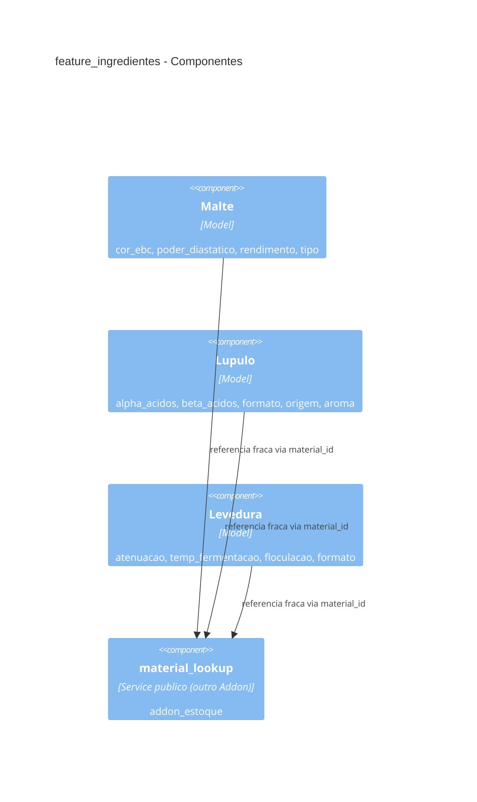

# 02 — Diagrama C4 (Feature Ingredientes — Componente)

```mermaid
C4Component
    title feature_ingredientes - Componentes

    Component(malte, "Malte", "Model", "cor_ebc, poder_diastatico, rendimento, tipo")
    Component(lupulo, "Lupulo", "Model", "alpha_acidos, beta_acidos, formato, origem, aroma")
    Component(levedura, "Levedura", "Model", "atenuacao, temp_fermentacao, floculacao, formato")
    Component(lookup_ext, "material_lookup", "Service publico (outro Addon)", "addon_estoque")

    Rel(malte, lookup_ext, "referencia fraca via material_id")
    Rel(lupulo, lookup_ext, "referencia fraca via material_id")
    Rel(levedura, lookup_ext, "referencia fraca via material_id")
```
