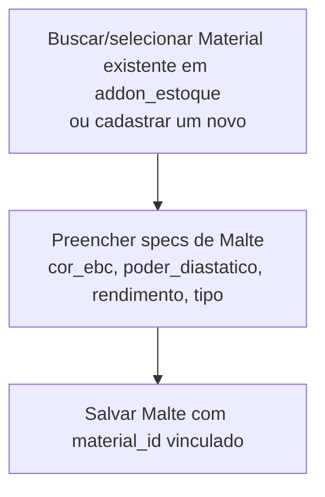

# 03 — Fluxos (Feature Ingredientes)

## Caminho feliz: cadastro de Malte

```mermaid
flowchart TD
    A[Buscar/selecionar Material existente em addon_estoque<br/>ou cadastrar um novo] --> B[Preencher specs de Malte<br/>cor_ebc, poder_diastatico, rendimento, tipo]
    B --> C[Salvar Malte com material_id vinculado]
```

Mesma estrutura para Lúpulo e Levedura, trocando os campos
específicos.
