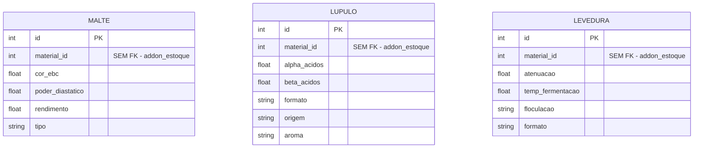

# 04 — Modelo de Dados (Feature Ingredientes)

Tabelas reais: `tesseract_brewstation_ingr_malte`,
`tesseract_brewstation_ingr_lupulo`,
`tesseract_brewstation_ingr_levedura`.

`material_id` em cada uma resolve, sem FK, para
`addon_estoque.tesseract_estoque_material.id`, via `material_lookup`.
