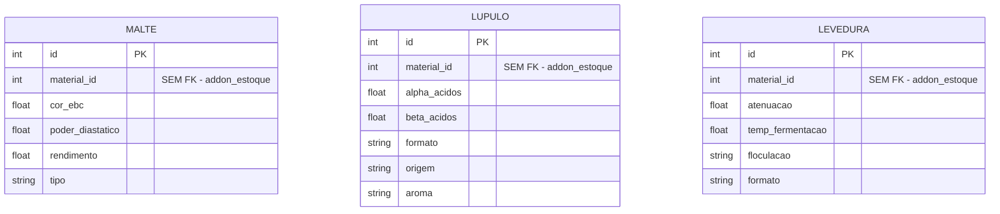
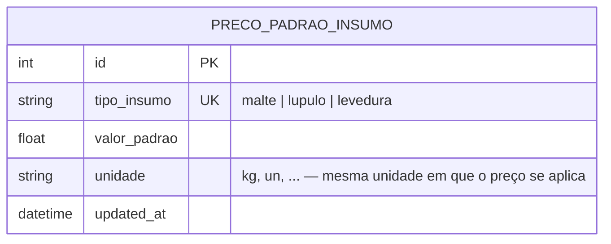

# 04 — Modelo de Dados (Feature Ingredientes)

```mermaid
erDiagram
    MALTE {
        int id PK
        int material_id "SEM FK - addon_estoque"
        float cor_ebc
        float poder_diastatico
        float rendimento
        string tipo
    }
    LUPULO {
        int id PK
        int material_id "SEM FK - addon_estoque"
        float alpha_acidos
        float beta_acidos
        string formato
        string origem
        string aroma
    }
    LEVEDURA {
        int id PK
        int material_id "SEM FK - addon_estoque"
        float atenuacao
        float temp_fermentacao
        string floculacao
        string formato
    }
```

Tabelas reais: `tesseract_brewstation_ingr_malte`,
`tesseract_brewstation_ingr_lupulo`,
`tesseract_brewstation_ingr_levedura`.

`material_id` em cada uma resolve, sem FK, para
`addon_estoque.tesseract_estoque_material.id`, via `material_lookup`.

```mermaid
erDiagram
    PRECO_PADRAO_INSUMO {
        int id PK
        string tipo_insumo UK "malte | lupulo | levedura"
        float valor_padrao
        string unidade "kg, un, ... — mesma unidade em que o preço se aplica"
        datetime updated_at
    }
```

Tabela real: `tesseract_brewstation_ingr_preco_padrao_insumo`. Não
referencia `Malte`/`Lupulo`/`Levedura` nem `Material` — é indexada só
pelo `tipo_insumo` (string, `UniqueConstraint`), resolvida em runtime
por `feature_envase/services/precificacao_service._tipo_insumo_do_material()`
checando em qual das 3 tabelas o `material_id` aparece.
