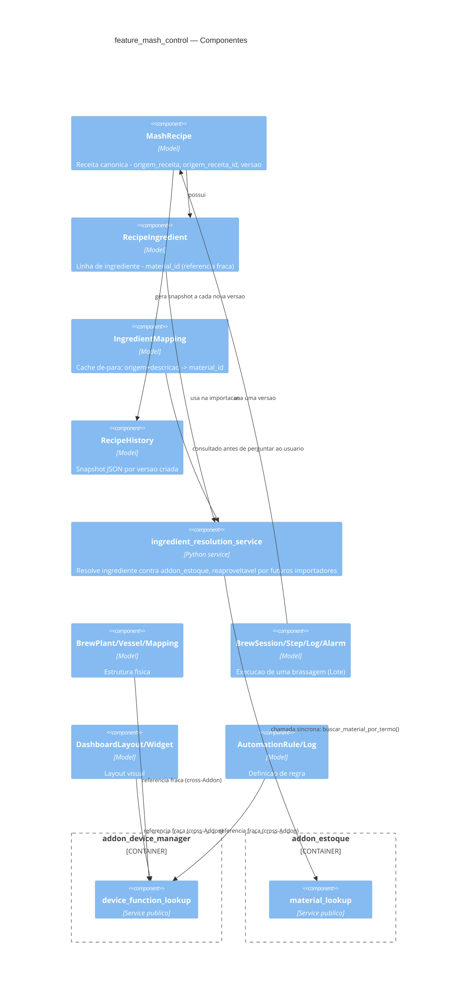

# 02 — Diagrama C4 (Feature Mash Control — Componente)

## Correção desta rodada

As `Rel` pra `addon_device_manager` eram descritas como "FK
cross-Feature" no diagrama anterior — **estava desatualizado**: desde
a promoção de `device_manager` a Addon independente (skill 05), a
relação real é referência fraca via service público
(`device_function_lookup`), sem FK. O código já refletia isso; só o
diagrama não tinha acompanhado.
