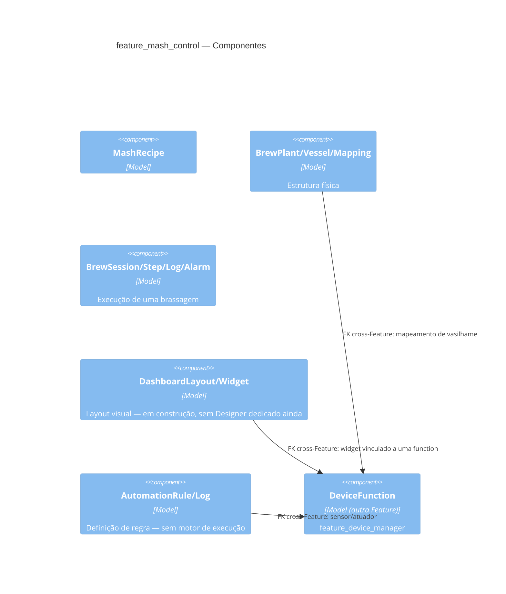

# 02 — Diagrama C4 (Feature Mash Control — Componente)

```mermaid
C4Component
    title feature_mash_control — Componentes

    Component(recipe, "MashRecipe", "Model")
    Component(plant, "BrewPlant/Vessel/Mapping", "Model", "Estrutura física")
    Component(session, "BrewSession/Step/Log/Alarm", "Model", "Execução de uma brassagem")
    Component(dashboard, "DashboardLayout/Widget", "Model", "Layout visual — em construção, sem Designer dedicado ainda")
    Component(rule, "AutomationRule/Log", "Model", "Definição de regra — sem motor de execução")
    Component(devicefunc, "DeviceFunction", "Model (outra Feature)", "feature_device_manager")

    Rel(plant, devicefunc, "FK cross-Feature: mapeamento de vasilhame")
    Rel(rule, devicefunc, "FK cross-Feature: sensor/atuador")
    Rel(dashboard, devicefunc, "FK cross-Feature: widget vinculado a uma function")
```
