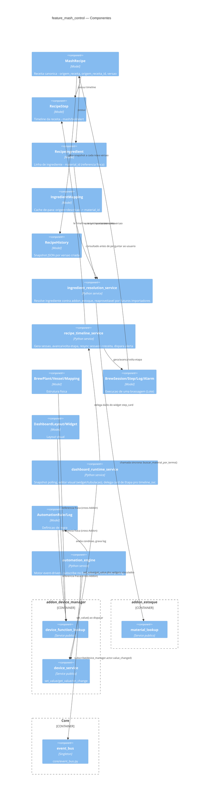

# 02 — Diagrama C4 (Feature Mash Control — Componente)

```mermaid
C4Component
    title feature_mash_control — Componentes

    Component(recipe, "MashRecipe", "Model", "Receita canonica - origem_receita, origem_receita_id, versao")
    Component(recipe_step, "RecipeStep", "Model", "Timeline da receita - mash/boil/alert")
    Component(recipe_ingr, "RecipeIngredient", "Model", "Linha de ingrediente - material_id (referencia fraca)")
    Component(recipe_map, "IngredientMapping", "Model", "Cache de-para: origem+descricao -> material_id")
    Component(recipe_hist, "RecipeHistory", "Model", "Snapshot JSON por versao criada")
    Component(resolve_svc, "ingredient_resolution_service", "Python service", "Resolve ingrediente contra addon_estoque, reaproveitavel por futuros importadores")
    Component(timeline_svc, "recipe_timeline_service", "Python service", "Gera sessao, avanca/volta etapa, resync sessao<->receita, dispara alerta")
    Component(plant, "BrewPlant/Vessel/Mapping", "Model", "Estrutura fisica")
    Component(session, "BrewSession/Step/Log/Alarm", "Model", "Execucao de uma brassagem (Lote)")
    Component(dashboard, "DashboardLayout/Widget", "Model", "Layout visual")
    Component(dashboard_svc, "dashboard_runtime_service", "Python service", "Snapshot polling, editor visual (widget/tubulacao), delega card de Etapa pro timeline_svc")
    Component(rule, "AutomationRule/Log", "Model", "Definicao de regra")
    Component(engine, "automation_engine", "Python service", "Motor event-driven - subscribe no EventBus do Core, sem polling")

    Container_Boundary(devicemanager_ext, "addon_device_manager") {
        Component(devicefunc_lookup, "device_function_lookup", "Service publico")
        Component(device_svc, "device_service", "Service publico", "set_value/get_value/on_change")
    }
    Container_Boundary(estoque_ext, "addon_estoque") {
        Component(material_lookup, "material_lookup", "Service publico")
    }
    Container_Boundary(core_ext, "Core") {
        Component(event_bus, "event_bus", "Singleton", "core/event_bus.py")
    }

    Rel(plant, devicefunc_lookup, "referencia fraca (cross-Addon)")
    Rel(rule, devicefunc_lookup, "referencia fraca (cross-Addon)")
    Rel(dashboard, devicefunc_lookup, "referencia fraca (cross-Addon)")
    Rel(resolve_svc, material_lookup, "chamada sincrona: buscar_material_por_termo()")
    Rel(recipe_ingr, resolve_svc, "usa na importacao")
    Rel(recipe_map, resolve_svc, "consultado antes de perguntar ao usuario")
    Rel(recipe, recipe_ingr, "possui")
    Rel(recipe, recipe_step, "possui timeline")
    Rel(recipe, recipe_hist, "gera snapshot a cada nova versao")
    Rel(session, recipe, "usa uma versao")
    Rel(timeline_svc, session, "gera/avanca/volta etapa")
    Rel(timeline_svc, recipe_step, "le timeline, resync sessao<->receita")
    Rel(dashboard_svc, timeline_svc, "delega dado do widget step_card")
    Rel(dashboard_svc, device_svc, "set_value/get_value dos widgets vinculados")
    Rel(engine, event_bus, "subscribe(device_manager.actor.value_changed)")
    Rel(engine, device_svc, "set_value() ao disparar")
    Rel(engine, rule, "avalia condicao, grava log")
```

## Correção desta rodada

As `Rel` pra `addon_device_manager` eram descritas como "FK
cross-Feature" no diagrama anterior — **estava desatualizado**: desde
a promoção de `device_manager` a Addon independente (skill 05), a
relação real é referência fraca via service público
(`device_function_lookup`), sem FK. O código já refletia isso; só o
diagrama não tinha acompanhado.

## Correção de rodada posterior (Dashboard + motor de automação)

O diagrama não tinha nenhum **componente de service** — só models e
relações de referência fraca. Corrigido: `recipe_timeline_service`
(orquestra geração/avanço/retrocesso de etapa e o resync
sessão↔receita), `dashboard_runtime_service` (snapshot do Dashboard,
editor visual) e `automation_engine` (motor real, event-driven via
`core/event_bus.py` — não existia enquanto componente neste diagrama,
mesmo já implementado e em produção).
