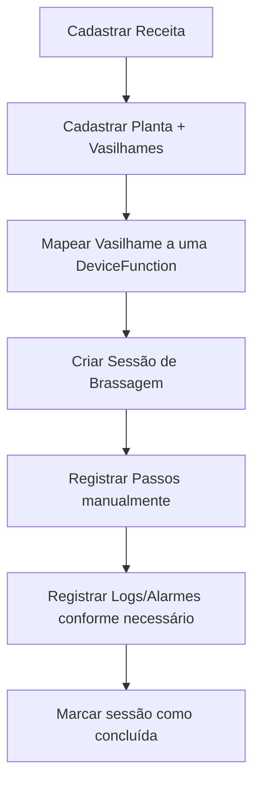
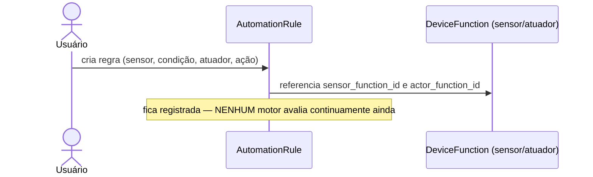

# 03 — Fluxos (Feature Mash Control)

## Caminho feliz: sessão de brassagem (manual, sem automação)

```mermaid
flowchart TD
    A[Cadastrar Receita] --> B[Cadastrar Planta + Vasilhames]
    B --> C[Mapear Vasilhame a uma DeviceFunction]
    C --> D[Criar Sessão de Brassagem]
    D --> E[Registrar Passos manualmente]
    E --> F[Registrar Logs/Alarmes conforme necessário]
    F --> G[Marcar sessão como concluída]
```

## Sequência: regra de automação (definição apenas, sem execução)

```mermaid
sequenceDiagram
    actor U as Usuário
    participant Rule as AutomationRule
    participant DF as DeviceFunction (sensor/atuador)

    U->>Rule: cria regra (sensor, condição, atuador, ação)
    Rule->>DF: referencia sensor_function_id e actor_function_id
    Note over Rule: fica registrada — NENHUM motor avalia continuamente ainda
```
