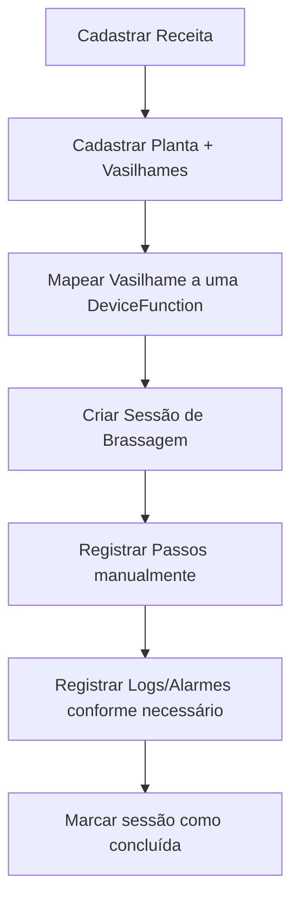
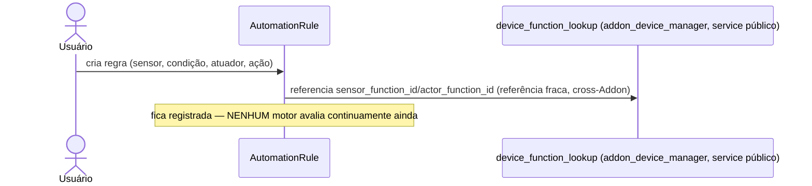
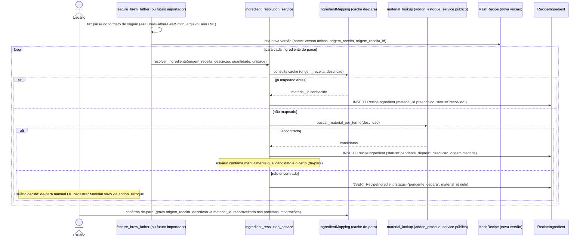
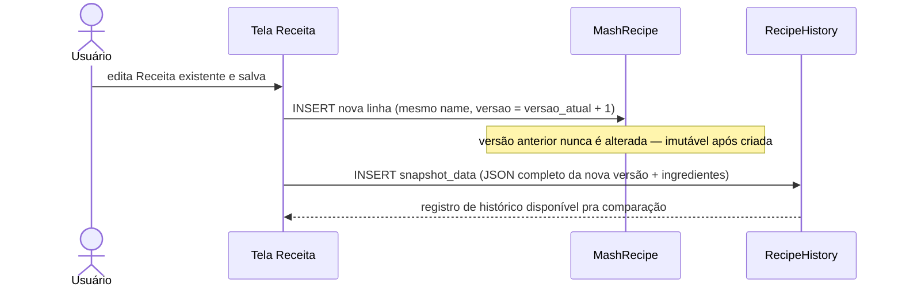

# 03 — Fluxos (Feature Mash Control)

## Caminho feliz: sessão de brassagem (manual, sem automação)

## Sequência: regra de automação (definição apenas, sem execução)

## Sequência: importação de receita + resolução de ingrediente (novo)

## Sequência: nova versão de receita ao salvar edição

