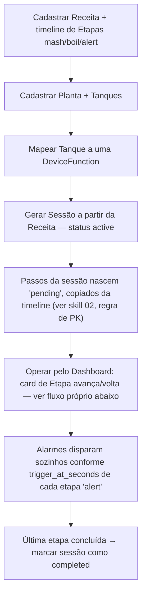
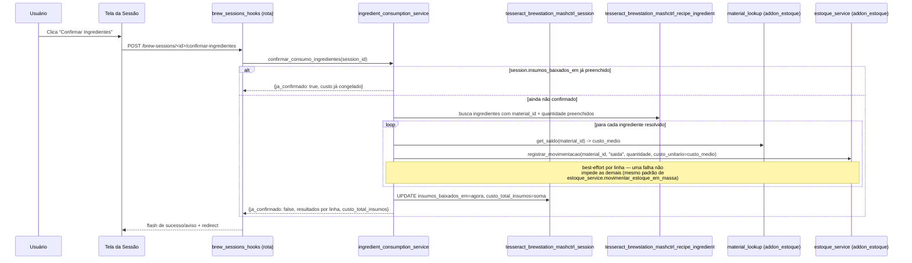
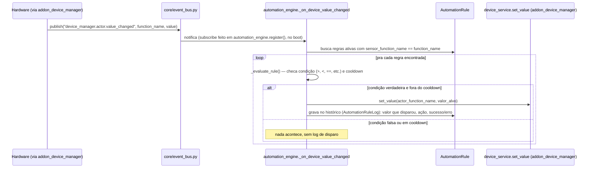
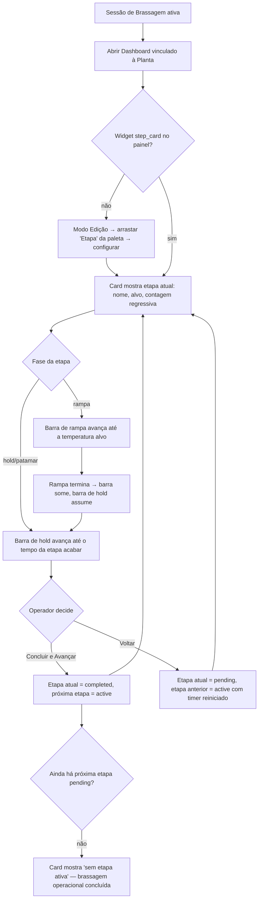
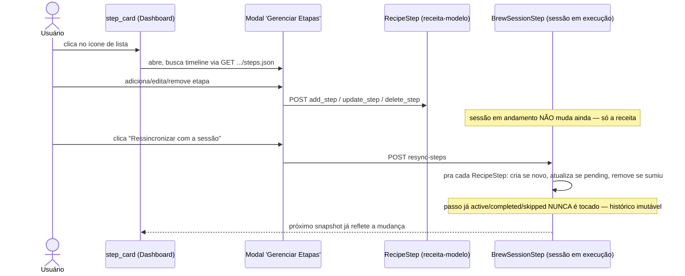
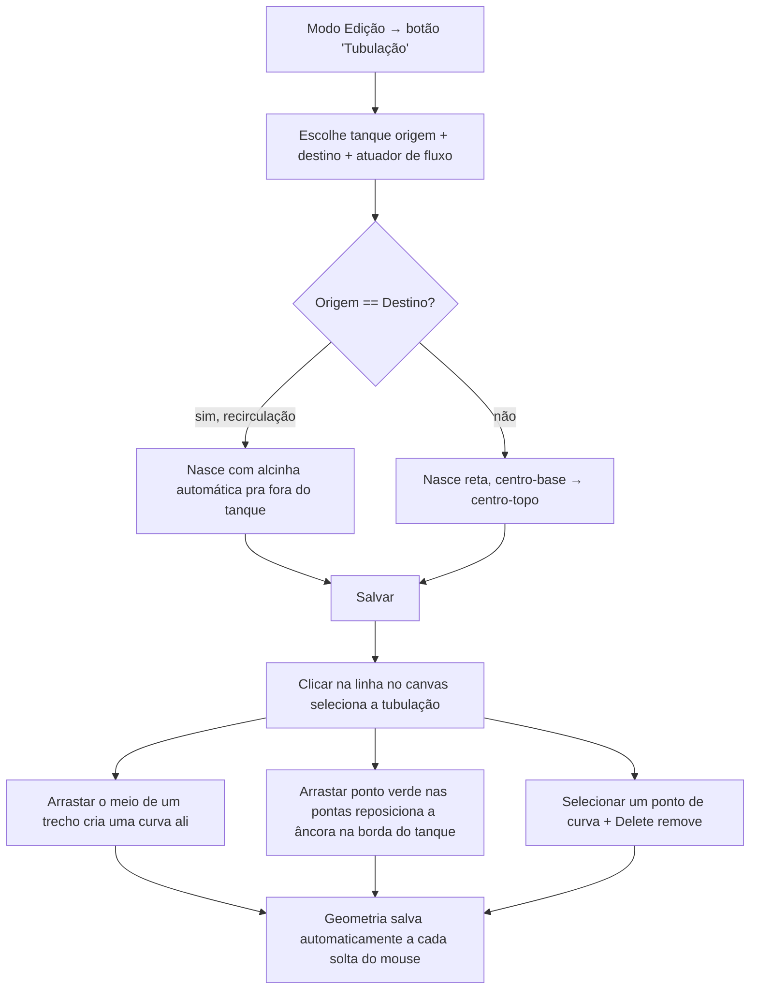
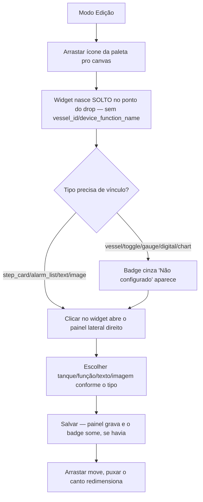
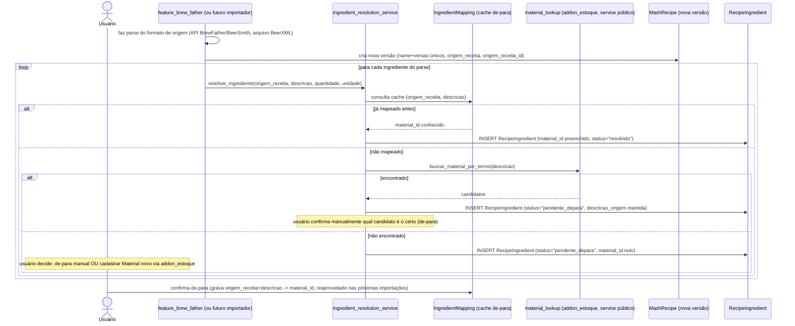
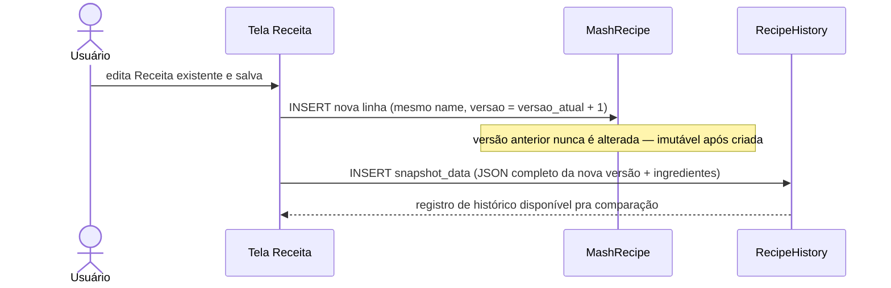

# 03 — Fluxos (Feature Mash Control)

## Caminho feliz: sessão de brassagem, do cadastro à operação

```mermaid
flowchart TD
    A[Cadastrar Receita + timeline de Etapas mash/boil/alert] --> B[Cadastrar Planta + Tanques]
    B --> C[Mapear Tanque a uma DeviceFunction]
    C --> D[Gerar Sessão a partir da Receita — status active]
    D --> E["Passos da sessão nascem 'pending', copiados da timeline (ver skill 02, regra de PK)"]
    E --> F[Operar pelo Dashboard: card de Etapa avança/volta — ver fluxo próprio abaixo]
    F --> G[Alarmes disparam sozinhos conforme trigger_at_seconds de cada etapa 'alert']
    G --> H[Última etapa concluída → marcar sessão como completed]
```

## Sequência: Confirmar Ingredientes (skill 26, 2026-09-01)

```mermaid
sequenceDiagram
    participant User as Usuário
    participant UI as Tela da Sessão
    participant Hook as brew_sessions_hooks (rota)
    participant IngSvc as ingredient_consumption_service
    participant Session as tesseract_brewstation_mashctrl_session
    participant RecIng as tesseract_brewstation_mashctrl_recipe_ingredient
    participant Lookup as material_lookup (addon_estoque)
    participant EstSvc as estoque_service (addon_estoque)

    User->>UI: Clica "Confirmar Ingredientes"
    UI->>Hook: POST /brew-sessions/<id>/confirmar-ingredientes
    Hook->>IngSvc: confirmar_consumo_ingredientes(session_id)

    alt session.insumos_baixados_em já preenchido
        IngSvc-->>Hook: {ja_confirmado: true, custo já congelado}
    else ainda não confirmado
        IngSvc->>RecIng: busca ingredientes com material_id + quantidade preenchidos
        loop para cada ingrediente resolvido
            IngSvc->>Lookup: get_saldo(material_id) -> custo_medio
            IngSvc->>EstSvc: registrar_movimentacao(material_id, "saida", quantidade, custo_unitario=custo_medio)
            Note over IngSvc,EstSvc: best-effort por linha — uma falha não<br/>impede as demais (mesmo padrão de<br/>estoque_service.movimentar_estoque_em_massa)
        end
        IngSvc->>Session: UPDATE insumos_baixados_em=agora, custo_total_insumos=soma
        IngSvc-->>Hook: {ja_confirmado: false, resultados por linha, custo_total_insumos}
    end

    Hook-->>UI: flash de sucesso/aviso + redirect
```

Ingredientes sem `material_id` resolvido (ainda pendente de de-para,
ver `feature_brew_father`) são pulados silenciosamente — não contam
como falha, só ficam de fora do cálculo/baixa até alguém resolver o
de-para deles.

Este mesmo service é chamado de novo, como fallback, quando um Envase
é registrado sem essa confirmação ter acontecido antes — ver
`feature_envase/docs/technical/03-fluxos.md`, primeiro diagrama.

## Sequência: motor de automação (event-driven, já dispara de verdade)

> Corrigido — a versão anterior deste documento descrevia só o
> cadastro da regra, sem execução ("nenhum motor avalia
> continuamente ainda"). O motor foi implementado e está em produção:
> reage a cada evento de mudança de valor publicado no EventBus do
> Core, sem polling e sem scheduler próprio.

```mermaid
sequenceDiagram
    participant HW as Hardware (via addon_device_manager)
    participant Bus as core/event_bus.py
    participant Engine as automation_engine._on_device_value_changed
    participant Rule as AutomationRule
    participant Svc as device_service.set_value (addon_device_manager)

    HW->>Bus: publish("device_manager.actor.value_changed", function_name, value)
    Bus->>Engine: notifica (subscribe feito em automation_engine.register(), no boot)
    Engine->>Rule: busca regras ativas com sensor_function_name == function_name
    loop pra cada regra encontrada
        Engine->>Engine: _evaluate_rule() — checa condição (>, <, ==, etc.) e cooldown
        alt condição verdadeira e fora do cooldown
            Engine->>Svc: set_value(actor_function_name, valor_alvo)
            Engine->>Rule: grava no histórico (AutomationRuleLog): valor que disparou, ação, sucesso/erro
        else condição falsa ou em cooldown
            Note over Engine: nada acontece, sem log de disparo
        end
    end
```

## Fluxo: operar uma brassagem pelo Dashboard (caminho feliz)

```mermaid
flowchart TD
    A[Sessão de Brassagem ativa] --> B[Abrir Dashboard vinculado à Planta]
    B --> C{Widget step_card no painel?}
    C -- não --> C1[Modo Edição → arrastar 'Etapa' da paleta → configurar] --> D
    C -- sim --> D[Card mostra etapa atual: nome, alvo, contagem regressiva]
    D --> E{Fase da etapa}
    E -- rampa --> E1[Barra de rampa avança até a temperatura alvo]
    E1 --> E2[Rampa termina → barra some, barra de hold assume]
    E -- hold/patamar --> F[Barra de hold avança até o tempo da etapa acabar]
    E2 --> F
    F --> G{Operador decide}
    G -- "Concluir e Avançar" --> H[Etapa atual = completed, próxima etapa = active]
    G -- "Voltar" --> I[Etapa atual = pending, etapa anterior = active com timer reiniciado]
    H --> D
    I --> D
    H --> J{Ainda há próxima etapa pending?}
    J -- não --> K[Card mostra 'sem etapa ativa' — brassagem operacional concluída]
```

Nota: a ativação da primeira etapa (`pending` → `active`) acontece
sozinha, de forma preguiçosa, na primeira vez que o snapshot do
Dashboard é lido depois da sessão nascer `active` — não precisa de
nenhuma ação manual pra "começar" a primeira etapa.

## Sequência: editar a receita e ressincronizar com a sessão em andamento

```mermaid
sequenceDiagram
    actor U as Usuário
    participant Card as step_card (Dashboard)
    participant Modal as Modal 'Gerenciar Etapas'
    participant RecipeStep as RecipeStep (receita-modelo)
    participant SessionStep as BrewSessionStep (sessão em execução)

    U->>Card: clica no ícone de lista
    Card->>Modal: abre, busca timeline via GET .../steps.json
    U->>Modal: adiciona/edita/remove etapa
    Modal->>RecipeStep: POST add_step / update_step / delete_step
    Note over SessionStep: sessão em andamento NÃO muda ainda — só a receita
    U->>Modal: clica "Ressincronizar com a sessão"
    Modal->>SessionStep: POST resync-steps
    SessionStep->>SessionStep: pra cada RecipeStep: cria se novo, atualiza se pending, remove se sumiu
    Note over SessionStep: passo já active/completed/skipped NUNCA é tocado — histórico imutável
    SessionStep-->>Card: próximo snapshot já reflete a mudança
```

## Fluxo: editor de tubulação (CAD-like, incluindo recirculação)

```mermaid
flowchart TD
    A[Modo Edição → botão 'Tubulação'] --> B[Escolhe tanque origem + destino + atuador de fluxo]
    B --> C{Origem == Destino?}
    C -- sim, recirculação --> C1[Nasce com alcinha automática pra fora do tanque]
    C -- não --> C2[Nasce reta, centro-base → centro-topo]
    C1 --> D[Salvar]
    C2 --> D
    D --> E[Clicar na linha no canvas seleciona a tubulação]
    E --> F[Arrastar o meio de um trecho cria uma curva ali]
    E --> G[Arrastar ponto verde nas pontas reposiciona a âncora na borda do tanque]
    E --> H[Selecionar um ponto de curva + Delete remove]
    F & G & H --> I[Geometria salva automaticamente a cada solta do mouse]
```

## Fluxo: montar um widget pelo Dashboard (paleta + painel lateral)

```mermaid
flowchart TD
    A[Modo Edição] --> B[Arrastar ícone da paleta pro canvas]
    B --> C[Widget nasce SOLTO no ponto do drop — sem vessel_id/device_function_name]
    C --> D{Tipo precisa de vínculo?}
    D -- "vessel/toggle/gauge/digital/chart" --> D1[Badge cinza 'Não configurado' aparece]
    D -- "step_card/alarm_list/text/image" --> E
    D1 --> E[Clicar no widget abre o painel lateral direito]
    E --> F[Escolher tanque/função/texto/imagem conforme o tipo]
    F --> G[Salvar — painel grava e o badge some, se havia]
    G --> H[Arrastar move, puxar o canto redimensiona]
```

## Sequência: importação de receita + resolução de ingrediente (novo)

```mermaid
sequenceDiagram
    actor U as Usuário
    participant Importer as feature_brew_father (ou futuro importador)
    participant Resolve as ingredient_resolution_service
    participant Mapping as IngredientMapping (cache de-para)
    participant Lookup as material_lookup (addon_estoque, service público)
    participant Recipe as MashRecipe (nova versão)
    participant Ingr as RecipeIngredient

    Importer->>Importer: faz parse do formato de origem (API BrewFather/BeerSmith, arquivo BeerXML)
    Importer->>Recipe: cria nova versão (name+versao únicos, origem_receita, origem_receita_id)

    loop para cada ingrediente do parse
        Importer->>Resolve: resolver_ingrediente(origem_receita, descricao, quantidade, unidade)
        Resolve->>Mapping: consulta cache (origem_receita, descricao)
        alt já mapeado antes
            Mapping-->>Resolve: material_id conhecido
            Resolve->>Ingr: INSERT RecipeIngredient (material_id preenchido, status="resolvido")
        else não mapeado
            Resolve->>Lookup: buscar_material_por_termo(descricao)
            alt encontrado
                Lookup-->>Resolve: candidatos
                Resolve->>Ingr: INSERT RecipeIngredient (status="pendente_depara", descricao_origem mantida)
                Note over Resolve: usuário confirma manualmente qual candidato é o certo (de-para)
            else não encontrado
                Resolve->>Ingr: INSERT RecipeIngredient (status="pendente_depara", material_id nulo)
                Note over U: usuário decide: de-para manual OU cadastrar Material novo via addon_estoque
            end
        end
    end

    U->>Mapping: confirma de-para (grava origem_receita+descricao -> material_id, reaproveitado nas próximas importações)
```

## Sequência: nova versão de receita ao salvar edição

```mermaid
sequenceDiagram
    actor U as Usuário
    participant UI as Tela Receita
    participant Recipe as MashRecipe
    participant Hist as RecipeHistory

    U->>UI: edita Receita existente e salva
    UI->>Recipe: INSERT nova linha (mesmo name, versao = versao_atual + 1)
    Note over Recipe: versão anterior nunca é alterada — imutável após criada
    UI->>Hist: INSERT snapshot_data (JSON completo da nova versão + ingredientes)
    Hist-->>UI: registro de histórico disponível pra comparação
```

## Prévia e decisão de consumo (2026-09-25)

`conferir_ingredientes(recipe_id)` lê as linhas da receita sem gravar nada; classifica como `pronto` somente com `status_resolucao=resolvido`, Material vinculado, quantidade positiva e conversão confiável. `status_resolucao=ignorado` registra a escolha explícita de não consumir. Qualquer `pendente` impede `confirmar_consumo_ingredientes`, inclusive durante o fallback transacional do envase. O controller gerado oferece `detail_context_extra` para que o hook de BrewSession apresente a prévia no detalhe do lote sem alterar a lógica de outros modelos. A confirmação mantém custo e baixa idempotentes.

**Inicialização dos hooks:** o blueprint do controller deve existir antes de importar `brew_sessions_hooks.py`, pois o hook importa o blueprint para registrar a rota de confirmação. O template do CrudGen define o blueprint primeiro; assim `detail_context_extra` é carregado na primeira importação e a prévia aparece na tela.
