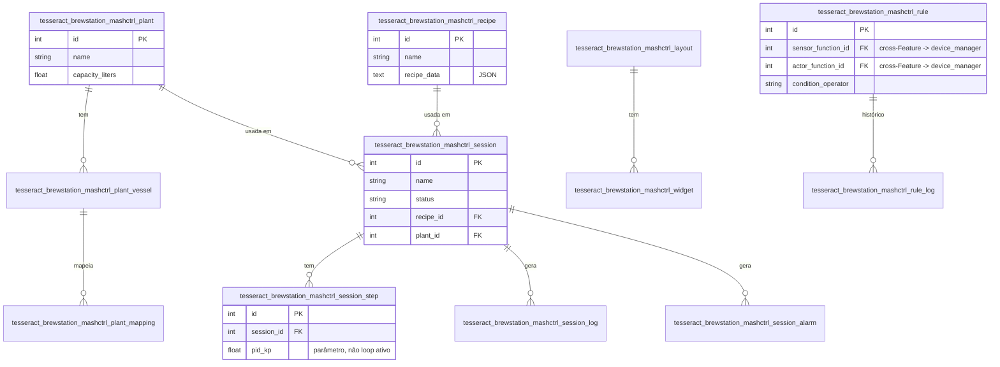

# 04 — Modelo de Dados (Feature Mash Control)

> 12 entidades, escopo CRUD (sem motor de controle em tempo real —
> ver `BACKLOG.md`, Fase 6).

## Colunas não óbvias

| Tabela | Coluna | Descrição |
|---|---|---|
| `..._session_step` | `pid_kp`/`pid_ki`/`pid_kd` | Só **parâmetros configurados** — o loop de controle PID que de fato os usaria em tempo real não foi portado (decisão registrada) |
| `..._rule` | `sensor_function_id`/`actor_function_id` | FK **cross-Feature** para `DeviceFunction` (`feature_device_manager`) — permitido por serem do mesmo Addon |
| `..._recipe` | `recipe_data` | JSON serializado como texto — sem schema fixo |
| (todas) | `is_deleted`/`deleted_at` | Soft-delete padrão (skill 02) |

## FK entre módulos

`BrewPlantMapping.device_function_id`, `DashboardWidget.device_function_id`,
`AutomationRule.sensor_function_id`/`actor_function_id` — todas FK
cross-Feature para `feature_device_manager`, dentro do mesmo Addon
(`addon_brewstation`). Skill 02 permite explicitamente esse caso desde
a Fase 6.
