# 04 — Modelo de Dados (Feature Mash Control)

> 15 entidades nesta rodada (12 já existentes + `RecipeIngredient` +
> `IngredientMapping` + `RecipeHistory`), escopo CRUD (sem motor de
> controle em tempo real — ver `BACKLOG.md`, Fase 6).

```mermaid
erDiagram
    tesseract_brewstation_mashctrl_plant ||--o{ tesseract_brewstation_mashctrl_plant_vessel : "tem"
    tesseract_brewstation_mashctrl_plant_vessel ||--o{ tesseract_brewstation_mashctrl_plant_mapping : "mapeia"
    tesseract_brewstation_mashctrl_recipe ||--o{ tesseract_brewstation_mashctrl_session : "usada em"
    tesseract_brewstation_mashctrl_recipe ||--o{ tesseract_brewstation_mashctrl_recipe_ingredient : "possui"
    tesseract_brewstation_mashctrl_recipe ||--o{ tesseract_brewstation_mashctrl_recipe_history : "gera snapshot"
    tesseract_brewstation_mashctrl_plant ||--o{ tesseract_brewstation_mashctrl_session : "usada em"
    tesseract_brewstation_mashctrl_session ||--o{ tesseract_brewstation_mashctrl_session_step : "tem"
    tesseract_brewstation_mashctrl_session ||--o{ tesseract_brewstation_mashctrl_session_log : "gera"
    tesseract_brewstation_mashctrl_session ||--o{ tesseract_brewstation_mashctrl_session_alarm : "gera"
    tesseract_brewstation_mashctrl_layout ||--o{ tesseract_brewstation_mashctrl_widget : "tem"
    tesseract_brewstation_mashctrl_rule ||--o{ tesseract_brewstation_mashctrl_rule_log : "histórico"

    tesseract_brewstation_mashctrl_recipe {
        int id PK
        string name
        string origem_receita "BrewFather | BeerSmith | BeerXML | Manual"
        string origem_receita_id "nullable se Manual"
        int versao
        boolean ativo
        text description
        text equipment_mapping
        int created_by FK
    }
    tesseract_brewstation_mashctrl_recipe_ingredient {
        int id PK
        int recipe_id FK "mesma Feature, FK real"
        int material_id "SEM FK - addon_estoque, referencia fraca"
        string descricao_origem "texto bruto da importacao, mantido mesmo apos resolvido"
        float quantidade
        string unidade_medida
        int tempo_adicao_min
        string etapa "mostura | fervura | fermentacao | ..."
        string status_resolucao "resolvido | pendente_depara"
    }
    tesseract_brewstation_mashctrl_ingredient_mapping {
        int id PK
        string origem_receita
        string descricao_origem
        int material_id "SEM FK - addon_estoque"
    }
    tesseract_brewstation_mashctrl_recipe_history {
        int id PK
        int recipe_id FK
        json snapshot_data "copia completa da receita + ingredientes"
        int alterado_por FK "tesseract_user.id"
        datetime alterado_em
        text observacao
    }
    tesseract_brewstation_mashctrl_plant {
        int id PK
        string name
        float capacity_liters
    }
    tesseract_brewstation_mashctrl_session {
        int id PK
        string name
        string status
        int recipe_id FK
        int plant_id FK
    }
    tesseract_brewstation_mashctrl_session_step {
        int id PK
        int session_id FK
        float pid_kp "parâmetro, não loop ativo"
    }
    tesseract_brewstation_mashctrl_rule {
        int id PK
        int sensor_function_id "SEM FK - addon_device_manager, referencia fraca"
        int actor_function_id "SEM FK - addon_device_manager, referencia fraca"
        string condition_operator
    }
```

## Colunas não óbvias

| Tabela | Coluna | Descrição |
|---|---|---|
| `..._session_step` | `pid_kp`/`pid_ki`/`pid_kd` | Só parâmetros configurados — loop de controle não portado |
| `..._recipe` | `origem_receita`/`origem_receita_id`/`versao` | Substituem `brewfather_recipe_id`. `unique(name, versao)`. Toda modificação salva cria nova versão — linhas são imutáveis após criadas |
| `..._recipe` | `recipe_data` | **Removido nesta rodada** — substituído por `recipe_ingredient` normalizada |
| `..._recipe_ingredient` | `material_id` | Referência fraca pra `addon_estoque.tesseract_estoque_material.id` — nullable até resolução (de-para ou cadastro) |
| `..._recipe_ingredient` | `status_resolucao` | Controla se o ingrediente já foi casado com um Material ou ainda está pendente de intervenção do usuário |
| `..._ingredient_mapping` | (todas) | Cache — evita perguntar a mesma resolução em toda nova importação da mesma origem+descrição |
| `..._recipe_history` | `snapshot_data` | JSON completo, não campo-a-campo — é arquivo de auditoria/comparação, não tela de operação, por isso JSON aqui não colide com a restrição de filtro tipado usada em `Material` |
| `..._rule` | `sensor_function_id`/`actor_function_id` | **Correção desta rodada**: eram FK cross-Feature pra `DeviceFunction`; agora são referência fraca cross-Addon (`device_manager` foi promovido) — coluna não é mais FK de banco, é `Integer` solto resolvido via `device_function_lookup` |
| (todas) | `is_deleted`/`deleted_at` | Soft-delete padrão (skill 02), exceto `recipe_history` (é ledger de auditoria, mesma lógica de `tesseract_estoque_movimentacao`) |

## FK entre módulos

**Real (mesmo Addon, permitida pela skill 02)**:
`recipe_ingredient.recipe_id` → `recipe.id`;
`recipe_history.recipe_id` → `recipe.id`;
`session.recipe_id` → `recipe.id`;
`feature_envase.envase.lote_id` → `session.id` (Feature externa a
este documento, ver `features/feature_envase/docs/technical/04-modelo-de-dados.md`).

**Referência fraca (cross-Addon, sem FK)**:
`rule.sensor_function_id`/`actor_function_id`,
`plant_mapping.device_function_id`, `dashboard_widget.device_function_id`
→ `addon_device_manager` (via `device_function_lookup`);
`recipe_ingredient.material_id`, `ingredient_mapping.material_id` →
`addon_estoque` (via `material_lookup`).
