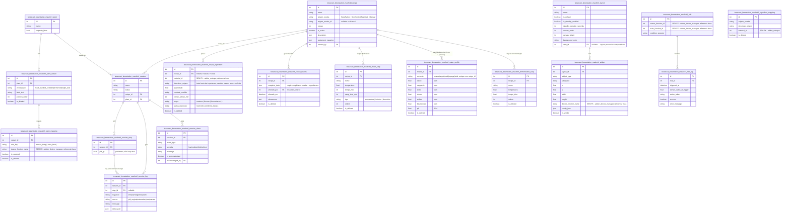

# 04 — Modelo de Dados (Feature Mash Control)

> 18 entidades — escopo CRUD completo + motor de automação reativo
> (via EventBus, ver `03-fluxos.md`), sem loop de controle PID ativo
> (parâmetros configurados em `session_step`, mas o loop em si não foi
> portado — ver `BACKLOG.md`, Fase 6).

```mermaid
erDiagram
    tesseract_brewstation_mashctrl_plant ||--o{ tesseract_brewstation_mashctrl_plant_vessel : "tem"
    tesseract_brewstation_mashctrl_plant_vessel ||--o{ tesseract_brewstation_mashctrl_plant_mapping : "mapeia"
    tesseract_brewstation_mashctrl_recipe ||--o{ tesseract_brewstation_mashctrl_session : "usada em"
    tesseract_brewstation_mashctrl_recipe ||--o{ tesseract_brewstation_mashctrl_recipe_ingredient : "possui"
    tesseract_brewstation_mashctrl_recipe ||--o{ tesseract_brewstation_mashctrl_recipe_history : "gera snapshot"
    tesseract_brewstation_mashctrl_recipe ||--o{ tesseract_brewstation_mashctrl_mash_step : "etapas de mostura"
    tesseract_brewstation_mashctrl_recipe ||--o{ tesseract_brewstation_mashctrl_water_profile : "perfil de água (até 5, por contexto)"
    tesseract_brewstation_mashctrl_recipe ||--o{ tesseract_brewstation_mashctrl_fermentation_step : "etapas de fermentação"
    tesseract_brewstation_mashctrl_plant ||--o{ tesseract_brewstation_mashctrl_session : "usada em"
    tesseract_brewstation_mashctrl_session ||--o{ tesseract_brewstation_mashctrl_session_step : "tem"
    tesseract_brewstation_mashctrl_session ||--o{ tesseract_brewstation_mashctrl_session_log : "gera"
    tesseract_brewstation_mashctrl_session ||--o{ tesseract_brewstation_mashctrl_session_alarm : "gera"
    tesseract_brewstation_mashctrl_session_step ||--o{ tesseract_brewstation_mashctrl_session_log : "log pode referenciar etapa"
    tesseract_brewstation_mashctrl_layout ||--o{ tesseract_brewstation_mashctrl_widget : "tem"
    tesseract_brewstation_mashctrl_rule ||--o{ tesseract_brewstation_mashctrl_rule_log : "histórico"

    tesseract_brewstation_mashctrl_recipe {
        int id PK
        string name
        string origem_receita "BrewFather | BeerSmith | BeerXML | Manual"
        string origem_receita_id "nullable se Manual"
        int versao
        boolean is_active
        text description
        text equipment_mapping
        int created_by FK
    }
    tesseract_brewstation_mashctrl_recipe_ingredient {
        int id PK
        int recipe_id FK "mesma Feature, FK real"
        int material_id "SEM FK - addon_estoque, referencia fraca"
        string descricao_origem "texto bruto da importacao, mantido mesmo apos resolvido"
        float quantidade
        string unidade_medida
        int tempo_adicao_min
        string etapa "mostura | fervura | fermentacao | ..."
        string status_resolucao "resolvido | pendente_depara"
        boolean is_deleted
    }
    tesseract_brewstation_mashctrl_ingredient_mapping {
        int id PK
        string origem_receita
        string descricao_origem
        int material_id "SEM FK - addon_estoque"
        boolean is_deleted
    }
    tesseract_brewstation_mashctrl_recipe_history {
        int id PK
        int recipe_id FK
        json snapshot_data "copia completa da receita + ingredientes"
        int alterado_por FK "tesseract_user.id"
        datetime alterado_em
        text observacao
        boolean is_deleted
    }
    tesseract_brewstation_mashctrl_mash_step {
        int id PK
        int recipe_id FK
        string nome
        float temperatura
        int tempo_min
        int ramp_time_min
        string tipo "temperature | infusion | decoction"
        int ordem
        boolean is_deleted
    }
    tesseract_brewstation_mashctrl_water_profile {
        int id PK
        int recipe_id FK
        string contexto "source|target|mash|sparge|total, unique com recipe_id"
        float calcio "ppm"
        float magnesio "ppm"
        float sodio "ppm"
        float cloreto "ppm"
        float sulfato "ppm"
        float bicarbonato "ppm"
        float ph "0-14"
        boolean is_deleted
    }
    tesseract_brewstation_mashctrl_fermentation_step {
        int id PK
        int recipe_id FK
        string nome
        float temperatura
        float tempo_dias
        int ordem
        boolean is_deleted
    }
    tesseract_brewstation_mashctrl_plant {
        int id PK
        string name
        float capacity_liters
    }
    tesseract_brewstation_mashctrl_plant_vessel {
        int id PK
        int plant_id FK
        string vessel_type "mash_tun|boil_kettle|hlt|fermenter|bright_tank"
        string label_text
        int position_order
        boolean is_deleted
    }
    tesseract_brewstation_mashctrl_plant_mapping {
        int id PK
        int vessel_id FK
        string role_key "sensor_temp | actor_heat | ..."
        string device_function_name "SEM FK - addon_device_manager, referencia fraca"
        boolean is_required
        boolean is_deleted
    }
    tesseract_brewstation_mashctrl_session {
        int id PK
        string name
        string status
        int recipe_id FK
        int plant_id FK
    }
    tesseract_brewstation_mashctrl_session_step {
        int id PK
        int session_id FK
        float pid_kp "parâmetro, não loop ativo"
    }
    tesseract_brewstation_mashctrl_session_log {
        int id PK
        int session_id FK
        int step_id FK "nullable"
        string log_level "info|warning|error|alarm"
        string source "pid_engine|automation|user|sensor"
        string message
        json detail_json
    }
    tesseract_brewstation_mashctrl_session_alarm {
        int id PK
        int session_id FK
        string alarm_type
        string severity "low|medium|high|critical"
        string message
        boolean is_acknowledged
        int acknowledged_by FK
    }
    tesseract_brewstation_mashctrl_layout {
        int id PK
        string name
        boolean is_default
        boolean is_standby_enabled
        int standby_duration_seconds
        int canvas_width
        int canvas_height
        string background_color
        int user_id FK "nullable — layout pessoal ou compartilhado"
    }
    tesseract_brewstation_mashctrl_widget {
        int id PK
        int layout_id FK
        string widget_type
        string label_text
        float x
        float y
        float width
        float height
        string device_function_name "SEM FK - addon_device_manager, referencia fraca"
        json config_json
        boolean is_visible
    }
    tesseract_brewstation_mashctrl_rule {
        int id PK
        int sensor_function_id "SEM FK - addon_device_manager, referencia fraca"
        int actor_function_id "SEM FK - addon_device_manager, referencia fraca"
        string condition_operator
    }
    tesseract_brewstation_mashctrl_rule_log {
        int id PK
        int rule_id FK
        datetime triggered_at
        float sensor_value_at_trigger
        string action_taken
        boolean success
        string error_message
    }
```

## Colunas não óbvias

| Tabela | Coluna | Descrição |
|---|---|---|
| `..._session_step` | `pid_kp`/`pid_ki`/`pid_kd` | Só parâmetros configurados — loop de controle não portado |
| `..._recipe` | `origem_receita`/`origem_receita_id`/`versao` | Substituem `brewfather_recipe_id`. `unique(name, versao)`. Toda modificação salva cria nova versão — linhas são imutáveis após criadas |
| `..._recipe` | `recipe_data` | **Removido** — substituído por `recipe_ingredient` normalizada |
| `..._recipe_ingredient` | `material_id` | Referência fraca pra `addon_estoque.tesseract_estoque_material.id` — nullable até resolução (de-para ou cadastro) |
| `..._recipe_ingredient` | `status_resolucao` | Controla se o ingrediente já foi casado com um Material ou ainda está pendente de intervenção do usuário |
| `..._ingredient_mapping` | (todas) | Cache — evita perguntar a mesma resolução em toda nova importação da mesma origem+descrição |
| `..._recipe_history` | `snapshot_data` | JSON completo, não campo-a-campo — é arquivo de auditoria/comparação, não tela de operação |
| `..._water_profile` | `contexto` | Distingue os 5 momentos do cálculo de água do BrewFather (`source`/`target`/`mash`/`sparge`/`total`). `unique(recipe_id, contexto)` — no máximo um registro por contexto por receita |
| `..._plant_vessel` | `vessel_type` | Um vaso físico da planta (masher, kettle, fermentador...) — a planta pode ter N vasos |
| `..._plant_mapping` | `device_function_name` | Referência fraca pra `addon_device_manager` — qual função de dispositivo cumpre o papel (`role_key`) naquele vaso |
| `..._layout`/`..._widget` | (dashboard) | Layout visual do painel de acompanhamento em tempo real — `widget.device_function_name` também é referência fraca cross-Addon |
| `..._rule` | `sensor_function_id`/`actor_function_id` | Referência fraca cross-Addon (`device_manager` foi promovido a Addon independente, skill 05) — coluna não é FK de banco, é `Integer` solto resolvido via `device_function_lookup` |
| `..._rule_log` | `sensor_value_at_trigger` | Valor que disparou a regra, guardado junto do log — auditoria sem precisar consultar o histórico de leitura do sensor |
| (todas) | `is_deleted`/`deleted_at` | Soft-delete padrão (skill 02) |

## FK entre módulos

**Real (mesmo Addon, permitida pela skill 02)**:
`recipe_ingredient.recipe_id`, `recipe_history.recipe_id`,
`mash_step.recipe_id`, `water_profile.recipe_id`,
`fermentation_step.recipe_id`, `session.recipe_id` → `recipe.id`;
`plant_vessel.plant_id`, `session.plant_id` → `plant.id`;
`plant_mapping.vessel_id` → `plant_vessel.id`;
`session_step.session_id`, `session_log.session_id`,
`session_alarm.session_id` → `session.id`; `widget.layout_id` →
`layout.id`; `rule_log.rule_id` → `rule.id`;
`feature_envase.envase.lote_id` → `session.id` (Feature externa a
este documento, ver `features/feature_envase/docs/technical/04-modelo-de-dados.md`).

**Referência fraca (cross-Addon, sem FK)**:
`rule.sensor_function_id`/`actor_function_id`,
`plant_mapping.device_function_name`, `widget.device_function_name`
→ `addon_device_manager` (via `device_function_lookup`);
`recipe_ingredient.material_id`, `ingredient_mapping.material_id` →
`addon_estoque` (via `material_lookup`).
