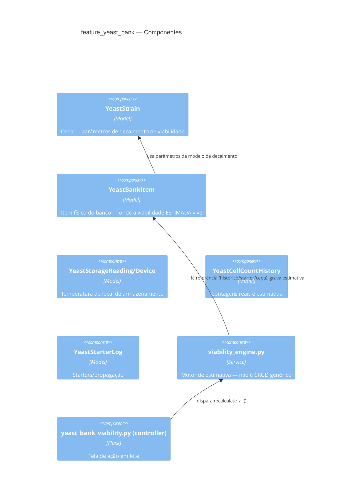

# 02 — Diagrama C4 (Feature Yeast Bank — Componente)

```mermaid
C4Component
    title feature_yeast_bank — Componentes

    Component(strain, "YeastStrain", "Model", "Cepa — parâmetros de decaimento de viabilidade")
    Component(item, "YeastBankItem", "Model", "Item físico do banco — onde a viabilidade ESTIMADA vive")
    Component(reading, "YeastStorageReading/Device", "Model", "Temperatura do local de armazenamento")
    Component(history, "YeastCellCountHistory", "Model", "Contagens reais e estimadas")
    Component(starter, "YeastStarterLog", "Model", "Starters/propagação")
    Component(viability, "viability_engine.py", "Service", "Motor de estimativa — não é CRUD genérico")
    Component(tool, "yeast_bank_viability.py (controller)", "Flask", "Tela de ação em lote")

    Rel(item, strain, "usa parâmetros de modelo de decaimento")
    Rel(viability, item, "lê referência (histórico/starter/cepa), grava estimativa")
    Rel(tool, viability, "dispara recalculate_all()")
```
