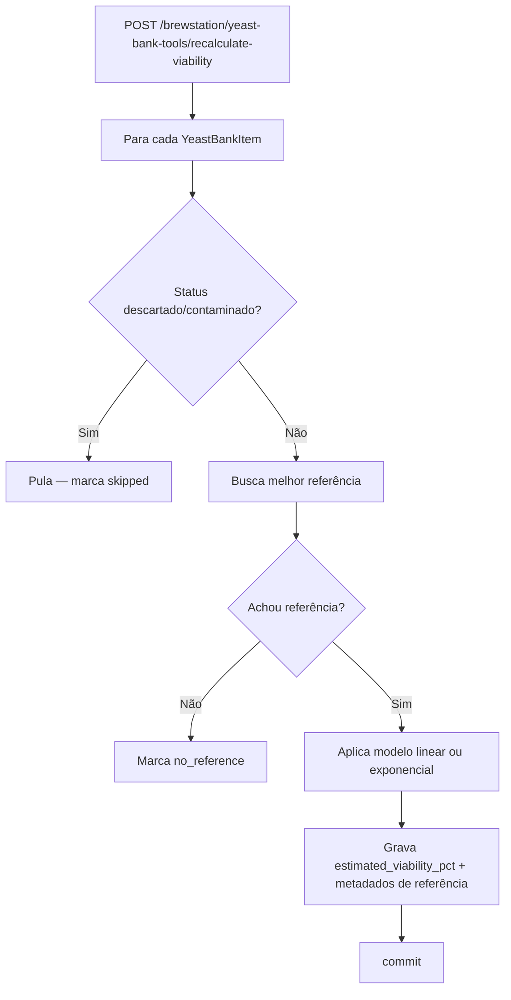
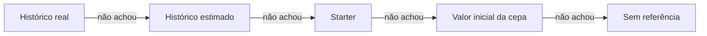

# 03 — Fluxos (Feature Yeast Bank)

## Caminho feliz: recalcular viabilidade

## Prioridade de referência (dentro de "Busca melhor referência")

Todas as consultas excluem registros com `contamination_detected=True`.
