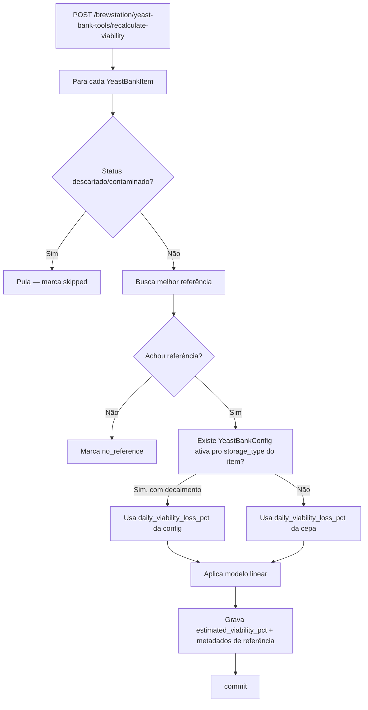
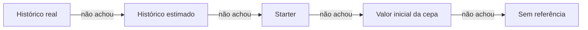
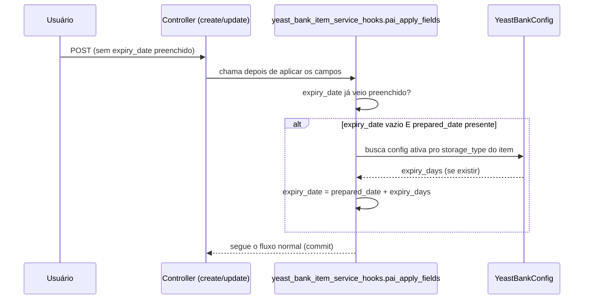
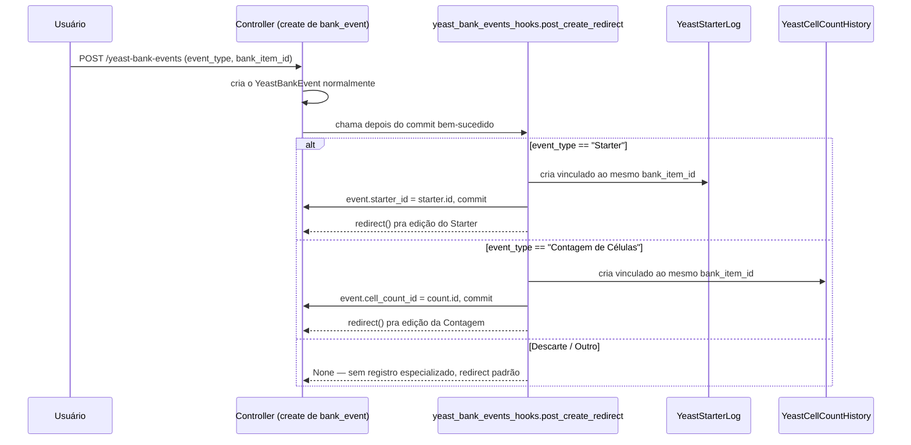
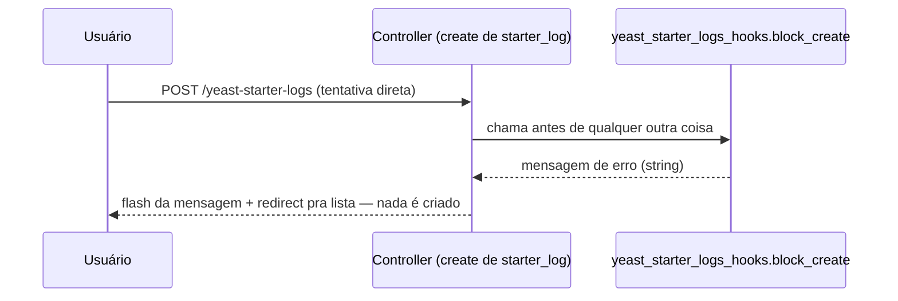

# 03 — Fluxos (Feature Yeast Bank)

## Caminho feliz: recalcular viabilidade

```mermaid
flowchart TD
    A[POST /brewstation/yeast-bank-tools/recalculate-viability] --> B[Para cada YeastBankItem]
    B --> C{Status descartado/contaminado?}
    C -->|Sim| D[Pula — marca skipped]
    C -->|Não| E[Busca melhor referência]
    E --> F{Achou referência?}
    F -->|Não| G[Marca no_reference]
    F -->|Sim| H[Existe YeastBankConfig ativa pro storage_type do item?]
    H -->|Sim, com decaimento| I[Usa daily_viability_loss_pct da config]
    H -->|Não| J[Usa daily_viability_loss_pct da cepa]
    I --> K[Aplica modelo linear]
    J --> K
    K --> L[Grava estimated_viability_pct + metadados de referência]
    L --> M[commit]
```

Modelo exponencial removido (skill 21) — sempre linear.

## Prioridade de referência (dentro de "Busca melhor referência")

```mermaid
flowchart LR
    A[Histórico real] -->|não achou| B[Histórico estimado]
    B -->|não achou| C[Starter]
    C -->|não achou| D[Valor inicial da cepa]
    D -->|não achou| E[Sem referência]
```

Todas as consultas excluem registros com `contamination_detected=True`.

## Criação de `YeastBankItem` — validade automática (skill 21)

```mermaid
sequenceDiagram
    participant U as Usuário
    participant C as Controller (create/update)
    participant H as yeast_bank_item_service_hooks.pai_apply_fields
    participant Cfg as YeastBankConfig

    U->>C: POST (sem expiry_date preenchido)
    C->>H: chama depois de aplicar os campos
    H->>H: expiry_date já veio preenchido?
    alt expiry_date vazio E prepared_date presente
        H->>Cfg: busca config ativa pro storage_type do item
        Cfg-->>H: expiry_days (se existir)
        H->>H: expiry_date = prepared_date + expiry_days
    end
    H-->>C: segue o fluxo normal (commit)
```

Nunca sobrescreve um `expiry_date` já informado manualmente.

## `YeastBankEvent` como ponto de entrada único (skill 21)

`YeastBankEvent` é o único lugar onde Starter e Contagem de Células
podem ser criados — as telas próprias delas bloqueiam a criação
direta (`block_create`, controller hook) e só permitem editar/
consultar registros já existentes.

```mermaid
sequenceDiagram
    participant U as Usuário
    participant C as Controller (create de bank_event)
    participant H as yeast_bank_events_hooks.post_create_redirect
    participant Starter as YeastStarterLog
    participant Count as YeastCellCountHistory

    U->>C: POST /yeast-bank-events (event_type, bank_item_id)
    C->>C: cria o YeastBankEvent normalmente
    C->>H: chama depois do commit bem-sucedido
    alt event_type == "Starter"
        H->>Starter: cria vinculado ao mesmo bank_item_id
        H->>C: event.starter_id = starter.id, commit
        H-->>C: redirect() pra edição do Starter
    else event_type == "Contagem de Células"
        H->>Count: cria vinculado ao mesmo bank_item_id
        H->>C: event.cell_count_id = count.id, commit
        H-->>C: redirect() pra edição da Contagem
    else Descarte / Outro
        H-->>C: None — sem registro especializado, redirect padrão
    end
```

O mesmo hook roda na rota web **e** na API JSON — na API só o efeito
colateral (criar o registro vinculado) importa, o valor de retorno
(um redirect do Flask) é descartado.

## Tentativa de criar Starter/Contagem direto na tela própria (bloqueada)

```mermaid
sequenceDiagram
    participant U as Usuário
    participant C as Controller (create de starter_log)
    participant H as yeast_starter_logs_hooks.block_create

    U->>C: POST /yeast-starter-logs (tentativa direta)
    C->>H: chama antes de qualquer outra coisa
    H-->>C: mensagem de erro (string)
    C-->>U: flash da mensagem + redirect pra lista — nada é criado
```

