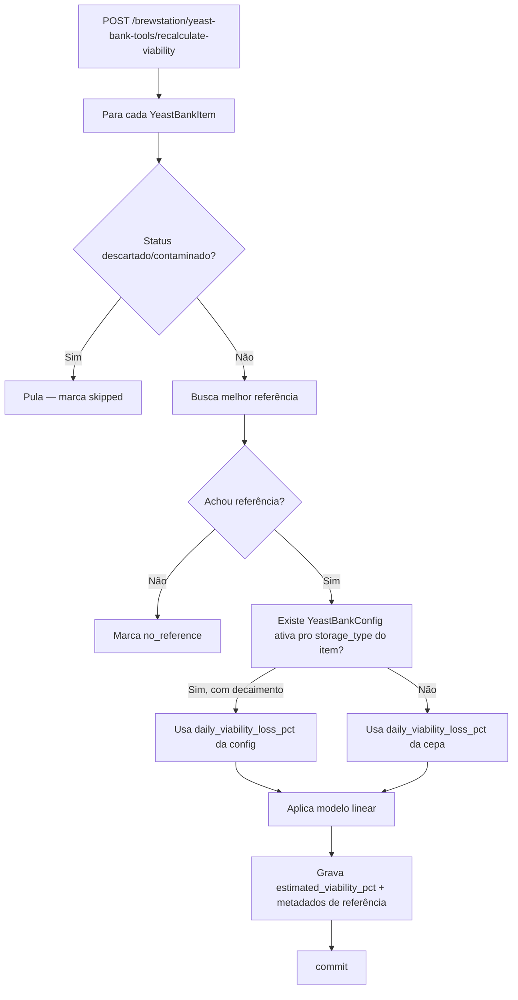
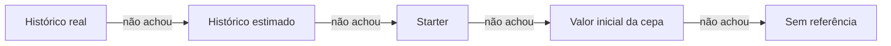
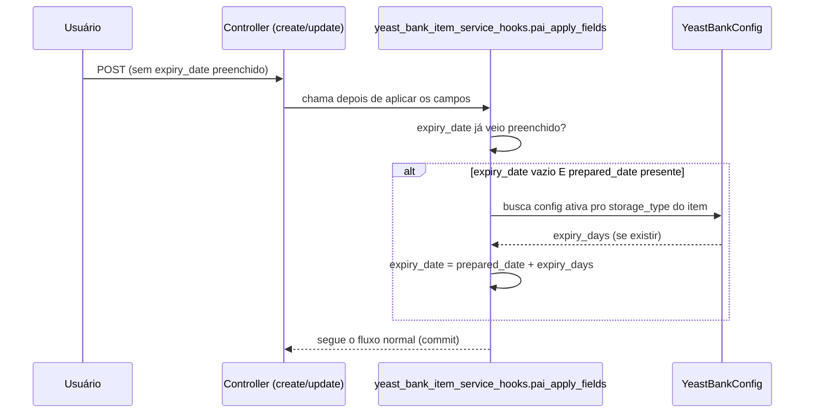
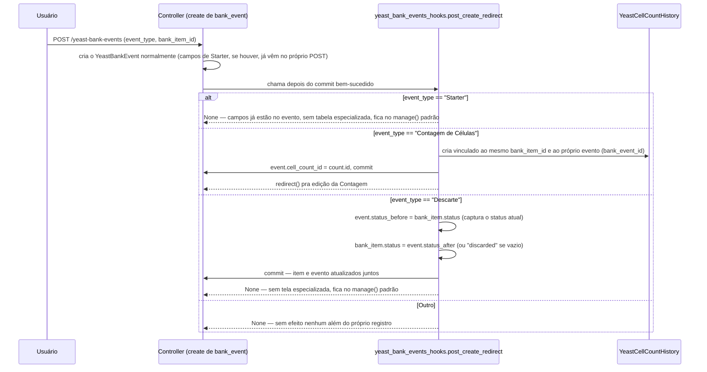
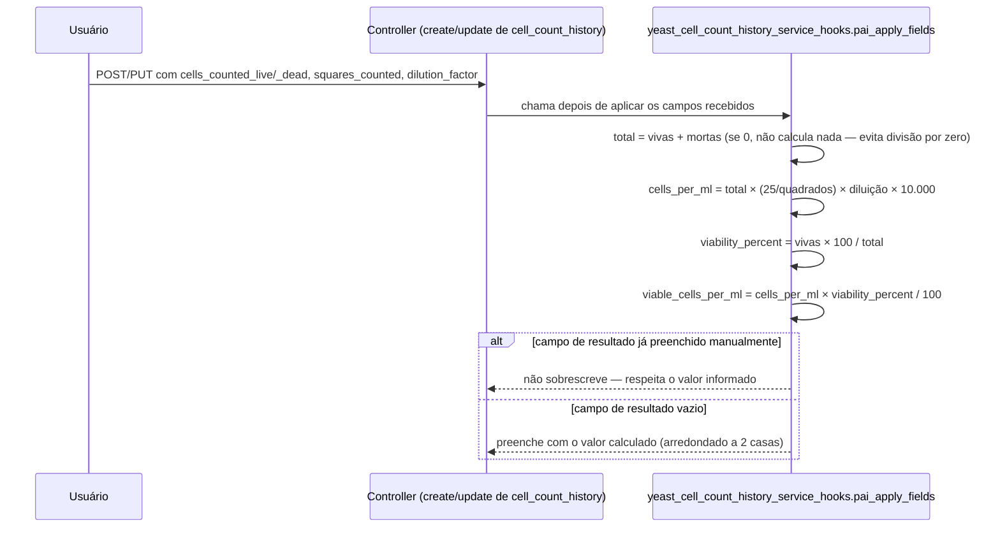
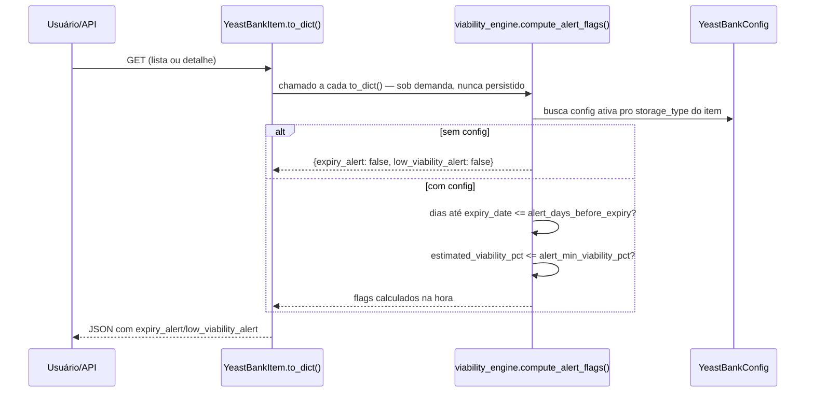

# 03 — Fluxos (Feature Yeast Bank)

## Caminho feliz: recalcular viabilidade

```mermaid
flowchart TD
    A[POST /brewstation/yeast-bank-tools/recalculate-viability] --> B[Para cada YeastBankItem]
    B --> C{Status descartado/contaminado?}
    C -->|Sim| D[Pula — marca skipped]
    C -->|Não| E[Busca melhor referência]
    E --> F{Achou referência?}
    F -->|Não| G[Marca no_reference]
    F -->|Sim| H[Existe YeastBankConfig ativa pro storage_type do item?]
    H -->|Sim, com decaimento| I[Usa daily_viability_loss_pct da config]
    H -->|Não| J[Usa daily_viability_loss_pct da cepa]
    I --> K[Aplica modelo linear]
    J --> K
    K --> L[Grava estimated_viability_pct + metadados de referência]
    L --> M[commit]
```

Modelo exponencial removido (skill 21) — sempre linear.

## Prioridade de referência (dentro de "Busca melhor referência")

```mermaid
flowchart LR
    A[Histórico real] -->|não achou| B[Histórico estimado]
    B -->|não achou| C[Starter]
    C -->|não achou| D[Valor inicial da cepa]
    D -->|não achou| E[Sem referência]
```

Todas as consultas excluem registros com `contamination_detected=True`.

## Criação de `YeastBankItem` — validade automática (skill 21)

```mermaid
sequenceDiagram
    participant U as Usuário
    participant C as Controller (create/update)
    participant H as yeast_bank_item_service_hooks.pai_apply_fields
    participant Cfg as YeastBankConfig

    U->>C: POST (sem expiry_date preenchido)
    C->>H: chama depois de aplicar os campos
    H->>H: expiry_date já veio preenchido?
    alt expiry_date vazio E prepared_date presente
        H->>Cfg: busca config ativa pro storage_type do item
        Cfg-->>H: expiry_days (se existir)
        H->>H: expiry_date = prepared_date + expiry_days
    end
    H-->>C: segue o fluxo normal (commit)
```

Nunca sobrescreve um `expiry_date` já informado manualmente.

## `YeastBankEvent` como ponto de entrada único (skill 21, revisado na skill 22)

`YeastBankEvent` é o único lugar onde Contagem de Células pode ser
criada — a tela própria dela bloqueia a criação direta
(`block_create`, controller hook) e só permite editar/consultar
registros já existentes. Starter (skill 22) não tem mais tela
própria pra bloquear — foi fundido direto no evento.

```mermaid
sequenceDiagram
    participant U as Usuário
    participant C as Controller (create de bank_event)
    participant H as yeast_bank_events_hooks.post_create_redirect
    participant Count as YeastCellCountHistory

    U->>C: POST /yeast-bank-events (event_type, bank_item_id)
    C->>C: cria o YeastBankEvent normalmente (campos de Starter, se houver, já vêm no próprio POST)
    C->>H: chama depois do commit bem-sucedido
    alt event_type == "Starter"
        H-->>C: None — campos já estão no evento, sem tabela especializada, fica no manage() padrão
    else event_type == "Contagem de Células"
        H->>Count: cria vinculado ao mesmo bank_item_id e ao próprio evento (bank_event_id)
        H->>C: event.cell_count_id = count.id, commit
        H-->>C: redirect() pra edição da Contagem
    else event_type == "Descarte"
        H->>H: event.status_before = bank_item.status (captura o status atual)
        H->>H: bank_item.status = event.status_after (ou "discarded" se vazio)
        H->>C: commit — item e evento atualizados juntos
        H-->>C: None — sem tela especializada, fica no manage() padrão
    else Outro
        H-->>C: None — sem efeito nenhum além do próprio registro
    end
```

`status_before` é `@readonly_fields` — mesmo que alguém tente mandar
esse campo direto via POST/JSON, `service.py.j2::_apply_fields` ignora
(reanálise de 2026-08-24: a primeira versão só protegia o formulário,
não a API — corrigido pra proteger os dois a partir da mesma fonte,
`get_readonly_fields()`).

O mesmo hook roda na rota web **e** na API JSON — na API só o efeito
colateral (criar o registro vinculado, ou aplicar a mudança de
status) importa, o valor de retorno (um redirect do Flask) é
descartado.

## Cálculo automático de Neubauer (skill 22)

`YeastCellCountHistory` calcula `cells_per_ml`/`viability_percent`/
`viable_cells_per_ml` a partir dos campos brutos (`cells_counted_live`/
`_dead`, `squares_counted`, `dilution_factor`), quando presentes e os
campos de resultado ainda estão vazios.

```mermaid
sequenceDiagram
    participant U as Usuário
    participant C as Controller (create/update de cell_count_history)
    participant H as yeast_cell_count_history_service_hooks.pai_apply_fields

    U->>C: POST/PUT com cells_counted_live/_dead, squares_counted, dilution_factor
    C->>H: chama depois de aplicar os campos recebidos
    H->>H: total = vivas + mortas (se 0, não calcula nada — evita divisão por zero)
    H->>H: cells_per_ml = total × (25/quadrados) × diluição × 10.000
    H->>H: viability_percent = vivas × 100 / total
    H->>H: viable_cells_per_ml = cells_per_ml × viability_percent / 100
    alt campo de resultado já preenchido manualmente
        H-->>C: não sobrescreve — respeita o valor informado
    else campo de resultado vazio
        H-->>C: preenche com o valor calculado (arredondado a 2 casas)
    end
```

Fórmula é a prática padrão de contagem em câmara de Neubauer (contar
5 dos 25 quadrados centrais e extrapolar) — pesquisada e documentada
na skill 22.

## Alerta de validade/viabilidade baixa (reanálise 2026-08-24)

Decisão do Christopher: só sinaliza pra tela, **não cria** `YeastBankEvent`
nem dispara nenhuma notificação.

```mermaid
sequenceDiagram
    participant U as Usuário/API
    participant Item as YeastBankItem.to_dict()
    participant Eng as viability_engine.compute_alert_flags()
    participant Cfg as YeastBankConfig

    U->>Item: GET (lista ou detalhe)
    Item->>Eng: chamado a cada to_dict() — sob demanda, nunca persistido
    Eng->>Cfg: busca config ativa pro storage_type do item
    alt sem config
        Eng-->>Item: {expiry_alert: false, low_viability_alert: false}
    else com config
        Eng->>Eng: dias até expiry_date <= alert_days_before_expiry?
        Eng->>Eng: estimated_viability_pct <= alert_min_viability_pct?
        Eng-->>Item: flags calculados na hora
    end
    Item-->>U: JSON com expiry_alert/low_viability_alert
```

Cada condição é independente — um item pode disparar só uma, as duas,
ou nenhuma. Calculado sob demanda em vez de persistido: sempre reflete
o estado atual, nunca fica desatualizado entre execuções do
"Recalcular Viabilidade" — o trade-off é 1 query extra
(`YeastBankConfig`) por item exibido, mesmo padrão de custo que
`weak_ref_display` já tem na listagem (skill 11).

## Nota sobre criação direta (skill 22)

Starter (skill 21) chegou a ter criação direta bloqueada
(`block_create`, quando ainda era `YeastStarterLog`) — essa trava
deixou de existir junto com a tabela, na fusão da skill 22. Contagem
de Células **nunca teve** bloqueio de criação direta — pode ser
criada tanto via Evento do Banco (fluxo automático) quanto direto na
própria tela, os dois caminhos sempre funcionaram em paralelo.

## Painel integrado — carregamento e drill-down (skill 21, seção 0/3)

Página customizada (skill 17/18) — dado 100% client-side via API REST
já existente, nenhuma rota nova de dado.

```mermaid
sequenceDiagram
    participant B as Navegador (painel-cepas.js / painel-eventos.js)
    participant API as API REST do CrudGen

    B->>API: GET /api/brewstation/yeast-strains/
    B->>API: GET /api/brewstation/yeast-bank-items/
    B->>API: GET /api/brewstation/yeast-bank-events/
    B->>API: GET /api/brewstation/yeast-cell-count-histories/
    Note over B: 4 chamadas em paralelo (Promise.all), uma vez ao carregar a página
    API-->>B: items[] (container/device já aninhados no item;<br/>bank_item/strain já aninhados no evento)
    B->>B: guarda tudo em memória (todosOsItens, todasAsContagens)

    Note over B: Clique numa linha da grid de Cepas
    B->>B: filtra todosOsItens por strain_id (client-side)
    B->>B: preenche a grid de Itens do Banco

    Note over B: Clique numa linha da grid de Eventos
    B->>B: filtra todasAsContagens por bank_item_id (client-side)
    B->>B: monta os cards de status + dashboard de viabilidade
```

**Achado real de arquitetura**: a API REST do CrudGen não tem filtro
por query param (`?strain_id=X`) — o filtro acontece inteiro no
navegador, sobre a lista completa já carregada. Aceitável pro volume
de uma cervejaria caseira/artesanal; se o volume crescer, filtro
server-side vira uma melhoria isolada (não muda a estrutura da tela).

Para não multiplicar requisição por linha, `YeastBankItem.to_dict()`
e `YeastBankEvent.to_dict()` aninham `container`/`device` e
`bank_item`/`strain` respectivamente — uma chamada por grid, não uma
por linha exibida.

