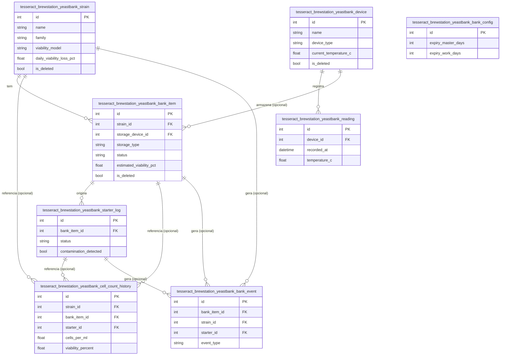

# 04 — Modelo de Dados (Feature Yeast Bank)

> ER completo — as 8 entidades originais do BrewStation foram
> migradas na Fase 5/5b.

## Colunas não óbvias

| Tabela | Coluna | Descrição de negócio |
|---|---|---|
| `..._strain` | `status` | Estado **estratégico** da cepa (ex.: `active`, `discontinued`) — não confundir com `is_deleted` |
| `..._strain` | `viability_model` | Algoritmo de decaimento (hoje só `linear_decay_default`; cálculo real ainda não portado) |
| `..._bank_item` | `estimated_viability_pct` | Viabilidade **estimada do item físico** — diferente dos parâmetros de modelo da cepa; é o valor calculado ao longo do tempo |
| `..._bank_item` | `label_text` | Renomeado de `label` (BrewStation original) para não colidir com o decorator `@label` das anotações |
| `..._starter_log` | `action_on_bank_item` | Ação sugerida/confirmada sobre o item de origem (ex.: descartar, manter) — texto livre, sem enum ainda |
| `..._cell_count_history` | FKs (`strain_id`/`bank_item_id`/`starter_id`) | Todas **opcionais** de propósito — um registro pode ser um cálculo livre, não necessariamente vinculado |
| `..._bank_event` | `metadata_json` | Texto livre (JSON serializado manualmente) — sem JSONB nativo nesta fase |
| `..._bank_config` | (toda a tabela) | Pensada como singleton (1 linha), mas modelada como tabela normal — CrudGen não tem conceito de singleton ainda |

## Regra de soft-delete

Todas as 8 tabelas seguem `is_deleted`/`deleted_at` (skill 02).

## FK entre módulos

Todas as FKs desta Feature são **dentro da própria Feature** — nenhuma
aponta para fora do `yeast_bank`, nenhuma para outro Addon (skill 02
proíbe FK entre Addons diferentes). Confirmado funcionando mesmo com o
mecanismo de renomeação de tabela (prefixo aplicado depois da
declaração do model) — ver `BACKLOG.md`, Fase 5b, para o teste que
validou isso antes de migrar tudo.
