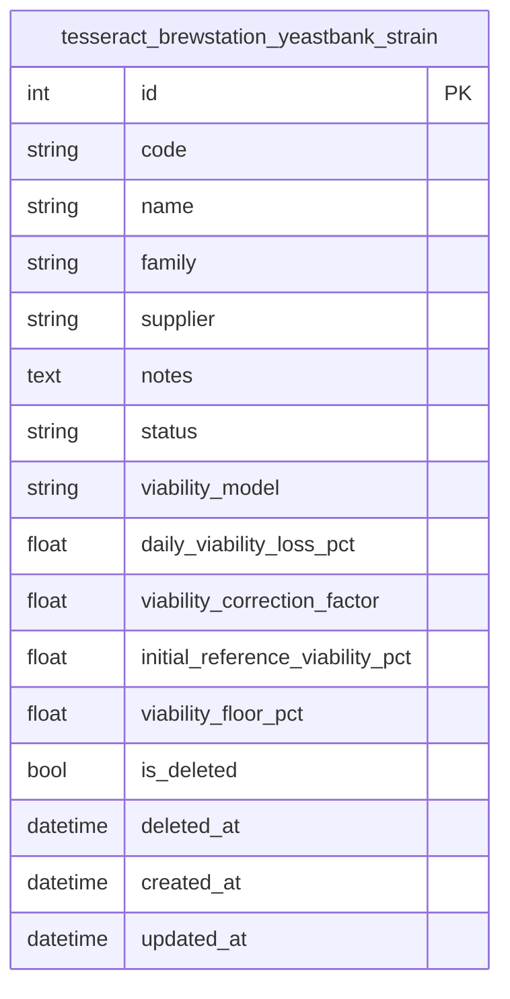

# 04 — Modelo de Dados (Feature Yeast Bank)

> Cobre só `YeastStrain` (a única tabela migrada até a Fase 5). O
> restante de `yeast_bank` (item físico, starter, storage device/
> reading, config, histórico, eventos) entra aqui quando a Fase 5b
> migrar o resto — este arquivo ganha o ER completo nesse momento,
> não um arquivo por tabela.

## Colunas não óbvias

| Coluna | Descrição de negócio |
|---|---|
| `status` | Estado **estratégico** da cepa (ex.: `active`, `discontinued`) — não confundir com `is_deleted`, que é o soft-delete do registro em si |
| `viability_model` | Nome do algoritmo de decaimento (hoje só `linear_decay_default` existe; o cálculo real ainda não foi portado — fica para quando `YeastBankItem` entrar, já que viabilidade *estimada* pertence ao item físico, não à cepa) |
| `daily_viability_loss_pct` | Parâmetro do modelo: % de viabilidade perdida por dia, usado para estimar a viabilidade de um item físico ao longo do tempo |

## Regra de soft-delete

`is_deleted`/`deleted_at` (skill 02) — `trash`/`restore` alternam a
flag, `delete_permanent` remove de fato (só permitido se já estiver
na lixeira).

## FK entre módulos

Nenhuma ainda — `YeastStrain` é a única tabela desta Feature até
agora. Quando `YeastBankItem` entrar (Fase 5b), a FK
`YeastBankItem.strain_id -> YeastStrain.id` será a primeira FK
*dentro do mesmo Addon* (permitida pela skill 02 — FK de Feature para
o núcleo/outra Feature do mesmo Addon é OK; o que é proibido é FK
*entre Addons diferentes*).
