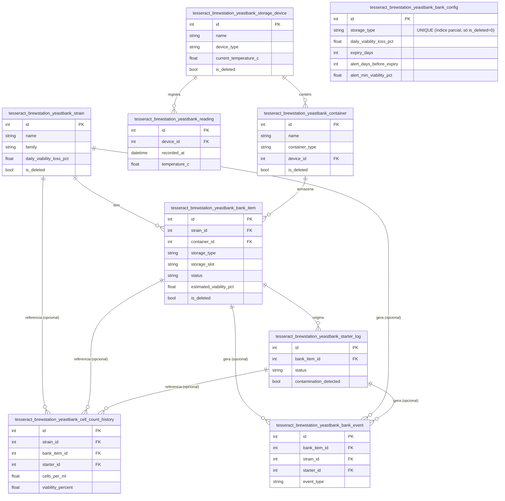

# 04 — Modelo de Dados (Feature Yeast Bank)

> ER completo — as 8 entidades originais do BrewStation foram
> migradas na Fase 5/5b. A 9ª entidade, `Container`, entrou na Fase 14
> (skill 19 — `docs/skills/19-proposta-reestruturacao-yeast-bank-container.md`)
> como nível intermediário entre Dispositivo e Item do Banco.
>
> **Correção de nome de tabela nesta revisão**: as entidades abaixo
> chamadas `Container`/`Dispositivo`/`Leitura` usam os nomes de tabela
> curtos reais do código (`container`/`storage_device`/`reading`) — a
> versão anterior deste diagrama usava `device` (nunca existiu como
> nome curto real; foi renomeado para `storage_device` na Fase 6 para
> não colidir com `DeviceMetadata` de `feature_device_manager`, skill
> 02, mas o diagrama nunca tinha sido corrigido).

```mermaid
erDiagram
    tesseract_brewstation_yeastbank_strain ||--o{ tesseract_brewstation_yeastbank_bank_item : "tem"
    tesseract_brewstation_yeastbank_storage_device ||--o{ tesseract_brewstation_yeastbank_reading : "registra"
    tesseract_brewstation_yeastbank_storage_device ||--o{ tesseract_brewstation_yeastbank_container : "contém"
    tesseract_brewstation_yeastbank_container ||--o{ tesseract_brewstation_yeastbank_bank_item : "armazena"
    tesseract_brewstation_yeastbank_bank_item ||--o{ tesseract_brewstation_yeastbank_starter_log : "origina"
    tesseract_brewstation_yeastbank_strain ||--o{ tesseract_brewstation_yeastbank_cell_count_history : "referencia (opcional)"
    tesseract_brewstation_yeastbank_bank_item ||--o{ tesseract_brewstation_yeastbank_cell_count_history : "referencia (opcional)"
    tesseract_brewstation_yeastbank_starter_log ||--o{ tesseract_brewstation_yeastbank_cell_count_history : "referencia (opcional)"
    tesseract_brewstation_yeastbank_bank_item ||--o{ tesseract_brewstation_yeastbank_bank_event : "gera (opcional)"
    tesseract_brewstation_yeastbank_strain ||--o{ tesseract_brewstation_yeastbank_bank_event : "gera (opcional)"
    tesseract_brewstation_yeastbank_starter_log ||--o{ tesseract_brewstation_yeastbank_bank_event : "gera (opcional)"

    tesseract_brewstation_yeastbank_strain {
        int id PK
        string name
        string family
        float daily_viability_loss_pct
        bool is_deleted
    }
    tesseract_brewstation_yeastbank_storage_device {
        int id PK
        string name
        string device_type
        float current_temperature_c
        bool is_deleted
    }
    tesseract_brewstation_yeastbank_reading {
        int id PK
        int device_id FK
        datetime recorded_at
        float temperature_c
    }
    tesseract_brewstation_yeastbank_container {
        int id PK
        string name
        string container_type
        int device_id FK
        bool is_deleted
    }
    tesseract_brewstation_yeastbank_bank_item {
        int id PK
        int strain_id FK
        int container_id FK
        string storage_type
        string storage_slot
        string status
        float estimated_viability_pct
        bool is_deleted
    }
    tesseract_brewstation_yeastbank_starter_log {
        int id PK
        int bank_item_id FK
        string status
        bool contamination_detected
    }
    tesseract_brewstation_yeastbank_cell_count_history {
        int id PK
        int strain_id FK
        int bank_item_id FK
        int starter_id FK
        float cells_per_ml
        float viability_percent
    }
    tesseract_brewstation_yeastbank_bank_event {
        int id PK
        int bank_item_id FK
        int strain_id FK
        int starter_id FK
        string event_type
    }
    tesseract_brewstation_yeastbank_bank_config {
        int id PK
        string storage_type "UNIQUE (índice parcial, só is_deleted=0)"
        float daily_viability_loss_pct
        int expiry_days
        int alert_days_before_expiry
        float alert_min_viability_pct
    }
```

## Campos por entidade — uso real confirmado no código

> Levantamento feito grepando o código real (services, hooks, `viability_engine.py`),
> não a partir do nome do campo. "Consumido por" = algo além do próprio
> CRUD lê/escreve esse campo pra alguma decisão. Campo sem consumidor
> não é necessariamente inútil — pode ser informativo (nota livre pra
> humano ler depois); a coluna "Observação" distingue os dois casos.
> Candidatos reais a remoção/decisão estão marcados **⚠**.

### `YeastStrain` (cepa)

> **Nota (2026-08-21)**: `viability_model` foi removido. Achado
> durante a auditoria de campos: o `@enum_field` mostrava as opções
> `"Linear Decayment"`/`"Other"`, mas o motor só reconhecia o valor
> literal `"exp_decay"` — selecionar `"Other"` nunca ativava o modelo
> exponencial de verdade, sempre caía no linear em silêncio. Decisão
> do Christopher: remover o exponencial de vez (nunca foi usado de
> propósito), em vez de consertar o mapeamento — `compute_estimated_viability()`
> agora é sempre linear.

| Campo | Consumido por | Observação |
|---|---|---|
| `code` | — | Informativo, sem lookup por ele em nenhum lugar |
| `name` | Tudo (display_field) | Nome de exibição |
| `family` | — | Informativo (Ale/Lager/Kveik/Other) — sem filtro/relatório que agrupe por família ainda |
| `supplier` | — | Informativo |
| `notes` | — | Nota livre pro usuário |
| `status` | — | Estado estratégico (`active`/`discontinued`) — não usado em nenhuma regra ainda (ex.: bloquear novo Item de cepa `discontinued`) |
| `daily_viability_loss_pct` | `viability_engine` | Usado de verdade no cálculo — **SUBSTITUÍDO** pelo `daily_viability_loss_pct` de `YeastBankConfig` quando existe config ativa pro `storage_type` do item (decisão do Christopher, 2026-08-21 — ver seção `YeastBankConfig` abaixo) |
| `viability_correction_factor` | `viability_engine` | Usado de verdade no cálculo |
| `initial_reference_viability_pct` | `viability_engine.best_viability_reference_for_item()` | Usado de verdade — última prioridade de referência quando não há histórico/starter |
| `viability_floor_pct` | `viability_engine` | Usado de verdade no cálculo |
| `viability_notes` | — | Nota livre |

### `YeastStorageDevice` (dispositivo)

| Campo | Consumido por | Observação |
|---|---|---|
| `name` | Tudo | Nome de exibição |
| `machcode` | — | Informativo |
| `device_type` | — | Informativo (Freezer/Geladeira/Câmara Fria) |
| `status` | `status_badge()` (no próprio model) | Usado — `inactive` some da lógica de badge de saúde |
| `description` | — | Nota livre |
| `brand` / `model` / `serial_number` | — | Informativo — ficha técnica do equipamento |
| `physical_location` | — | Informativo |
| `target_temperature_c` | — | Informativo — não há alarme se a leitura real se afastar do alvo |
| `temperature_min_c` / `temperature_max_c` | `status_badge()` | Usado — gera `alert_low`/`alert_high` no badge, mas **não dispara nenhuma notificação** (achado já registrado no início desta sessão) |
| `current_temperature_c` / `last_temperature_at` | `status_badge()` | Usado — cache do último valor, atualizado manualmente hoje (sem sensor integrado ainda) |

### `YeastStorageReading` (leitura)

| Campo | Consumido por | Observação |
|---|---|---|
| `device_id` | FK real + `@weak_ref` | Estrutural |
| `recorded_at` | — | Timestamp da leitura |
| `temperature_c` | — | O dado em si — mas **nada lê o histórico de leituras** pra alimentar `current_temperature_c`/`status_badge()` do Dispositivo automaticamente; é preenchimento paralelo, não conectado |
| `humidity_percent` | — | Informativo |
| `source_type` / `source_ref` | — | Informativo (`manual` é o único valor usado na prática hoje) |
| `notes` | — | Nota livre |

### `YeastContainer` / `YeastBankItem`

Já cobertos na íntegra na skill 19 e na tabela "Colunas não óbvias"
original (mantida abaixo) — sem achado novo de campo morto nesta
revisão; todos os campos de `YeastBankItem` (inclusive os de
viabilidade) são lidos por `viability_engine.py` ou pela tela.

### `YeastStarterLog` (starter)

| Campo | Consumido por | Observação |
|---|---|---|
| `bank_item_id` | FK real + `@weak_ref` | Estrutural |
| `brew_date` / `start_date` | `viability_engine` (`start_date`, como data de referência) | `start_date` usado; `brew_date` informativo |
| `target_volume_l` | — | Informativo |
| `objective` | — | Informativo |
| `notes` | — | Nota livre |
| `status` | — | Livre (`planned`/outros) — sem máquina de estado, sem gatilho |
| `result_viability_percent` | `viability_engine.best_viability_reference_for_item()` | Usado de verdade — 3ª prioridade de referência |
| `contamination_detected` | `viability_engine` | Usado de verdade — exclui o registro como referência válida |

### `YeastCellCountHistory` (histórico de contagem)

| Campo | Consumido por | Observação |
|---|---|---|
| `strain_id` / `bank_item_id` / `starter_id` | FKs opcionais de propósito | Estrutural |
| `sample_date` | `viability_engine` | Usado — ordena qual histórico é "mais recente" |
| `lot_code` | — | Informativo |
| `cells_per_ml` / `viable_cells_per_ml` | — | Dado bruto de contagem — informativo, não entra na fórmula de viabilidade (só os dois campos de `_percent` abaixo entram) |
| `viability_percent` | `viability_engine.best_viability_reference_for_item()` | Usado de verdade — 1ª prioridade de referência (histórico real) |
| `estimated_viability_percent` | `viability_engine` | Usado de verdade — 2ª prioridade (histórico estimado) |
| `contamination_detected` | `viability_engine` | Usado de verdade — exclui o registro como referência |
| `notes` | — | Nota livre |

### `YeastBankEvent` (evento)

| Campo | Consumido por | Observação |
|---|---|---|
| `bank_item_id` / `strain_id` / `starter_id` | FKs opcionais | Estrutural — preenchidas manualmente na tela do próprio evento |
| `event_type` | — | Obrigatório, texto livre — sem catálogo fechado (`@enum_field`) apesar do nome sugerir categorias fixas |
| `status_before` / `status_after` | — | Texto livre — **nenhum outro service preenche isso automaticamente** (achado já registrado no início desta sessão: evento não é gerado a partir de mudança real em Item/Starter/Contagem, só manual) |
| `notes` | — | Nota livre |

### `YeastBankConfig` (configuração por tipo de armazenamento)

> **Redesenhado em 2026-08-21** (decisão do Christopher). Os 4 campos
> antigos de validade (`expiry_master_days`/`expiry_work_days`/
> `expiry_plate_days`/`expiry_saline_days`) nunca tiveram consumidor
> (achado da auditoria original) e não faziam sentido numa linha já
> específica de 1 `storage_type`. Substituídos por um desenho mais
> simples: **1 config ativa por `storage_type`**, com decaimento +
> validade + limites de alerta.

| Campo | Consumido por | Observação |
|---|---|---|
| `storage_type` | `viability_engine.recalculate_all()`, `yeast_bank_item_service_hooks.py` | Único por linha ativa (índice único parcial, `WHERE is_deleted = 0` — uma linha na lixeira não bloqueia recriar o tipo) |
| `daily_viability_loss_pct` | `viability_engine.recalculate_all()` | Quando preenchido, **SUBSTITUI** (não combina com) o `daily_viability_loss_pct` da `YeastStrain` do item — decisão explícita do Christopher. `correction_factor`/`floor_pct` continuam vindo sempre da cepa |
| `expiry_days` | `yeast_bank_item_service_hooks.py::_auto_fill_expiry_date()` | Preenche `YeastBankItem.expiry_date` automaticamente (`prepared_date + expiry_days`) **só quando `expiry_date` ainda está vazio** — nunca sobrescreve valor informado manualmente |
| `alert_days_before_expiry` | — | Limite cadastrado, mas a lógica de disparo/notificação ainda não existe — fase própria (mesmo tema do achado "`YeastBankEvent` não é gerado automaticamente", registrado no BACKLOG) |
| `alert_min_viability_pct` | — | Mesmo caso acima — limite existe, disparo ainda não |

## Colunas não óbvias (registro histórico, mantido)

| Tabela | Coluna | Descrição de negócio |
|---|---|---|
| `..._strain` | `status` | Estado **estratégico** da cepa (ex.: `active`, `discontinued`) — não confundir com `is_deleted` |
| `..._container` | `container_type` | Caixa/Estante/Prateleira/Outro (`@enum_field`) — unidade física dentro do dispositivo, nunca virtual (skill 19) |
| `..._container` | `device_id` | Obrigatório (`NOT NULL`) — todo Container pertence a exatamente 1 Dispositivo |
| `..._bank_item` | `container_id` | Obrigatório desde a skill 19 — substituiu `storage_device_id` (removido); o dispositivo do item é sempre resolvido via `item.container.device`, nunca por FK direta |
| `..._bank_item` | `storage_slot` | Desde a skill 19, significa posição **dentro do Container** (ex.: "gaveta 2"), não mais posição solta no dispositivo inteiro |
| `..._bank_item` | `estimated_viability_pct` | Viabilidade **estimada do item físico** — diferente dos parâmetros de modelo da cepa; é o valor calculado ao longo do tempo |
| `..._bank_item` | `label_text` | Renomeado de `label` (BrewStation original) para não colidir com o decorator `@label` das anotações |
| `..._cell_count_history` | FKs (`strain_id`/`bank_item_id`/`starter_id`) | Todas **opcionais** de propósito — um registro pode ser um cálculo livre, não necessariamente vinculado |
| `..._bank_config` | `storage_type` | Único por linha **ativa** — índice parcial (`WHERE is_deleted = 0`), não `Column(unique=True)` puro (skill 18/redesign 2026-08-21: uma constraint cheia colidiria até com linha na lixeira, incompatível com soft-delete) |

## Regra de soft-delete

Todas as 9 tabelas seguem `is_deleted`/`deleted_at` (skill 02).

## FK entre módulos

Todas as FKs desta Feature são **dentro da própria Feature** — nenhuma
aponta para fora do `yeast_bank`, nenhuma para outro Addon (skill 02
proíbe FK entre Addons diferentes). Confirmado funcionando mesmo com o
mecanismo de renomeação de tabela (prefixo aplicado depois da
declaração do model) — ver `BACKLOG.md`, Fase 5b, para o teste que
validou isso antes de migrar tudo.
