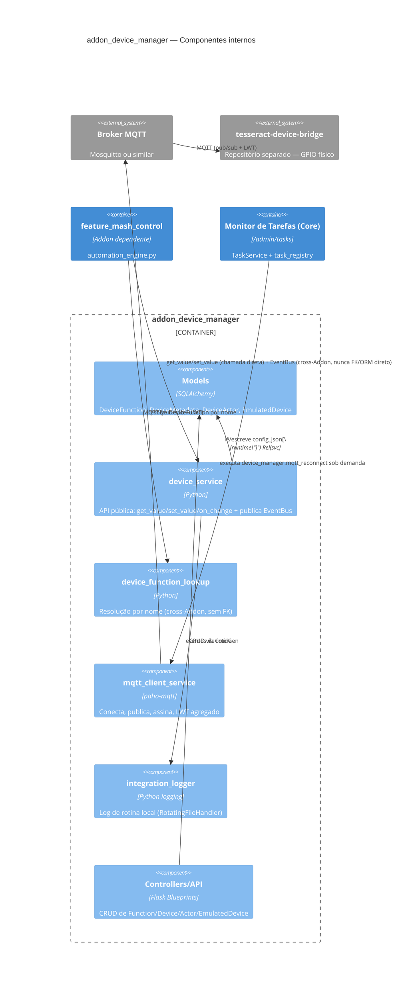

# 02 — Diagrama C4 (`addon_device_manager`)

No nível Addon, gera-se só **Componente** (skill 04) — Contexto e
Container já estão cobertos em `docs/technical/02-diagrama-c4.md` da
raiz do projeto.

## Componente

## Observações de fronteira (skill 02)

- `feature_mash_control` (Addon `brewstation`) nunca importa
  `root/model/*` deste Addon — só `device_service`/
  `device_function_lookup`, e sempre recebendo `string`/valor
  primitivo, nunca o objeto ORM (`DeviceActor`) em si. Essa regra foi
  corrigida durante a implementação da Fase E (o callback de
  o mecanismo original (substituído pelo EventBus do Core na Fase G) vazava o objeto `DeviceActor` —
  corrigido para entregar só `function_name: str`).
- `addon_device_manager` nunca importa nada de `feature_mash_control`
  — a dependência só existe na direção `mash_control → device_manager`
  (declarada em `feature_mash_control/feature.json: requires`).
- O sistema de Tasks (Core) chama este Addon só através de uma função
  registrada (`core.task_registry.register_task`), nunca o contrário.
