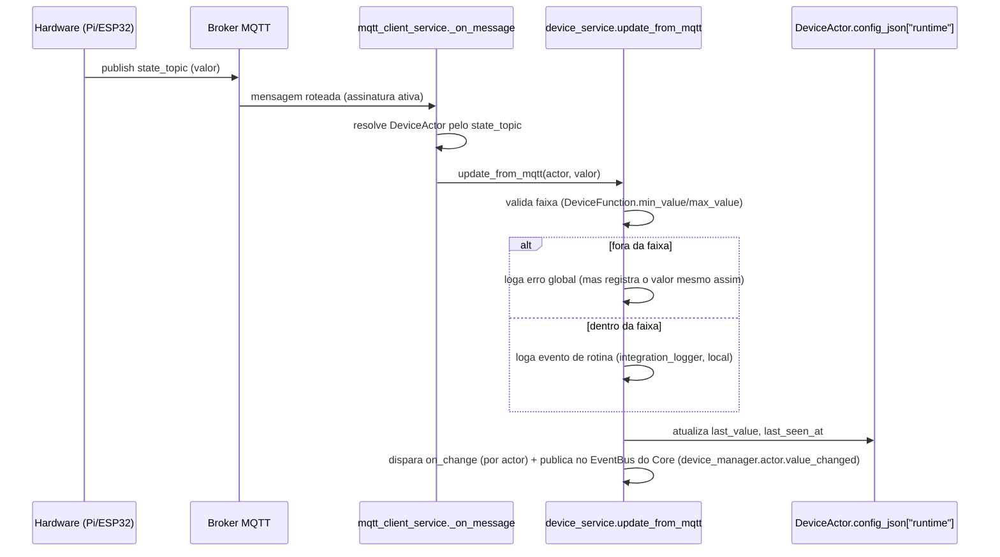
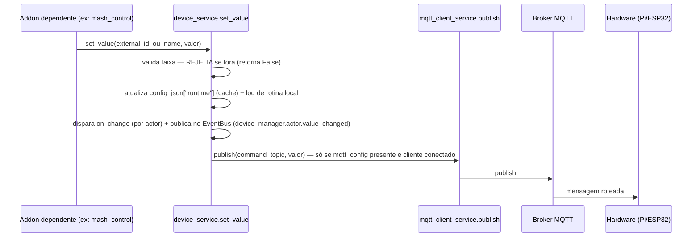
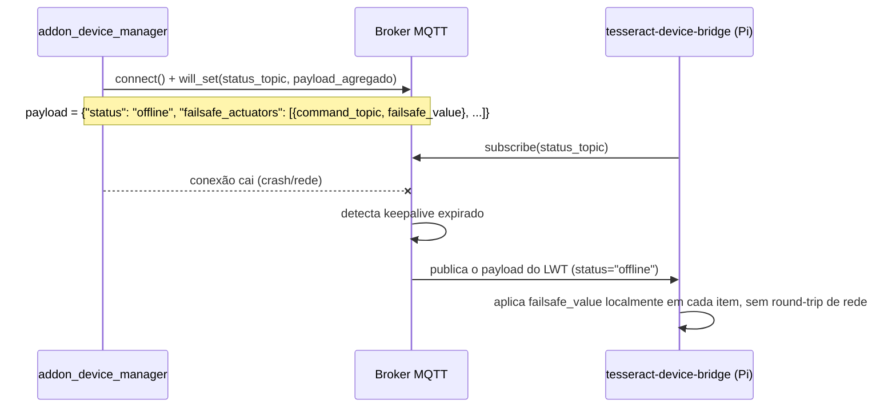
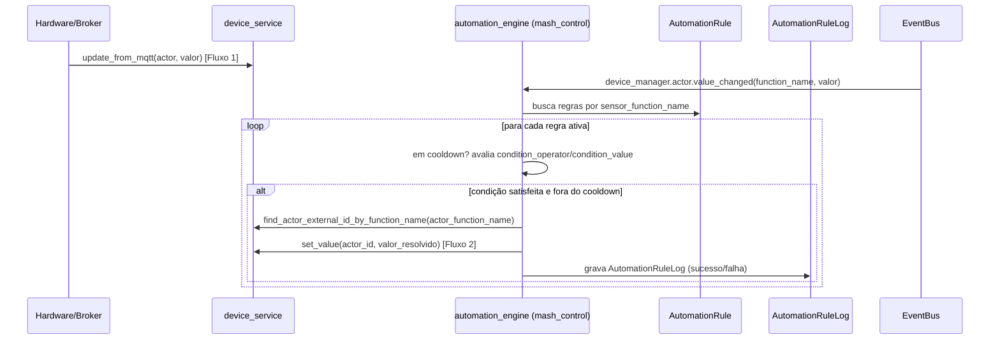
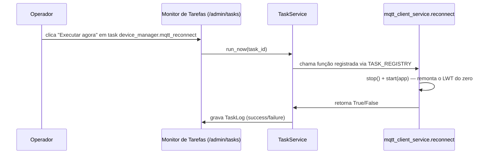

# 03 — Fluxos (`addon_device_manager`)

> Diagramas reaproveitados de `docs/skills/05-proposta-addon-device-manager-e-mqtt.md`
> (seção 5), já validados em produção — reproduzidos aqui no formato
> exigido pela skill 04 para a documentação do próprio Addon.

## Fluxo 1 — Leitura de sensor (caminho feliz)

## Fluxo 2 — Comando de atuador (caminho feliz)

## Fluxo 3 — Fail-safe (LWT agregado) — conexão do Tesseract cai

> Correção de protocolo (registrada na Fase D): MQTT permite só **um**
> LWT por conexão de cliente — por isso o payload é agregado (lista de
> atuadores de risco), não um LWT por atuador.

## Fluxo 4 — Motor de automação reativo (Fase E)

## Fluxo 5 — Reconexão manual via Monitor de Tarefas

