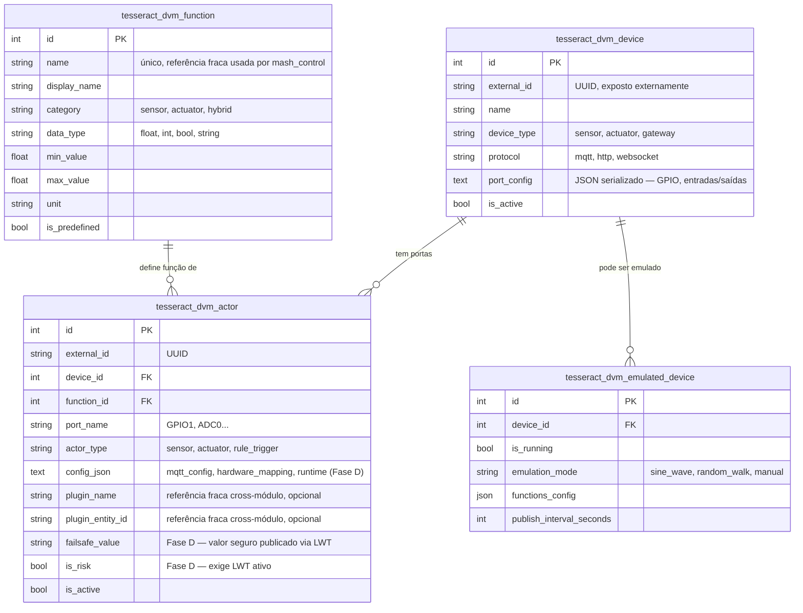

# 04 — Modelo de Dados (`addon_device_manager`)

## Colunas não óbvias

| Tabela | Coluna | Descrição |
|---|---|---|
| `..._device`/`..._actor` | `external_id` | UUID gerado automaticamente — usado em integrações externas (MQTT, etc.), nunca como PK (skill 02, "Regra de PK externa"). Fallback de identificador de tópico quando `config_json` não define um `mqtt_config` explícito. |
| `..._actor` | `plugin_name`/`plugin_entity_id` | Referência fraca a entidade de outro módulo — nunca FK direta entre Addons (skill 02). |
| `..._actor` | `config_json` | Coluna `Text` (não `JSON` nativo) — serializado/desserializado via `get_config()`/`set_config()` do model. Estrutura de uso (convenção, não enforced por schema): `{"mqtt_config": {...}, "hardware_mapping": {...}, "runtime": {"last_value": ..., "last_seen_at": ...}}` (Fase D). |
| `..._actor` | `failsafe_value` | String (não tipado) — interpretado conforme `DeviceFunction.data_type` na hora de publicar. Só relevante quando `is_risk=true`. |
| `..._actor` | `is_risk` | Default `false` — marca se este ator exige LWT ativo (`mqtt_client_service.build_lwt_payload()` consulta isso a cada conexão). |
| `..._emulated_device` | `functions_config` | JSON nativo — corrigido em relação ao original (que usava `default={}` mutável compartilhado entre instâncias). |

> **Nota de correção de documentação**: uma versão anterior deste
> arquivo (quando ainda era Feature) mencionava uma coluna
> `current_temperature_c` em `tesseract_dvm_device` que **nunca
> existiu no model real** — divergência entre doc e código
> encontrada e corrigida nesta revisão (2026-06-29).

## FK entre módulos

Todas internas a este Addon (`DeviceActor.device_id` →
`DeviceMetadata.id`, `DeviceActor.function_id` → `DeviceFunction.id`,
`EmulatedDevice.device_id` → `DeviceMetadata.id`), permitidas pela
skill 02. **Nenhuma FK sai para outro Addon** — `feature_mash_control`
referencia `DeviceFunction` só por **referência fraca** (`*_function_name`,
coluna string, resolvida via `device_function_lookup.py`/
`device_service.find_actor_external_id_by_function_name()`), desde a
remoção das 4 FKs cross-Addon na Fase 9 (skill 02).
