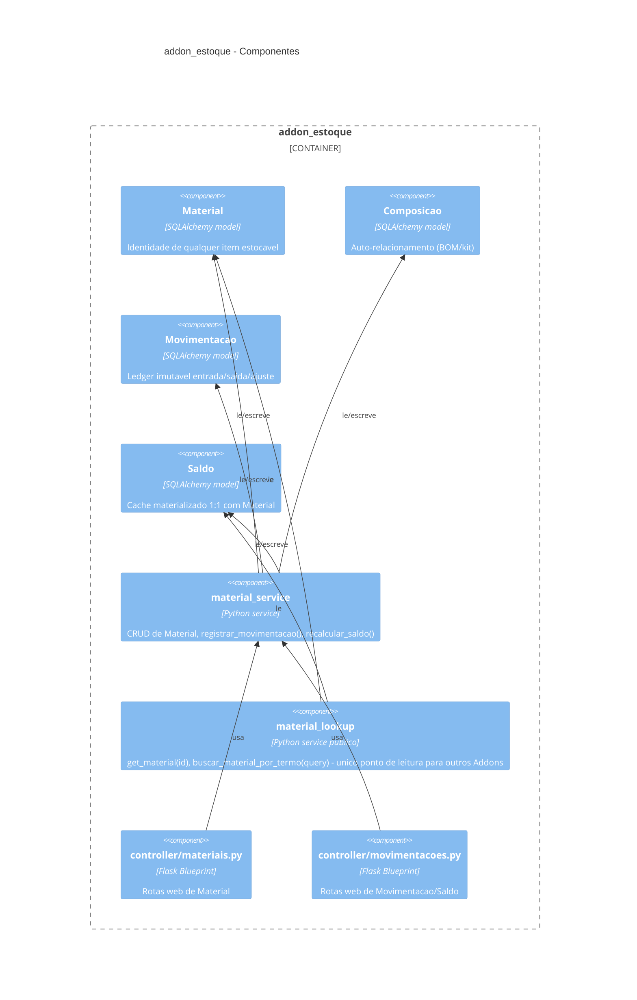

# 02 — Diagrama C4 (Addon Estoque — Componente)

Nível Componente (skill 04 — nível Addon gera Componente). Contexto/
Container do sistema como um todo fica em `docs/technical/02-diagrama-c4.md`
da raiz — ainda **não atualizado** com a caixa deste Addon (pendência).

## Nota sobre `buscar_material_por_termo`

Método novo no service público, motivado pelo fluxo de resolução de
ingrediente de `feature_mash_control` (busca textual/fuzzy por nome,
não só `get_material(id)`) — ver
`addons/addon_brewstation/features/feature_mash_control/docs/technical/03-fluxos.md`.

## Nota sobre consumidores externos

`svc_lookup` é o único ponto de entrada pra qualquer Addon externo.
Nenhum Addon externo importa `model_material`/`model_saldo`
diretamente — sempre passa pelo service público, mesmo em leitura.
