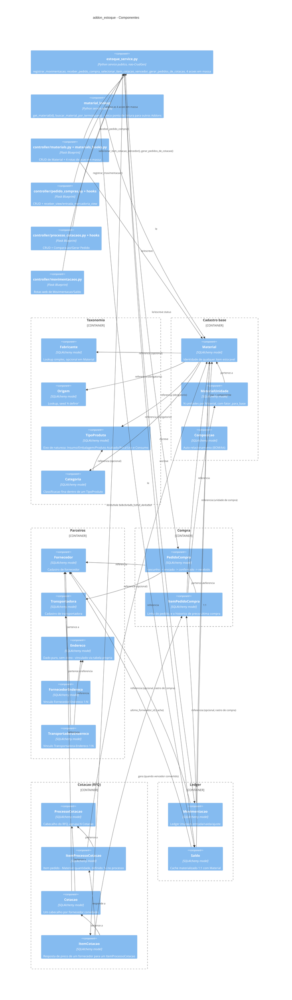

# 02 — Diagrama C4 (Addon Estoque — Componente)

Nível Componente (skill 04 — nível Addon gera Componente). Contexto/
Container do sistema como um todo fica em `docs/technical/02-diagrama-c4.md`
da raiz.

```mermaid
C4Component
    title addon_estoque - Componentes

    Container_Boundary(taxonomia, "Taxonomia") {
        Component(model_fabricante, "Fabricante", "SQLAlchemy model", "Lookup simples, opcional em Material")
        Component(model_origem, "Origem", "SQLAlchemy model", "Lookup, seed 'A definir'")
        Component(model_tipo_produto, "TipoProduto", "SQLAlchemy model", "Eixo de natureza: Insumo/Embalagem/Produto Acabado/Peca/Uso e Consumo")
        Component(model_categoria, "Categoria", "SQLAlchemy model", "Classificacao fina dentro de um TipoProduto")
    }

    Container_Boundary(cadastro, "Cadastro base") {
        Component(model_material, "Material", "SQLAlchemy model", "Identidade de qualquer item estocavel")
        Component(model_material_unidade, "MaterialUnidade", "SQLAlchemy model", "N unidades por Material, com fator_para_base")
        Component(model_composicao, "Composicao", "SQLAlchemy model", "Auto-relacionamento (BOM/kit)")
    }

    Container_Boundary(parceiros, "Parceiros") {
        Component(model_fornecedor, "Fornecedor", "SQLAlchemy model", "Cadastro de fornecedor")
        Component(model_transportadora, "Transportadora", "SQLAlchemy model", "Cadastro de transportadora")
        Component(model_endereco, "Endereco", "SQLAlchemy model", "Dado puro, sem dono - vinculado via tabela propria")
        Component(model_fornecedor_endereco, "FornecedorEndereco", "SQLAlchemy model", "Vinculo Fornecedor-Endereco 1:N")
        Component(model_transportadora_endereco, "TransportadoraEndereco", "SQLAlchemy model", "Vinculo Transportadora-Endereco 1:N")
    }

    Container_Boundary(compra, "Compra") {
        Component(model_pedido_compra, "PedidoCompra", "SQLAlchemy model", "rascunho -> enviado -> confirmado -> recebido")
        Component(model_item_pedido_compra, "ItemPedidoCompra", "SQLAlchemy model", "Linha do pedido; e o historico de preco/ultima compra")
    }

    Container_Boundary(cotacao, "Cotacao (RFQ)") {
        Component(model_processo_cotacao, "ProcessoCotacao", "SQLAlchemy model", "Cabecalho do RFQ, agrupa N Cotacao")
        Component(model_item_processo_cotacao, "ItemProcessoCotacao", "SQLAlchemy model", "Item pedido - Material+quantidade, definido 1x no processo")
        Component(model_cotacao, "Cotacao", "SQLAlchemy model", "Um cabecalho por fornecedor convidado")
        Component(model_item_cotacao, "ItemCotacao", "SQLAlchemy model", "Resposta de preco de um fornecedor para um ItemProcessoCotacao")
    }

    Container_Boundary(ledger, "Ledger") {
        Component(model_mov, "Movimentacao", "SQLAlchemy model", "Ledger imutavel entrada/saida/ajuste")
        Component(model_saldo, "Saldo", "SQLAlchemy model", "Cache materializado 1:1 com Material")
    }

    Component(svc_estoque, "estoque_service.py", "Python service publico, nao-CrudGen", "registrar_movimentacao, receber_pedido_compra, selecionar_item_cotacao_vencedor, gerar_pedidos_de_cotacao, 4 acoes em massa")
    Component(svc_lookup, "material_lookup", "Python service publico", "get_material(id), buscar_material_por_termo(query) - unico ponto de leitura para outros Addons")

    Component(ctrl_materials, "controller/materials.py + materials_hooks.py", "Flask Blueprint", "CRUD de Material + 4 rotas de acao em massa")
    Component(ctrl_pedido, "controller/pedido_compras.py + hooks", "Flask Blueprint", "CRUD + receber_view/entrada_mercadoria_view")
    Component(ctrl_cotacao, "controller/processo_cotacaos.py + hooks", "Flask Blueprint", "CRUD + Comparacao/Gerar Pedido")
    Component(ctrl_mov, "controller/movimentacaos.py", "Flask Blueprint", "Rotas web de Movimentacao/Saldo")

    Rel(ctrl_materials, model_material, "le/escreve")
    Rel(ctrl_materials, svc_estoque, "aciona as 4 acoes em massa")
    Rel(ctrl_pedido, svc_estoque, "receber_pedido_compra()")
    Rel(ctrl_cotacao, svc_estoque, "selecionar_item_cotacao_vencedor(), gerar_pedidos_de_cotacao()")
    Rel(ctrl_mov, svc_estoque, "registrar_movimentacao()")

    Rel(model_material, model_fabricante, "referencia (opcional)")
    Rel(model_material, model_origem, "referencia (obrigatorio)")
    Rel(model_material, model_tipo_produto, "referencia (obrigatorio)")
    Rel(model_material, model_categoria, "referencia (obrigatorio)")
    Rel(model_categoria, model_tipo_produto, "referencia (opcional)")
    Rel(model_material_unidade, model_material, "pertence a")
    Rel(model_composicao, model_material, "pai + componente")

    Rel(model_fornecedor_endereco, model_fornecedor, "pertence a")
    Rel(model_fornecedor_endereco, model_endereco, "referencia")
    Rel(model_transportadora_endereco, model_transportadora, "pertence a")
    Rel(model_transportadora_endereco, model_endereco, "referencia")

    Rel(model_pedido_compra, model_fornecedor, "referencia")
    Rel(model_pedido_compra, model_transportadora, "referencia (opcional)")
    Rel(model_item_pedido_compra, model_pedido_compra, "pertence a")
    Rel(model_item_pedido_compra, model_material, "referencia")
    Rel(model_item_pedido_compra, model_material_unidade, "referencia (unidade de compra)")

    Rel(model_item_processo_cotacao, model_processo_cotacao, "pertence a")
    Rel(model_item_processo_cotacao, model_material, "referencia")
    Rel(model_cotacao, model_processo_cotacao, "pertence a")
    Rel(model_cotacao, model_fornecedor, "referencia")
    Rel(model_item_cotacao, model_cotacao, "pertence a")
    Rel(model_item_cotacao, model_item_processo_cotacao, "responde a")
    Rel(model_item_cotacao, model_item_pedido_compra, "gera (quando vencedor convertido)")

    Rel(model_mov, model_material, "referencia")
    Rel(model_mov, model_fornecedor, "referencia (opcional, rastro de compra)")
    Rel(model_mov, model_item_pedido_compra, "referencia (opcional, rastro de compra)")
    Rel(model_saldo, model_material, "1:1")
    Rel(model_saldo, model_fornecedor, "ultimo_fornecedor_id (cache)")

    Rel(svc_estoque, model_mov, "escreve")
    Rel(svc_estoque, model_saldo, "escreve")
    Rel(svc_estoque, model_pedido_compra, "le/escreve status")
    Rel(svc_estoque, model_item_cotacao, "le/escreve selecionado_como_vencedor")
    Rel(svc_lookup, model_material, "le")
    Rel(svc_lookup, model_saldo, "le")
```

## Nota sobre `estoque_service.py` como service p√∫blico n√£o-CrudGen

Assim como `device_service.py` em `addon_device_manager` (skill 05,
seção 2.3), `estoque_service.py` não é gerado pelo CrudGen — é o
ponto de extensão estável para regra de negócio que atravessa mais de
uma entidade (registrar movimentação + atualizar saldo; receber
pedido + gerar N movimentações; selecionar vencedor de cotação +
desmarcar outros; gerar pedidos a partir de vencedores). Cada entidade
individual (`Material`, `PedidoCompra`, `Cotacao`, etc.) ainda tem seu
`*_service.py` gerado normalmente para CRUD simples.

## Nota sobre `buscar_material_por_termo`

M©todo no service p√∫blico, motivado pelo fluxo de resolu√ß√£o de
ingrediente de `feature_mash_control` (busca textual/fuzzy por nome,
não só `get_material(id)`) — ver
`addons/addon_brewstation/features/feature_mash_control/docs/technical/03-fluxos.md`.

## Nota sobre consumidores externos

`svc_lookup` (`material_lookup`) é o único ponto de entrada para
qualquer Addon externo. Nenhum Addon externo importa `model_material`/
`model_saldo` diretamente — sempre passa pelo service público, mesmo
em leitura. `estoque_service.py` inteiro é de uso **interno** ao
Addon — não é exposto como ponto de integração cross-Addon (diferente
de `material_lookup`).
