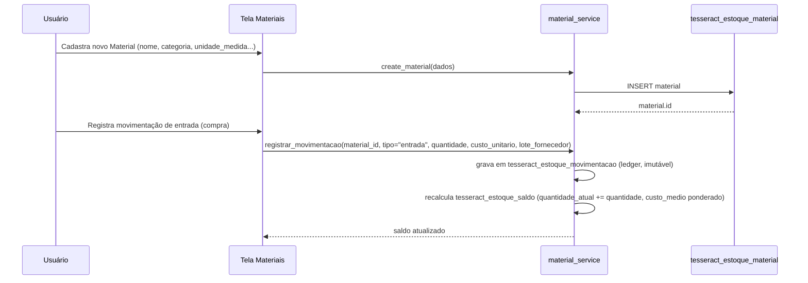
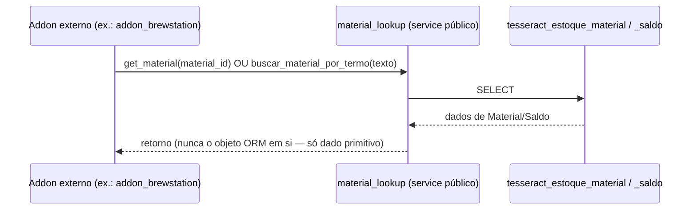

# 03 — Fluxos (Addon Estoque)

## Fluxo 1 — Cadastro de Material + entrada de estoque (caminho feliz)

## Fluxo 2 — Consumo por Addon externo (leitura via service público)

`buscar_material_por_termo` existe especificamente pro fluxo de
resolução de ingrediente de `feature_mash_control` (importação de
receita externa, tentativa de casar descrição textual com Material já
cadastrado). Espelha a mesma regra de fronteira já usada em
`device_manager` (skill 05, seção 6): cross-Addon nunca enxerga ORM de
outro módulo, só o retorno do service público.

## Interação com o `EventBus` — pendência

Ainda não há publicação de evento via `core/event_bus.py` — o desenho
atual usa só chamada direta e síncrona ao service público. Se no
futuro algum Addon quiser reagir a mudança de estoque sem polling
(ex.: alerta de estoque mínimo), o evento seguiria a convenção da
skill 00 (`estoque.saldo.abaixo_do_minimo`) — não desenhado ainda.
