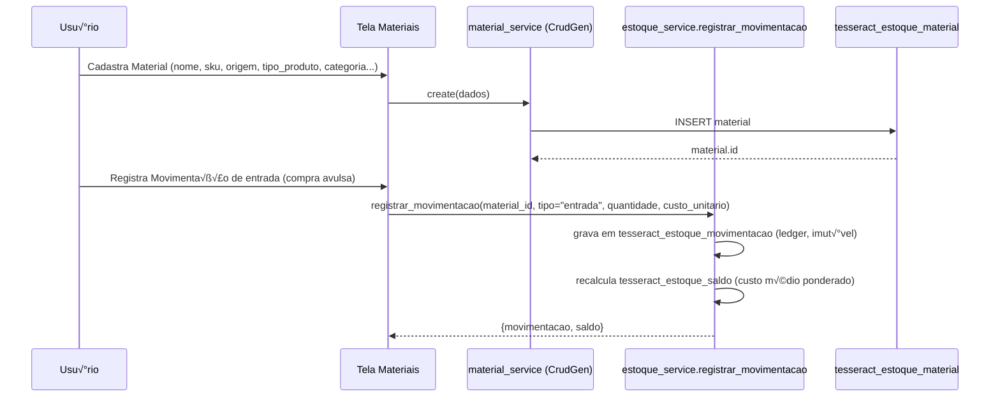
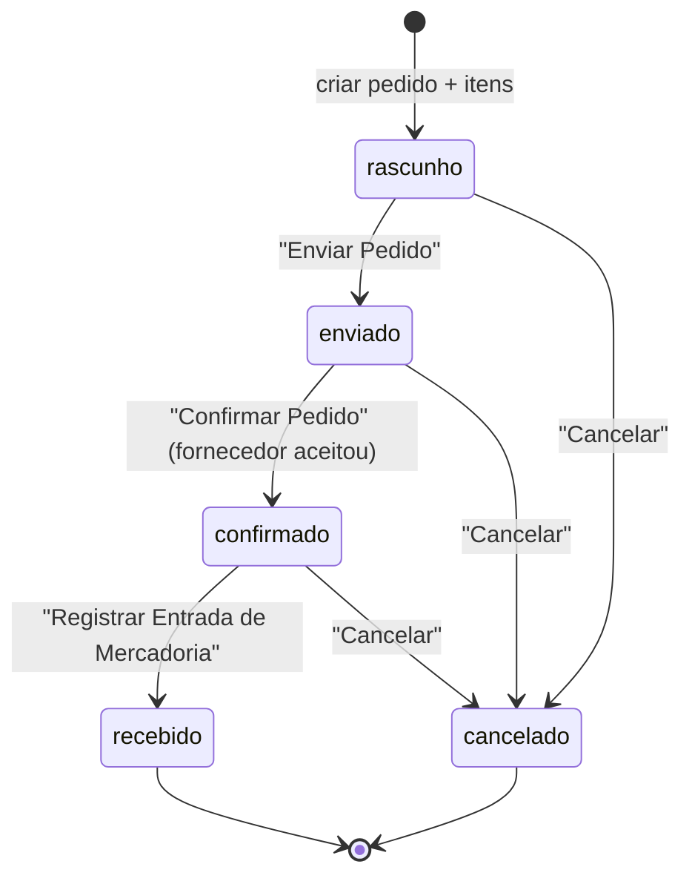
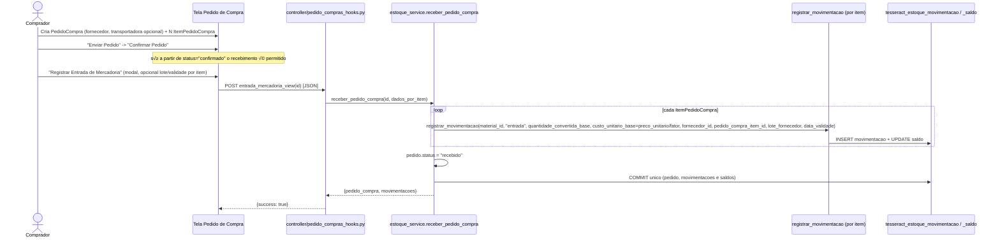
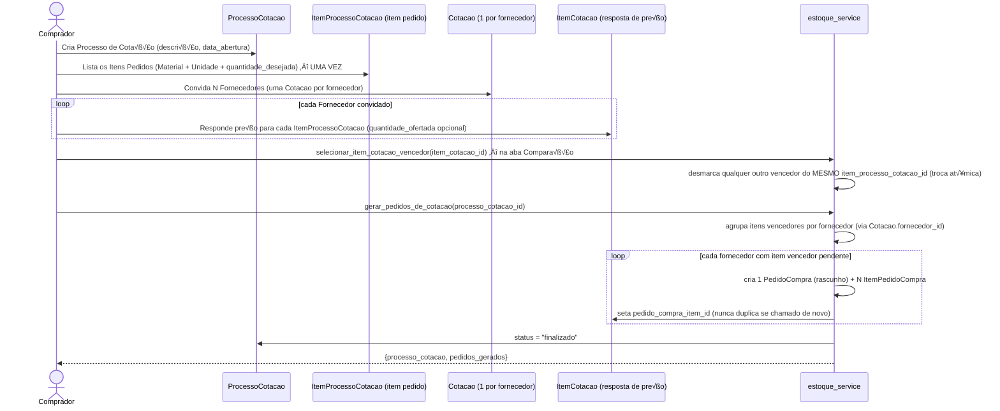
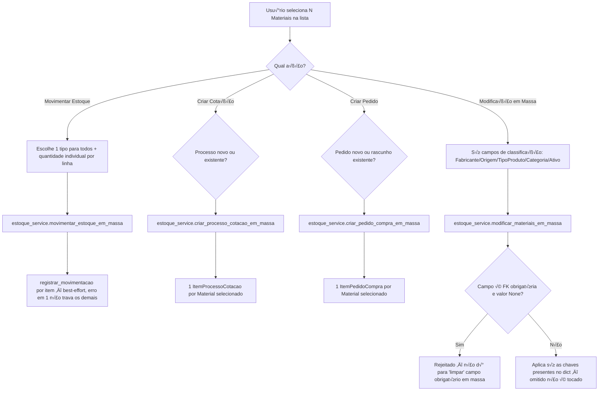
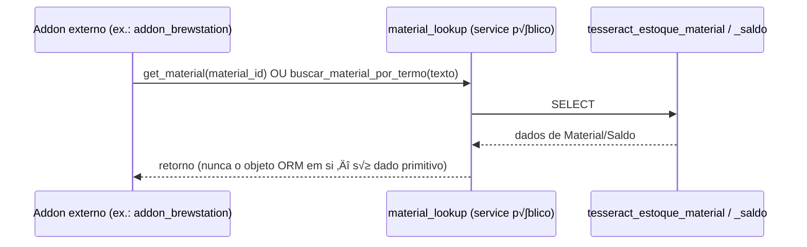

# 03 — Fluxos (Addon Estoque)

## Fluxo 1 — Cadastro de Material + entrada manual de estoque (caminho feliz)

```mermaid
sequenceDiagram
    participant User as Usu√°rio
    participant UI as Tela Materiais
    participant Svc as material_service (CrudGen)
    participant Estoque as estoque_service.registrar_movimentacao
    participant DB as tesseract_estoque_material

    User->>UI: Cadastra Material (nome, sku, origem, tipo_produto, categoria...)
    UI->>Svc: create(dados)
    Svc->>DB: INSERT material
    DB-->>Svc: material.id

    User->>UI: Registra Movimentação de entrada (compra avulsa)
    UI->>Estoque: registrar_movimentacao(material_id, tipo="entrada", quantidade, custo_unitario)
    Estoque->>Estoque: grava em tesseract_estoque_movimentacao (ledger, imut√°vel)
    Estoque->>Estoque: recalcula tesseract_estoque_saldo (custo médio ponderado)
    Estoque-->>UI: {movimentacao, saldo}
```

Esta é a via manual — sem passar por `PedidoCompra`. `fornecedor_id`
pode ser informado, mas `pedido_compra_item_id` fica nulo; o rastro do
pedido (fluxo 2) só existe quando a entrada vem do recebimento.

A entrada manual usa `MovimentacaoService.create_override`, hook
preservado pelo CrudGen, que chama
`estoque_service.registrar_movimentacao()`. O ledger e o saldo s√£o
confirmados juntos. Lançamentos registrados só podem ser corrigidos
por novo ajuste.

---

## Fluxo 2 — Ciclo de compra direto (Pedido de Compra → Entrada de Mercadoria)

M°quina de estado de `PedidoCompra.status`:

```mermaid
stateDiagram-v2
    [*] --> rascunho: criar pedido + itens
    rascunho --> enviado: "Enviar Pedido"
    enviado --> confirmado: "Confirmar Pedido" (fornecedor aceitou)
    confirmado --> recebido: "Registrar Entrada de Mercadoria"
    rascunho --> cancelado: "Cancelar"
    enviado --> cancelado: "Cancelar"
    confirmado --> cancelado: "Cancelar"
    recebido --> [*]
    cancelado --> [*]
```

Cada transição é um botão na tela de detalhe do pedido — nunca um
campo de status solto editável livremente. Não existe transição
"para trás" (de `confirmado` para `enviado`, por exemplo) — se o
pedido foi confirmado por engano, a saída é cancelar e criar outro.

```mermaid
sequenceDiagram
    actor User as Comprador
    participant UI as Tela Pedido de Compra
    participant Ctrl as controller/pedido_compras_hooks.py
    participant Svc as estoque_service.receber_pedido_compra
    participant Mov as registrar_movimentacao (por item)
    participant DB as tesseract_estoque_movimentacao / _saldo

    User->>UI: Cria PedidoCompra (fornecedor, transportadora opcional) + N ItemPedidoCompra
    User->>UI: "Enviar Pedido" -> "Confirmar Pedido"
    Note over UI: só a partir de status="confirmado" o recebimento é permitido

    User->>UI: "Registrar Entrada de Mercadoria" (modal, opcional lote/validade por item)
    UI->>Ctrl: POST entrada_mercadoria_view(id) [JSON]
    Ctrl->>Svc: receber_pedido_compra(id, dados_por_item)
    loop cada ItemPedidoCompra
        Svc->>Mov: registrar_movimentacao(material_id, "entrada", quantidade_convertida_base, custo_unitario_base=preco_unitario/fator, fornecedor_id, pedido_compra_item_id, lote_fornecedor, data_validade)
        Mov->>DB: INSERT movimentacao + UPDATE saldo
    end
    Svc->>Svc: pedido.status = "recebido"
    Svc->>DB: COMMIT unico (pedido, movimentacoes e saldos)
    Svc-->>Ctrl: {pedido_compra, movimentacoes}
    Ctrl-->>UI: {success: true}
```

**Achados reais que este fluxo carrega:**

- **Recebimento é sempre total.** Não há recebimento parcial de um
  pedido — decisão explícita (skill 23, revisitada na skill 24), fica
  para quando o volume real de uso justificar o esforço.
- **Conversão de unidade acontece uma vez só, na entrada do dado.**
  `ItemPedidoCompra.quantidade` est√° na unidade de **compra**
  (`material_unidade_id`); a `Movimentacao` gerada usa sempre a
  quantidade convertida para a unidade-base do Material
  (`quantidade_convertida_base`, calculada no hook do item no momento
  do save do pedido — nunca recalculada depois). O custo unitário
  também é convertido (`preco_unitario / fator_conversao_aplicado`)
  para manter `Saldo.custo_medio` consistente em unidade-base.
- **Rastro de compra é opcional em `Movimentacao`.** `fornecedor_id`/
  `pedido_compra_item_id`/`unidade_original`/`quantidade_original`/
  `fator_conversao_aplicado` só são preenchidos quando a movimentação
  vem daqui — uma movimentação manual (Fluxo 1) continua válida sem
  nenhum desses campos.
- **Existem dois endpoints de recebimento** por razão histórica:
  `receber_view` (redirect, sem captar lote/validade — mantido por
  compatibilidade) e `entrada_mercadoria_view` (JSON, usado pelo modal
  real de "Entrada de Mercadoria", aceita lote/validade por item).
  Ambos chamam o mesmo `estoque_service.receber_pedido_compra()`.

### Sobre "aprovação" — o que este fluxo NÃO tem

N√£o existe uma permiss√£o `pedido_compras.aprovar` nem um papel
dedicado de aprovador. Toda transição de status (incluindo
`enviado`‚Üí`confirmado`, que funciona como o port√£o antes do
recebimento) é protegida apenas pela permissão padrão
`pedido_compras.update` — a mesma que edita qualquer campo do pedido.
Quem tem permissão para editar o pedido também pode "aprovar" (mudar
para `confirmado`). Se a operação real exigir um segundo usuário
diferente do criador, ou um papel `comprador`/`aprovador` distinto,
isso é uma decisão de arquitetura nova, não algo já implementado.

---

## Fluxo 3 — Cotação de Fornecedores (RFQ) → geração de Pedido de Compra

```mermaid
sequenceDiagram
    actor User as Comprador
    participant Proc as ProcessoCotacao
    participant ItemProc as ItemProcessoCotacao (item pedido)
    participant Cot as Cotacao (1 por fornecedor)
    participant ItemCot as ItemCotacao (resposta de preço)
    participant Svc as estoque_service

    User->>Proc: Cria Processo de Cotação (descrição, data_abertura)
    User->>ItemProc: Lista os Itens Pedidos (Material + Unidade + quantidade_desejada) — UMA VEZ
    User->>Cot: Convida N Fornecedores (uma Cotacao por fornecedor)
    loop cada Fornecedor convidado
        User->>ItemCot: Responde preço para cada ItemProcessoCotacao (quantidade_ofertada opcional)
    end
    User->>Svc: selecionar_item_cotacao_vencedor(item_cotacao_id) — na aba Comparação
    Svc->>Svc: desmarca qualquer outro vencedor do MESMO item_processo_cotacao_id (troca atômica)
    User->>Svc: gerar_pedidos_de_cotacao(processo_cotacao_id)
    Svc->>Svc: agrupa itens vencedores por fornecedor (via Cotacao.fornecedor_id)
    loop cada fornecedor com item vencedor pendente
        Svc->>Svc: cria 1 PedidoCompra (rascunho) + N ItemPedidoCompra
        Svc->>ItemCot: seta pedido_compra_item_id (nunca duplica se chamado de novo)
    end
    Svc->>Proc: status = "finalizado"
    Svc-->>User: {processo_cotacao, pedidos_gerados}
```

**Achados reais deste fluxo (correção pós-Fase 6.3, achado do
Christopher):**

- **O item pedido vive uma vez só no processo**, não repetido por
  Cotação/fornecedor. `ItemProcessoCotacao` (Material + Unidade +
  quantidade desejada) é definido no processo; cada `Cotacao` de
  fornecedor só responde com `ItemCotacao.preco_unitario` para um
  `ItemProcessoCotacao` já existente — nunca redigita o Material. Isso
  substituiu um desenho anterior onde `ItemCotacao` tinha `material_id`
  próprio, redundante entre fornecedores e frágil para comparação
  (agrupava por nome de Material, sem FK garantida).
- **Vencedor é por item, não por Cotação inteira** — dá para escolher
  o Fornecedor A no item 1 e o Fornecedor B no item 2 do mesmo
  processo. A regra "no m√°ximo um vencedor por item" atravessa
  `Cotacao`s diferentes, então não é constraint de banco — é aplicada
  em `estoque_service.selecionar_item_cotacao_vencedor()`.
- **"Gerar Pedido" é uma ação manual e separada** (não automática ao
  marcar o último vencedor) — o comprador decide quando fechar. Rodar
  a ação de novo não duplica: só pega `ItemCotacao` com
  `pedido_compra_item_id IS NULL`.
- **Um `PedidoCompra` por fornecedor vencedor**, nunca um pedido
  misturando fornecedores diferentes — agrupamento automático via
  `Cotacao.fornecedor_id` de cada item vencedor.
- **`PedidoCompra` gerado nasce em `rascunho`** — revisável antes de
  seguir o Fluxo 2 normalmente a partir daí (nenhuma `Movimentacao` é
  criada neste fluxo, só no recebimento efetivo).

---

## Fluxo 4 — Ações em massa na lista de Materiais

```mermaid
flowchart TD
    A[Usuário seleciona N Materiais na lista] --> B{Qual ação?}
    B -- Movimentar Estoque --> C[Escolhe 1 tipo para todos + quantidade individual por linha]
    C --> C2[estoque_service.movimentar_estoque_em_massa]
    C2 --> C3[registrar_movimentacao por item — best-effort, erro em 1 não trava os demais]

    B -- Criar Cotação --> D{Processo novo ou existente?}
    D --> D2[estoque_service.criar_processo_cotacao_em_massa]
    D2 --> D3[1 ItemProcessoCotacao por Material selecionado]

    B -- Criar Pedido --> E{Pedido novo ou rascunho existente?}
    E --> E2[estoque_service.criar_pedido_compra_em_massa]
    E2 --> E3[1 ItemPedidoCompra por Material selecionado]

    B -- Modificação em Massa --> F[Só campos de classificação: Fabricante/Origem/TipoProduto/Categoria/Ativo]
    F --> F2[estoque_service.modificar_materiais_em_massa]
    F2 --> F3{Campo é FK obrigatória e valor None?}
    F3 -- Sim --> F4[Rejeitado — não dá para 'limpar' campo obrigatório em massa]
    F3 -- Não --> F5[Aplica só as chaves presentes no dict — omitido não é tocado]
```

**Achado real**: `movimentar_estoque_em_massa` **não é atômico entre
itens** — cada `registrar_movimentacao()` já comita a própria
transação (mesmo comportamento usado por `receber_pedido_compra()`/
`gerar_pedidos_de_cotacao()`). Um item com erro n√£o impede os
seguintes; o retorno traz sucesso/erro por Material para a pessoa
corrigir só o que falhou.

---

## Fluxo 5 — Consumo por Addon externo (leitura via service público)

```mermaid
sequenceDiagram
    participant Ext as Addon externo (ex.: addon_brewstation)
    participant Lookup as material_lookup (service p√∫blico)
    participant DB as tesseract_estoque_material / _saldo

    Ext->>Lookup: get_material(material_id) OU buscar_material_por_termo(texto)
    Lookup->>DB: SELECT
    DB-->>Lookup: dados de Material/Saldo
    Lookup-->>Ext: retorno (nunca o objeto ORM em si — só dado primitivo)
```

`buscar_material_por_termo` existe especificamente para o fluxo de
resolução de ingrediente de `feature_mash_control` (importação de
receita externa, tentativa de casar descrição textual com Material já
cadastrado). Espelha a mesma regra de fronteira j√° usada em
`device_manager` (skill 05, seção 6): cross-Addon nunca enxerga ORM de
outro módulo, só o retorno do service público. `estoque_service.py`
inteiro (compra, RFQ, ações em massa) é de uso **interno** — nenhum
Addon externo chama essas funções, só `material_lookup`.

## Interação com o `EventBus` — pendência

Ainda não há publicação de evento via `core/event_bus.py` em nenhum
dos fluxos acima — todo o desenho usa chamada direta e síncrona.
Se no futuro algum Addon quiser reagir a mudança de estoque sem
polling (ex.: alerta de estoque mínimo, notificação de pedido
recebido), o evento seguiria a convenção da skill 00
(`estoque.saldo.abaixo_do_minimo`, `estoque.pedido_compra.recebido`)
— não desenhado ainda.
