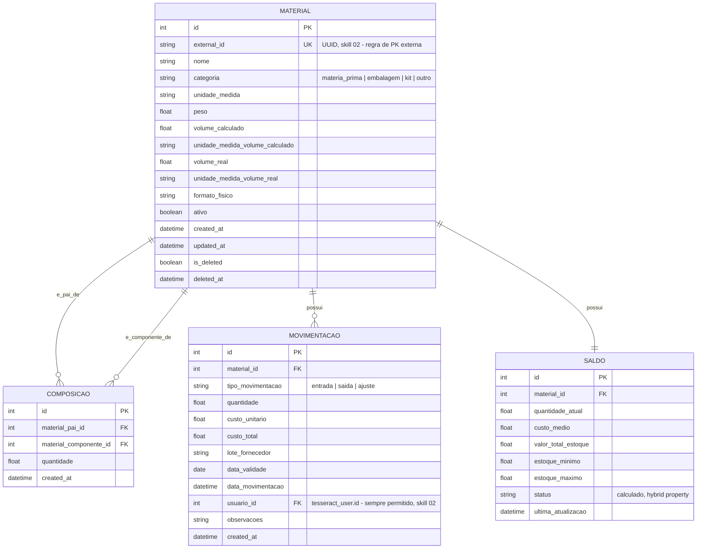

# 04 — Modelo de Dados (Addon Estoque)

## Tabelas — nome completo e descrição de negócio

| Tabela real | Descrição |
|---|---|
| `tesseract_estoque_material` | Identidade de qualquer coisa estocável. `categoria` livre por ora. `volume_calculado` = teórico; `volume_real` = medido/declarado — podem divergir, campos e unidades separadas. |
| `tesseract_estoque_composicao` | Auto-relacionamento (BOM). FK real, mesmo Addon (skill 02). |
| `tesseract_estoque_movimentacao` | Ledger imutável — correção é lançamento de ajuste, nunca update/delete. |
| `tesseract_estoque_saldo` | Cache materializado 1:1 com `material`. |

**Soft-delete**: `material` segue padrão CrudGen (`is_deleted`/
`deleted_at`). `movimentacao` **não tem soft-delete** — é ledger
contábil.

## Referenciado (fracamente) por outros Addons

| Addon/Feature consumidor | Coluna | Resolvido por |
|---|---|---|
| `addon_brewstation` / `feature_mash_control` (`RecipeIngredient`, `IngredientMapping`) | `material_id` | `material_lookup` |
| `addon_brewstation` / `feature_ingredientes` (Malte/Lupulo/Levedura) | `material_id` | `material_lookup` |
| `addon_brewstation` / `feature_envase` (`ItemEnvase`) | `material_id` | `material_lookup` |

Ver `addons/addon_brewstation/docs/technical/04-modelo-de-dados.md` e
`addons/addon_brewstation/features/feature_mash_control/docs/technical/04-modelo-de-dados.md`
para o lado espelhado.
