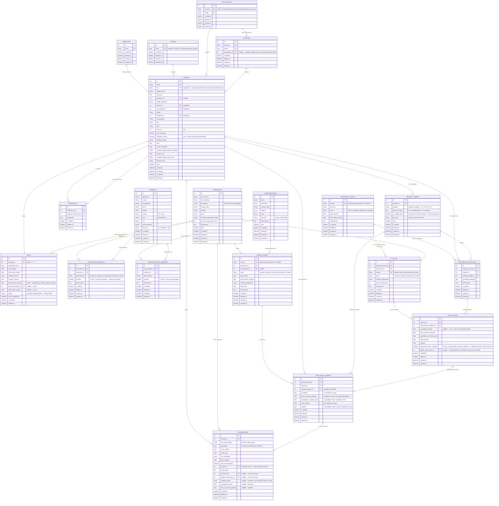

# 04 — Modelo de Dados (Addon Estoque)

> **Reescrito nesta sessão** (auditoria de documentação — a versão
> anterior cobria só Fabricante/Origem/TipoProduto/Categoria/Material/
> Composicao/Movimentacao/Saldo; as skills 23-Fase 2 a 25 adicionaram
> `MaterialUnidade`, `Fornecedor`, `Transportadora`, `Endereco`,
> `FornecedorEndereco`, `TransportadoraEndereco`, `PedidoCompra`,
> `ItemPedidoCompra`, `ProcessoCotacao`, `Cotacao`,
> `ItemProcessoCotacao`, `ItemCotacao` — nenhuma estava documentada
> aqui. `Movimentacao`/`Saldo` também ganharam colunas de rastro de
> compra não refletidas antes.

```mermaid
erDiagram
    FABRICANTE ||--o{ MATERIAL : "fabrica (opcional)"
    ORIGEM ||--o{ MATERIAL : "classifica"
    TIPO_PRODUTO ||--o{ MATERIAL : "classifica"
    TIPO_PRODUTO ||--o{ CATEGORIA : "classifica (opcional)"
    CATEGORIA ||--o{ MATERIAL : "classifica"
    MATERIAL ||--o{ MATERIAL_UNIDADE : "tem N unidades"
    MATERIAL ||--o{ COMPOSICAO : "e_pai_de"
    MATERIAL ||--o{ COMPOSICAO : "e_componente_de"
    MATERIAL ||--o{ MOVIMENTACAO : "possui"
    MATERIAL ||--|| SALDO : "possui"

    FORNECEDOR ||--o{ FORNECEDOR_ENDERECO : "tem N enderecos"
    ENDERECO ||--o{ FORNECEDOR_ENDERECO : "referenciado por"
    TRANSPORTADORA ||--o{ TRANSPORTADORA_ENDERECO : "tem N enderecos"
    ENDERECO ||--o{ TRANSPORTADORA_ENDERECO : "referenciado por"

    FORNECEDOR ||--o{ PEDIDO_COMPRA : "recebe"
    TRANSPORTADORA ||--o{ PEDIDO_COMPRA : "transporta (opcional)"
    PEDIDO_COMPRA ||--o{ ITEM_PEDIDO_COMPRA : "tem N itens"
    MATERIAL ||--o{ ITEM_PEDIDO_COMPRA : "referenciado por"
    MATERIAL_UNIDADE ||--o{ ITEM_PEDIDO_COMPRA : "unidade de compra"

    PROCESSO_COTACAO ||--o{ ITEM_PROCESSO_COTACAO : "tem N itens pedidos"
    MATERIAL ||--o{ ITEM_PROCESSO_COTACAO : "referenciado por"
    MATERIAL_UNIDADE ||--o{ ITEM_PROCESSO_COTACAO : "unidade"
    PROCESSO_COTACAO ||--o{ COTACAO : "tem N cotacoes (1 por fornecedor)"
    FORNECEDOR ||--o{ COTACAO : "convidado em"
    COTACAO ||--o{ ITEM_COTACAO : "tem N respostas"
    ITEM_PROCESSO_COTACAO ||--o{ ITEM_COTACAO : "recebe respostas"
    ITEM_COTACAO |o--o| ITEM_PEDIDO_COMPRA : "gera (quando vencedor)"

    FORNECEDOR ||--o{ MOVIMENTACAO : "origem (opcional)"
    ITEM_PEDIDO_COMPRA ||--o{ MOVIMENTACAO : "origem (opcional)"
    FORNECEDOR ||--o{ SALDO : "ultimo_fornecedor (cache, opcional)"

    FABRICANTE {
        int id PK
        string nome UK
        boolean is_deleted
        datetime deleted_at
        datetime created_at
        datetime updated_at
    }
    ORIGEM {
        int id PK
        string nome UK "seed fixo: 'A definir' (ver services/estoque_seed.py)"
        boolean is_deleted
        datetime deleted_at
        datetime created_at
        datetime updated_at
    }
    TIPO_PRODUTO {
        int id PK
        string descricao UK "seeds: Insumo/Embalagem/Produto Acabado/Peca/Uso e Consumo"
        string codigo UK
        boolean is_deleted
        datetime deleted_at
        datetime created_at
        datetime updated_at
    }
    CATEGORIA {
        int id PK
        string descricao UK
        string codigo UK
        int tipo_produto_id FK "nullable — cadastros antigos ficam sem classificação até revisão"
        boolean is_deleted
        datetime deleted_at
        datetime created_at
        datetime updated_at
    }
    MATERIAL {
        int id PK
        string nome UK
        string sku UK "obrigatório — gerado automaticamente no autocreate, editável depois"
        string codigo_barras
        text descricao
        int fabricante_id FK "nullable"
        string codigo_fabricante
        int origem_id FK "obrigatório"
        int tipo_produto_id FK "obrigatório"
        string familia
        int categoria_id FK "obrigatório"
        string subcategoria
        string ncm
        string cest
        int vida_util "dias"
        boolean lote_controlado
        boolean pendente_revisao "true = criado via autocreate BrewFather"
        string unidade_medida
        float peso
        float volume_calculado
        string unidade_medida_volume_calculado
        float volume_real
        string unidade_medida_volume_real
        string formato_fisico
        boolean ativo
        datetime created_at
        datetime updated_at
        boolean is_deleted
        datetime deleted_at
    }
    MATERIAL_UNIDADE {
        int id PK
        int material_id FK
        string unidade "código do catálogo — ex.: KG, PCT, CX"
        float fator_para_base "1.0 na unidade-base; > 0 nas demais"
        boolean is_unidade_base "exatamente 1 true por material — índice único parcial"
        string tipo_uso "compra | consumo | ambos"
        boolean ativo
        boolean is_deleted
        datetime deleted_at
        datetime created_at
        datetime updated_at
    }
    COMPOSICAO {
        int id PK
        int material_pai_id FK
        int material_componente_id FK
        float quantidade
        boolean is_deleted
        datetime deleted_at
        datetime created_at
    }
    FORNECEDOR {
        int id PK
        string razao_social
        string nome_fantasia
        string documento "CNPJ/CPF, livre de propósito"
        string contato_nome
        string telefone
        string email
        string condicao_pagamento_padrao
        int prazo_entrega_padrao_dias
        text observacoes
        boolean ativo
        boolean is_deleted
        datetime deleted_at
        datetime created_at
        datetime updated_at
    }
    TRANSPORTADORA {
        int id PK
        string nome
        string documento
        string contato_nome
        string telefone
        string email
        string tipo_frete "proprio | terceirizado"
        text observacoes
        boolean ativo
        boolean is_deleted
        datetime deleted_at
        datetime created_at
        datetime updated_at
    }
    ENDERECO {
        int id PK
        string logradouro
        string numero
        string complemento
        string bairro
        string cidade
        string estado "UF, 2 chars"
        string pais "default 'Brasil'"
        string cep
        string ponto_referencia
        string descricao "ex.: 'Depósito 2', livre"
        boolean is_deleted
        datetime deleted_at
        datetime created_at
        datetime updated_at
    }
    FORNECEDOR_ENDERECO {
        int id PK
        int fornecedor_id FK
        int endereco_id FK
        string tipo_endereco "cobranca | entrega | correspondencia | faturamento | outro"
        boolean principal "no máx. 1 true por fornecedor — índice único parcial"
        text observacoes
        boolean is_deleted
        datetime deleted_at
        datetime created_at
        datetime updated_at
    }
    TRANSPORTADORA_ENDERECO {
        int id PK
        int transportadora_id FK
        int endereco_id FK
        string tipo_endereco
        boolean principal "no máx. 1 true por transportadora"
        text observacoes
        boolean is_deleted
        datetime deleted_at
        datetime created_at
        datetime updated_at
    }
    PEDIDO_COMPRA {
        int id PK
        string numero UK "gerado automaticamente: PC-000001"
        int fornecedor_id FK
        int transportadora_id FK "nullable"
        string status "rascunho | enviado | confirmado | recebido | cancelado"
        date data_pedido
        date data_previsao_entrega
        string condicao_pagamento
        float valor_frete
        text observacoes
        boolean is_deleted
        datetime deleted_at
        datetime created_at
        datetime updated_at
    }
    ITEM_PEDIDO_COMPRA {
        int id PK
        int pedido_compra_id FK
        int material_id FK
        int material_unidade_id FK "unidade de COMPRA"
        float quantidade "na unidade de compra"
        float fator_conversao_aplicado "snapshot no save, nunca recalculado depois"
        float quantidade_convertida_base "= quantidade * fator, calculado no hook"
        float preco_unitario "por unidade de compra"
        float subtotal "= quantidade * preco_unitario, calculado no hook"
        boolean is_deleted
        datetime deleted_at
        datetime created_at
        datetime updated_at
    }
    PROCESSO_COTACAO {
        int id PK
        string numero UK "gerado automaticamente: COT-000001"
        string descricao
        string status "aberto | comparado | finalizado | cancelado"
        date data_abertura
        date data_limite_resposta
        text observacoes
        boolean is_deleted
        datetime deleted_at
        datetime created_at
        datetime updated_at
    }
    ITEM_PROCESSO_COTACAO {
        int id PK
        int processo_cotacao_id FK
        int material_id FK
        int material_unidade_id FK
        float quantidade_desejada
        text observacoes
        boolean is_deleted
        datetime deleted_at
        datetime created_at
        datetime updated_at
    }
    COTACAO {
        int id PK
        int processo_cotacao_id FK
        int fornecedor_id FK
        string numero UK "gerado: {numero_processo}-{sufixo_letra}"
        string status "rascunho | enviada | respondida | recusada"
        string condicao_pagamento
        int prazo_entrega_dias
        text observacoes
        boolean is_deleted
        datetime deleted_at
        datetime created_at
        datetime updated_at
    }
    ITEM_COTACAO {
        int id PK
        int cotacao_id FK
        int item_processo_cotacao_id FK
        float quantidade_ofertada "nullable — nulo = confirma a quantidade pedida"
        float fator_conversao_aplicado
        float quantidade_convertida_base
        float preco_unitario
        float subtotal
        boolean selecionado_como_vencedor "no máx. 1 true por item_processo_cotacao_id — aplicado no service, não é constraint"
        int pedido_compra_item_id FK "nullable — setado quando 'Gerar Pedido' converte este vencedor"
        boolean is_deleted
        datetime deleted_at
        datetime created_at
        datetime updated_at
    }
    MOVIMENTACAO {
        int id PK
        int material_id FK
        string tipo_movimentacao "entrada | saida | ajuste"
        float quantidade "sempre na unidade-base do Material"
        float custo_unitario
        float custo_total
        string lote_fornecedor
        date data_validade
        datetime data_movimentacao
        int usuario_id FK "tesseract_user.id — sempre permitido, skill 02"
        text observacoes
        int fornecedor_id FK "nullable — rastro de compra"
        int pedido_compra_item_id FK "nullable — rastro de compra"
        string unidade_original "nullable — auditoria, nunca lido pelo cálculo de saldo"
        float quantidade_original "nullable — auditoria"
        float fator_conversao_aplicado "nullable — auditoria"
        boolean is_deleted
        datetime deleted_at
        datetime created_at
    }
    SALDO {
        int id PK
        int material_id FK "unique — 1:1"
        float quantidade_atual
        float custo_medio
        float valor_total_estoque
        float estoque_minimo
        float estoque_maximo
        float ultimo_preco_compra "cache — atualizado por receber_pedido_compra()"
        int ultimo_fornecedor_id FK "nullable — cache"
        date data_ultima_compra "nullable — cache"
        string status "calculado, property Python — não persistido"
        datetime ultima_atualizacao
        boolean is_deleted
        datetime deleted_at
    }
```

## Tabelas — nome completo e descrição de negócio

| Tabela real | Descrição |
|---|---|
| `tesseract_estoque_fabricante` | Lookup simples (fabricante/marca). Referenciado opcionalmente por `Material.fabricante_id`. |
| `tesseract_estoque_origem` | Lookup simples (nacional/importado/etc.). Ganha o registro seed `"A definir"` no boot — usado quando a origem real não é conhecida (ex.: autocreate do BrewFather). |
| `tesseract_estoque_tipo_produto` | Eixo de **natureza** do Material — 5 seeds fixos (Insumo/Embalagem/Produto Acabado/Peça/Uso e Consumo), criados idempotentemente no boot. |
| `tesseract_estoque_categoria` | Classificação **fina** dentro de um `TipoProduto` (`tipo_produto_id` nullable — cadastros antigos ficam sem essa relação até revisão manual, nunca bloqueados). Substituiu o antigo campo `Material.categoria` (string livre). |
| `tesseract_estoque_material` | Identidade de qualquer coisa estocável. `sku` é o identificador de negócio (único, sempre presente). `origem_id`/`tipo_produto_id`/`categoria_id` são obrigatórios; `fabricante_id` é opcional. `volume_calculado` = teórico; `volume_real` = medido/declarado. As unidades desses dois volumes são enums limitados a `ML`, `L`, `CM3` e `M3`; os campos numéricos de peso e volume usam `autocomplete="off"` no formulário gerado. |
| `tesseract_estoque_material_unidade` | Múltiplas unidades por Material (compra × consumo), com código selecionado do catálogo via `@weak_ref(value_field="codigo")`. Embalagens usam códigos como `PCT` e `CX`, sem tamanho no código: `fator_para_base` registra quanto contém cada embalagem deste Material (por exemplo, base `KG` e `PCT` com fator `25`). `quantidade_atual`/`quantidade` em `Movimentacao`/`Saldo` estão SEMPRE na unidade-base — a conversão acontece uma vez, na entrada do dado. |
| `tesseract_estoque_composicao` | Auto-relacionamento (BOM). FK real, mesmo Addon (skill 02). |
| `tesseract_estoque_fornecedor` | Cadastro de fornecedor. Vive dentro do próprio `addon_estoque` (decisão raiz da skill 23) — permite FK real com `PedidoCompra`/`Movimentacao` por serem do mesmo Addon. |
| `tesseract_estoque_transportadora` | Cadastro de transportadora — mesmo raciocínio de escopo do Fornecedor. |
| `tesseract_estoque_endereco` | Endereço reutilizável, dado puro, sem saber quem é o dono — decisão explícita de **não** usar padrão polimórfico (`entidade_tipo`+`entidade_id` sem FK real); quem vincula é uma tabela própria por dono. |
| `tesseract_estoque_fornecedor_endereco` | Vínculo Fornecedor→Endereço, 1:N. No máximo um `principal=true` por fornecedor (índice único parcial). |
| `tesseract_estoque_transportadora_endereco` | Vínculo Transportadora→Endereço, mesmo formato de `fornecedor_endereco`. |
| `tesseract_estoque_pedido_compra` | Cabeçalho do pedido de compra. `numero` gerado automaticamente (`PC-000001`) se não informado. Máquina de estado: rascunho→enviado→confirmado→recebido (ou cancelado a qualquer momento antes de recebido). |
| `tesseract_estoque_item_pedido_compra` | Linha do pedido — também **é** o histórico de preço/última compra (não existe tabela separada para isso: "últimas compras de um Material" é uma query sobre esta tabela + `data_pedido`). `quantidade` na unidade de compra; `quantidade_convertida_base`/`subtotal` calculados no hook. |
| `tesseract_estoque_processo_cotacao` | Cabeçalho do RFQ. `numero` gerado automaticamente (`COT-000001`). Agrupa N `Cotacao` (uma por fornecedor convidado) para comparação. |
| `tesseract_estoque_item_processo_cotacao` | O "item pedido" (Material+quantidade) do RFQ — definido **uma vez** no processo, nunca repetido por fornecedor. |
| `tesseract_estoque_cotacao` | Um cabeçalho por fornecedor convidado dentro de um `ProcessoCotacao`. `numero` gerado como `{numero_do_processo}-{sufixo_letra}`. No máximo uma `Cotacao` não-deletada por `(processo_cotacao_id, fornecedor_id)`. |
| `tesseract_estoque_item_cotacao` | A **resposta de preço** de um fornecedor para um `ItemProcessoCotacao` já definido — nunca redigita o Material. `selecionado_como_vencedor` e `pedido_compra_item_id` são geridos pelo service (`estoque_service.py`), nunca editados direto pelo formulário genérico. |
| `tesseract_estoque_movimentacao` | Ledger imutável — correção é lançamento de ajuste, nunca update/delete. Rastro de compra (`fornecedor_id`/`pedido_compra_item_id`/`unidade_original`/`quantidade_original`/`fator_conversao_aplicado`) é opcional — só preenchido quando a movimentação vem de `receber_pedido_compra()`. |
| `tesseract_estoque_saldo` | Cache materializado 1:1 com `material`. Ganhou cache de última compra (`ultimo_preco_compra`/`ultimo_fornecedor_id`/`data_ultima_compra`), atualizado por `receber_pedido_compra()`. `status` é `property` Python, não persistido. |

## Sobre `Material.pendente_revisao` e a resolução de campos obrigatórios no autocreate

`origem_id`/`tipo_produto_id`/`categoria_id`/`sku` são obrigatórios em
`Material`, mas o autocreate de ingredientes vindo do BrewFather
(`addons/addon_brewstation/features/feature_brew_father/services/ingredient_autocreate_service.py`)
não recebe essa informação da API externa. Resolvido assim:

- `tipo_produto_id` → sempre o seed `"Insumo"` — não é um
  "desconhecido" temporário, é uma classificação correta de fato para
  tudo que vem de sync de receita.
- `origem_id` → sempre o seed `"A definir"` — esse sim é desconhecido
  de verdade (BrewFather não informa nacional/importado).
- `categoria_id` → `get_or_create` por nome, reaproveitando o mesmo
  mapeamento `tipo_ingrediente → categoria` que já existia para o
  antigo campo string.
- `sku` → `"{TIPO_INGREDIENTE}-{10 primeiros caracteres do nome}"`,
  maiúsculo, sem acento, com sufixo numérico sequencial em caso de
  colisão.
- `pendente_revisao=True` é setado nesse fluxo — **só sinaliza** (filtro
  na tela de-para de `feature_brew_father`), nunca bloqueia
  `Movimentacao`/`Saldo`/uso em `PedidoCompra`/`ItemProcessoCotacao`.

## Soft-delete

Todas as tabelas listadas têm `is_deleted`/`deleted_at`, seguindo a
skill 02 ("padrão para qualquer entidade gerada pelo CrudGen"). Nota
histórica preservada de sessão anterior: a intenção original era
`Movimentacao` **não** ter soft-delete (é ledger contábil, correção é
sempre novo lançamento de ajuste, nunca edição) — mas isso divergia da
skill sem ter sido sinalizado como exceção, e quebrou a tela de
listagem gerada (CrudGen filtra por `is_deleted` incondicionalmente em
toda entidade). A trash/restore gerada fica disponível na UI para
`Movimentacao`, mas o uso pretendido continua sendo só ocultar um
lançamento claramente errado da listagem — nunca "consertar" um valor.

## Regra de "unicidade parcial" usada em 4 lugares deste Addon

`MaterialUnidade.is_unidade_base`, `FornecedorEndereco.principal`,
`TransportadoraEndereco.principal` e a dupla `(processo_cotacao_id,
fornecedor_id)` de `Cotacao` usam **índice único parcial**
(`sqlite_where=...`), nunca `Column(unique=True)` puro — uma
constraint cheia impediria mais de uma linha `false`/duplicada por
dono, o que é exatamente o caso normal (N unidades não-base, N
endereços não-principais). Mesmo padrão já usado em
`YeastBankConfig.storage_type` (`feature_yeast_bank`, skill 18/
redesign 2026-08-21).

## Referenciado (fracamente) por outros Addons

| Addon/Feature consumidor | Coluna | Resolvido por |
|---|---|---|
| `addon_brewstation` / `feature_mash_control` (`RecipeIngredient`, `IngredientMapping`) | `material_id` | `material_lookup` |
| `addon_brewstation` / `feature_ingredientes` (Malte/Lupulo/Levedura) | `material_id` | `material_lookup` |
| `addon_brewstation` / `feature_envase` (`ItemEnvase`) | `material_id` | `material_lookup` |

Nenhum Addon externo referencia `Fornecedor`, `PedidoCompra`,
`ProcessoCotacao` ou qualquer tabela do bloco de compra/RFQ — esse
bloco é de uso interno ao `addon_estoque` até hoje. Ver
`addons/addon_brewstation/docs/technical/04-modelo-de-dados.md` e
`addons/addon_brewstation/features/feature_mash_control/docs/technical/04-modelo-de-dados.md`
para o lado espelhado.
